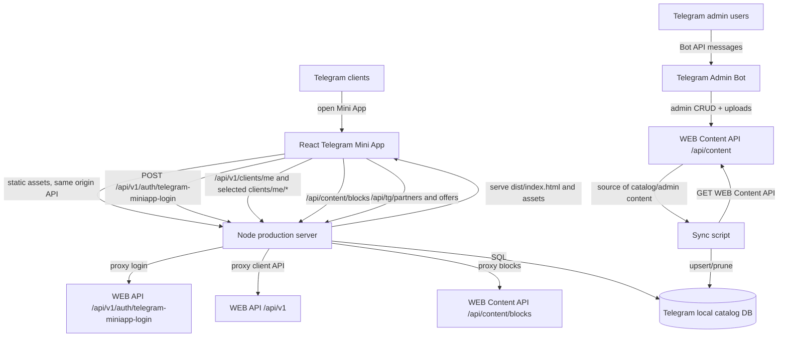

# Архитектура Bloom Club Telegram Mini App / Admin Bot

Документ описывает фактическую архитектуру репозитория `/workspace/bloom_app_TELEGA_NEW` на момент анализа. Репозиторий содержит Telegram Mini App, production Node.js server, scaffold локального Telegram catalog API, утилиты синхронизации и отдельный Telegram Admin Bot.

## 1. Назначение репозитория

Репозиторий является Telegram-слоем Bloom Club. Он **не является основным WEB backend** и не хранит весь бизнес-домен Bloom Club. Основной источник правды для пользователей, подписок, платежей, экономии, верификаций и Content CMS находится во внешнем WEB API `https://bloomclub.ru`.

Основные задачи репозитория:

- отдать React/Vite Telegram Mini App;
- проксировать Telegram login и часть client API к WEB backend;
- предоставить локальный TG catalog API `/api/tg/*` для каталога партнёров/офферов;
- синхронизировать WEB Content CMS в локальную TG DB;
- предоставить Telegram Admin Bot для управления Content CMS через WEB Content Admin API.

## 2. Приложения и сервисы

### 2.1 Telegram Mini App frontend

- Каталог: `telegram-mini-app/src`.
- Технологии: React, TypeScript, Vite.
- Entry point: `telegram-mini-app/src/main.tsx`.
- Root component: `telegram-mini-app/src/App.tsx`.
- Сборка: `npm run build` = `tsc --noEmit && vite build`.
- Runtime: HTML/JS отдаётся Node production server из `telegram-mini-app/dist`.

Назначение:

- читает Telegram WebApp runtime (`window.Telegram.WebApp`);
- получает Telegram `initData`;
- логинится через `/api/v1/auth/telegram-miniapp-login`;
- использует access token WEB backend для client API;
- показывает профиль, подписку, каталог, партнёров, привилегии, экономию;
- при включённом `VITE_TG_LOCAL_CATALOG_ENABLED=true` читает каталог из `/api/tg/partners` текущего origin.

### 2.2 Production Node.js server

- Каталог: `telegram-mini-app/server`.
- Entry point: `telegram-mini-app/server/production-server.js`.
- Запуск: `node server/production-server.js`, `npm start`, Docker `CMD`.
- Технологии: Node.js HTTP server, динамический импорт `pg`.

Назначение:

- слушает `HOST:PORT`;
- отдаёт `dist/index.html`, `/assets/*`, `/uploads/*`;
- отдаёт SPA по `/`, `/app`, `/app-v*`, `/miniapp/*`, `/telegram-app/*`;
- реализует локальные public catalog endpoints `/api/tg/partners`, `/api/tg/partners/{id}`, `/api/tg/partners/{id}/offers`;
- реализует health/debug endpoints;
- проксирует Telegram login на WEB backend;
- проксирует часть client API на WEB backend;
- проксирует `/api/content/blocks` на WEB Content API;
- при `TELEGRAM_AUTO_INIT_DB=true` инициализирует PostgreSQL-схему TG catalog.

### 2.3 Python WSGI Telegram catalog backend scaffold

- Каталог: `telegram-mini-app/backend/telegram_catalog`.
- Entry point WSGI: `backend.telegram_catalog.app:application`.
- CLI запуск: `python -m backend.telegram_catalog.app`.
- Production wrapper: `telegram-mini-app/backend/telegram_catalog/production_app.py`.

Назначение:

- альтернативная/историческая WSGI реализация локального TG catalog API;
- поддерживает SQLite и PostgreSQL через `TELEGRAM_APP_DATABASE_URL`;
- умеет public catalog read endpoints;
- умеет admin CRUD endpoints `/api/tg/admin/*` с `TELEGRAM_ADMIN_API_TOKEN`;
- умеет upload endpoint `/api/content/uploads`;
- умеет idempotent DB init при `TELEGRAM_AUTO_INIT_DB=true`.

Важно: текущий Dockerfile запускает Node production server, а не WSGI server.

### 2.4 Telegram catalog maintenance scripts

- Каталог: `telegram-mini-app/telegram_app/scripts`.
- Entry points через npm scripts:
  - `npm run check:tg-db-env`;
  - `npm run init:tg-db`;
  - `npm run seed:tg-db`;
  - `npm run sync:content-to-tg-db`.

Назначение:

- безопасно проверять видимость `TELEGRAM_APP_DATABASE_URL` без печати секрета;
- инициализировать TG catalog DB;
- заполнять dev/test данные;
- синхронизировать WEB Content CMS в TG local DB.

### 2.5 Telegram Admin Bot

- Каталог: `admin_bot`.
- Entry point: `python -m admin_bot`, модуль `admin_bot/admin_bot/__main__.py`.
- Технологии: aiogram 3, httpx, python-dotenv.

Назначение:

- отдельный Telegram bot для администраторов;
- авторизует пользователей по `TELEGRAM_ADMIN_IDS`;
- работает как server-to-server клиент WEB Content Admin API;
- управляет партнёрами, офферами, фото, справочниками, блоками главной, баннерами, розыгрышами и призами;
- отправляет секретный admin token в заголовках `Authorization: Bearer ...` и `X-Telegram-Admin-Token`.

### 2.6 Docker service

- Файлы: `Dockerfile`, `docker-compose.yml`.
- Service name: `telegram-mini-app`.
- Build context: root repo.
- Runtime command: `node server/production-server.js`.
- Порт: `3000:3000`.

## 3. Верхнеуровневая схема архитектуры



## 4. Карта зависимостей между сервисами

```text
Telegram Mini App frontend
  ├─ depends on Telegram WebApp SDK from https://telegram.org/js/telegram-web-app.js
  ├─ calls same-origin Node server routes
  ├─ receives auth token from WEB API via Node login proxy
  ├─ reads local TG catalog through Node /api/tg/* when enabled
  └─ falls back/uses WEB client endpoints for user, subscription, payments, cities, verification, savings

Node production server
  ├─ depends on built Vite dist
  ├─ optionally depends on PostgreSQL through TELEGRAM_APP_DATABASE_URL and pg
  ├─ proxies auth to https://bloomclub.ru/api/v1/auth/telegram-miniapp-login
  ├─ proxies selected /api/v1/clients/* to https://bloomclub.ru/api/v1
  └─ proxies /api/content/blocks to https://bloomclub.ru/api/content/blocks

Python WSGI catalog scaffold
  ├─ depends on TELEGRAM_APP_DATABASE_URL
  ├─ supports sqlite3 or psycopg2-binary PostgreSQL
  └─ protects admin endpoints with TELEGRAM_ADMIN_API_TOKEN

Sync script
  ├─ depends on TELEGRAM_APP_DATABASE_URL
  ├─ depends on WEB_CONTENT_API_BASE_URL
  ├─ depends on TELEGRAM_ADMIN_API_TOKEN
  └─ writes local TG catalog tables

Telegram Admin Bot
  ├─ depends on Telegram Bot API via aiogram
  ├─ depends on WEB_CONTENT_API_BASE_URL
  ├─ reserves WEB_API_BASE_URL for future/public WEB API usage
  └─ authenticates WEB Content Admin API with TELEGRAM_ADMIN_API_TOKEN
```

## 5. Полное дерево проекта

```text
.
├── .dockerignore
├── Dockerfile
├── README.md
├── architecture.md
├── docker-compose.yml
├── admin_bot
│   ├── .env.example
│   ├── README.md
│   ├── admin_bot
│   │   ├── __init__.py
│   │   ├── __main__.py
│   │   ├── bot.py
│   │   ├── config.py
│   │   ├── keyboards.py
│   │   ├── states.py
│   │   └── web_api.py
│   ├── bloomclub-admin-bot.service.example
│   ├── requirements.txt
│   └── tests
│       ├── conftest.py
│       └── test_web_api.py
└── telegram-mini-app
    ├── .env.example
    ├── .gitignore
    ├── README.md
    ├── backend
    │   ├── README.md
    │   ├── __init__.py
    │   ├── init_telegram_catalog_db.py
    │   ├── seed_telegram_catalog.py
    │   └── telegram_catalog
    │       ├── __init__.py
    │       ├── app.py
    │       ├── config.py
    │       ├── database.py
    │       ├── production_app.py
    │       └── repository.py
    ├── docs
    │   ├── telegram-local-catalog-plan.md
    │   ├── telegram-local-catalog.md
    │   ├── timeweb-docker-deploy.md
    │   ├── timeweb-docker-healthcheck-audit.md
    │   └── timeweb-tg-db-setup.md
    ├── index.html
    ├── package-lock.json
    ├── package.json
    ├── requirements.txt
    ├── server
    │   └── production-server.js
    ├── src
    │   ├── App.tsx
    │   ├── api
    │   │   ├── client.ts
    │   │   └── types.ts
    │   ├── buildInfo.ts
    │   ├── components
    │   │   ├── AccountLinkingOnboarding.tsx
    │   │   ├── AppShell.tsx
    │   │   ├── BottomNav.tsx
    │   │   ├── ContentText.tsx
    │   │   ├── EmptyState.tsx
    │   │   ├── ErrorState.tsx
    │   │   ├── LoadingState.tsx
    │   │   └── RuntimeErrorBoundary.tsx
    │   ├── content
    │   │   ├── ContentContext.tsx
    │   │   └── clientContentApi.ts
    │   ├── diagnostics
    │   │   ├── index.ts
    │   │   └── startupTrace.ts
    │   ├── diagnostics.ts
    │   ├── main.tsx
    │   ├── pages
    │   │   ├── CatalogPage.tsx
    │   │   ├── HomePage.tsx
    │   │   ├── PartnerPage.tsx
    │   │   ├── PrivilegesPage.tsx
    │   │   ├── ProfilePage.tsx
    │   │   ├── SavingsPage.tsx
    │   │   └── SubscriptionPage.tsx
    │   ├── react-shim.d.ts
    │   ├── stateRecovery.ts
    │   ├── styles.css
    │   ├── telegram
    │   │   └── webapp.ts
    │   ├── utils
    │   │   ├── catalogCategories.ts
    │   │   ├── format.ts
    │   │   ├── partnerDisplay.ts
    │   │   ├── subscription.ts
    │   │   └── text.ts
    │   └── vite-env.d.ts
    ├── telegram_app
    │   ├── __init__.py
    │   └── scripts
    │       ├── __init__.py
    │       ├── check_db_env.py
    │       ├── init_db.py
    │       ├── seed_dev_data.py
    │       └── sync_content_to_tg_catalog.py
    ├── tests
    │   ├── test_frontend_local_catalog_static.py
    │   ├── test_production_app.py
    │   ├── test_startup_trace_static.py
    │   ├── test_sync_content_to_tg_catalog.py
    │   └── test_telegram_catalog.py
    ├── tsconfig.json
    └── vite.config.ts
```

## 6. Каталоги: назначение, содержимое, зависимости, потребители

### `/`

- Зачем существует: корень deployable проекта и Docker build context.
- Что хранит: Dockerfile, docker-compose, общий README, документацию архитектуры, два приложения (`telegram-mini-app`, `admin_bot`).
- Какие модули использует: Docker, Node.js, Python.
- Кто использует: CI/deploy, Docker Compose, разработчики.

### `/telegram-mini-app`

- Зачем существует: основное Telegram Mini App приложение.
- Что хранит: frontend, Node server, backend scaffold, scripts, docs, tests, npm/python dependencies.
- Какие модули использует: React, Vite, TypeScript, Node HTTP, pg, Python helpers, psycopg2-binary.
- Кто использует: Dockerfile, production server, frontend users, sync/ops scripts.

### `/telegram-mini-app/src`

- Зачем существует: исходный код React SPA.
- Что хранит: entrypoint, routing/state UI, pages, components, API clients, Telegram WebApp integration, styles, diagnostics.
- Какие модули использует: `react`, `react-dom`, Telegram WebApp global object, browser Fetch API.
- Кто использует: Vite build, frontend runtime.

### `/telegram-mini-app/src/api`

- Зачем существует: типизированный client API слой.
- Что хранит: request helpers, domain types, нормализацию WEB/TG responses, auth and catalog API functions.
- Какие модули использует: Fetch API, `import.meta.env`, `types.ts`.
- Кто использует: `App.tsx`, pages, onboarding/profile/catalog flows.

### `/telegram-mini-app/src/components`

- Зачем существует: переиспользуемые UI-компоненты.
- Что хранит: shell, bottom nav, loading/error/empty states, content text, runtime error boundary, account linking onboarding.
- Какие модули использует: React, content/api utilities.
- Кто использует: `App.tsx` и page components.

### `/telegram-mini-app/src/pages`

- Зачем существует: экранные модули приложения.
- Что хранит: Home, Catalog, Partner, Privileges, Savings, Subscription, Profile pages.
- Какие модули использует: API client, utils, components, content context.
- Кто использует: `App.tsx` через internal page state/navigation.

### `/telegram-mini-app/src/content`

- Зачем существует: слой динамического контента Content CMS.
- Что хранит: `ContentProvider`, загрузку `/blocks` и `/home`-подобных блоков, нормализацию контентных responses.
- Какие модули использует: API error types, Fetch API, `VITE_CONTENT_API_BASE_URL`.
- Кто использует: pages/components, которым нужны CMS-тексты и блоки главной.

### `/telegram-mini-app/src/telegram`

- Зачем существует: изоляция работы с Telegram WebApp SDK.
- Что хранит: чтение `initData`, retry чтения initData, runtime diagnostics, viewport preparation.
- Какие модули использует: `window.Telegram.WebApp`.
- Кто использует: `App.tsx` для login/bootstrap и diagnostics.

### `/telegram-mini-app/src/diagnostics` и `/telegram-mini-app/src/diagnostics.ts`

- Зачем существует: безопасная диагностика старта и runtime ошибок.
- Что хранит: startup trace events, diagnostic formatting.
- Какие модули использует: browser globals, performance/window APIs.
- Кто использует: `main.tsx`, error UI.

### `/telegram-mini-app/src/utils`

- Зачем существует: доменные pure helpers.
- Что хранит: форматирование, категории каталога, отображение партнёров, расчёты подписки, text helpers.
- Какие модули использует: TypeScript/JS standard library.
- Кто использует: pages/components/API normalization.

### `/telegram-mini-app/server`

- Зачем существует: production runtime для SPA и same-origin API.
- Что хранит: `production-server.js`.
- Какие модули использует: Node built-ins, `pg`, external WEB APIs.
- Кто использует: Docker CMD, npm start, Timeweb/App Platform.

### `/telegram-mini-app/backend`

- Зачем существует: Python WSGI scaffold локального TG catalog backend.
- Что хранит: README, compatibility entry scripts, package `telegram_catalog`.
- Какие модули использует: Python standard library, sqlite3, psycopg2-binary.
- Кто использует: ручной WSGI запуск, ops/debug scripts, tests.

### `/telegram-mini-app/backend/telegram_catalog`

- Зачем существует: реализация WSGI TG catalog API.
- Что хранит: application routing, config, DB schema/connectors, repository queries, production app wrapper.
- Какие модули использует: env variables, SQLite/PostgreSQL, WSGI server.
- Кто использует: `python -m backend.telegram_catalog.app`, `production_app.py`, tests.

### `/telegram-mini-app/telegram_app/scripts`

- Зачем существует: operational CLI scripts.
- Что хранит: DB env check, init DB, seed dev data, WEB Content CMS sync.
- Какие модули использует: backend database helpers, urllib/http requests, `TELEGRAM_APP_DATABASE_URL`, `WEB_CONTENT_API_BASE_URL`, `TELEGRAM_ADMIN_API_TOKEN`.
- Кто использует: npm scripts, deploy operators, scheduled sync jobs.

### `/telegram-mini-app/docs`

- Зачем существует: deployment and local catalog documentation.
- Что хранит: Timeweb deployment, DB setup, healthcheck audit, catalog plan.
- Какие модули использует: Markdown only.
- Кто использует: developers/operators.

### `/telegram-mini-app/tests`

- Зачем существует: static and behavioral tests for frontend/server/catalog/scripts.
- Что хранит: pytest tests.
- Какие модули использует: pytest, Python stdlib, imported project modules, Node server subprocess in production tests.
- Кто использует: developers/CI.

### `/admin_bot`

- Зачем существует: отдельный Telegram bot для администрирования WEB Content CMS.
- Что хранит: bot source, env example, requirements, service example, tests.
- Какие модули использует: aiogram, httpx, python-dotenv.
- Кто использует: Telegram admins, systemd service, developers.

### `/admin_bot/admin_bot`

- Зачем существует: Python package admin bot.
- Что хранит: entrypoint, bot handlers, config, keyboards, FSM states, WEB API client.
- Какие модули использует: aiogram, httpx, WEB Content Admin API.
- Кто использует: `python -m admin_bot`, tests.

### `/admin_bot/tests`

- Зачем существует: tests для WEB API client behavior.
- Что хранит: pytest files.
- Какие модули использует: pytest/httpx testing patterns.
- Кто использует: developers/CI.

## 7. Точки входа

### Frontend/build entrypoints

- `telegram-mini-app/index.html` — HTML entry, подключает Telegram WebApp SDK перед React bundle.
- `telegram-mini-app/src/main.tsx` — React bootstrap, early error handlers, dynamic import `App` и `RuntimeErrorBoundary`.
- `telegram-mini-app/src/App.tsx` — root application state, auth lifecycle, navigation, page rendering.
- `telegram-mini-app/vite.config.ts` — Vite config.

### Node/runtime entrypoints

- `telegram-mini-app/server/production-server.js` — production HTTP server.
- `telegram-mini-app/package.json` scripts:
  - `dev`;
  - `build`;
  - `typecheck`;
  - `preview`;
  - `start`, `start:production`, `start:api`.
- Docker `CMD ["node", "server/production-server.js"]`.

### Python catalog entrypoints

- `python -m backend.telegram_catalog.app`.
- `backend.telegram_catalog.app:application` for WSGI.
- `python -m backend.init_telegram_catalog_db`.
- `python -m backend.seed_telegram_catalog`.
- `python -m telegram_app.scripts.check_db_env`.
- `python -m telegram_app.scripts.init_db`.
- `python -m telegram_app.scripts.seed_dev_data`.
- `python -m telegram_app.scripts.sync_content_to_tg_catalog`.

### Admin bot entrypoints

- `python -m admin_bot`.
- `admin_bot/admin_bot/__main__.py` calls `run()` from `bot.py`.
- `bloomclub-admin-bot.service.example` for systemd deployment.

## 8. API routes and integration points

### Node production server public/runtime routes

- `GET /`, `/app`, `/app-v*`, `/miniapp/*`, `/telegram-app/*` — SPA HTML.
- `GET /assets/*` — static assets.
- `GET /uploads/*` — uploaded files.
- `GET|HEAD /ready` — readiness text `ok`.
- `GET|HEAD /health`, `/api/tg/health` — service health.
- `GET /api/tg/health/db` — DB health, fails if DB not configured/reachable.
- `GET /debug/runtime-port` — safe runtime port diagnostics.
- `GET /api/tg/status` — catalog status/counts.
- `GET /api/tg/partners` — active partners from TG DB.
- `GET /api/tg/partners/{id}` — active partner detail.
- `GET /api/tg/partners/{id}/offers` — active offers.
- `GET /api/tg/me/verifications`, `/api/tg/me/savings` — currently `501 user_context_not_configured`.
- `POST /api/v1/auth/telegram-miniapp-login` — proxy to WEB auth.
- selected `/api/v1/clients/*` — proxy to WEB client API.
- `GET /api/content/blocks` — proxy to WEB Content blocks.

### Python WSGI catalog routes

- `GET /api/tg/health`.
- `GET /api/tg/health/db`.
- `GET /api/tg/status`.
- `GET /api/tg/partners`.
- `GET /api/tg/partners/{id}`.
- `GET /api/tg/partners/{id}/offers`.
- `POST /api/tg/partners/{id}/offers/{offer_id}/verify` — not implemented/access check missing.
- `GET /api/tg/me/verifications`, `/api/tg/me/savings` — not implemented.
- `POST /api/content/uploads` — admin upload.
- `GET|POST /api/tg/admin/partners`.
- `PATCH|DELETE /api/tg/admin/partners/{id}` — soft delete for partner.
- `GET|POST /api/tg/admin/partners/{id}/photos`.
- `PATCH|DELETE /api/tg/admin/photos/{id}`.
- `GET|POST /api/tg/admin/partners/{id}/offers`.
- `PATCH|DELETE /api/tg/admin/offers/{id}` — soft delete for offer.

### Frontend calls to WEB/client API

Frontend API client supports these WEB contract endpoints:

- `POST /auth/telegram-miniapp-login` via same-origin `/api/v1/auth/telegram-miniapp-login`;
- `GET /clients/me`;
- `PATCH /clients/me`;
- `GET /clients/me/subscription`;
- `POST /clients/me/trial-subscription`;
- `GET /clients/catalog/partners` when local catalog disabled;
- `GET /clients/partners/{id}/offers` when local catalog disabled;
- `POST /clients/partners/{id}/verify` when local catalog disabled;
- `GET /clients/me/verifications`;
- `GET /clients/me/savings`;
- `GET /clients/cities`;
- account linking endpoints `/clients/me/linking-status`, `/clients/me/linking/start`, `/clients/me/linking/confirm`;
- payment request endpoints `/clients/me/payment-requests`, `/clients/me/payment-requests/{id}/mark-paid`.

### Admin Bot WEB Content Admin API endpoints

Admin bot client implements access to:

- uploads;
- partners and partner photos;
- offers and offer photos;
- content blocks;
- banners;
- cities;
- categories;
- giveaways;
- giveaway photos;
- giveaway items.

All calls are relative to `WEB_CONTENT_API_BASE_URL`, usually `https://bloomclub.ru/api/content`.

## 9. ENV переменные

### Build-time frontend env

| Variable | Used by | Meaning |
|---|---|---|
| `VITE_API_BASE_URL` | frontend build/API client, Docker build arg | Base WEB API URL, default `https://bloomclub.ru/api/v1`. |
| `VITE_TG_LOCAL_CATALOG_ENABLED` | frontend build/API client | Enables local TG catalog routes when exact string `true`. |
| `VITE_TG_API_BASE_URL` | frontend build/API client | Optional absolute/relative TG API base; empty means same origin. |
| `VITE_CONTENT_API_BASE_URL` | frontend content client | Optional Content API base; `/blocks` uses same-origin proxy. |
| `VITE_APP_VERSION` | build info | App version override. |
| `VITE_APP_BUILD_TIMESTAMP` | build info | Build timestamp override. |

### Node production runtime env

| Variable | Meaning |
|---|---|
| `NODE_ENV` | Runtime mode, set to production in Docker. |
| `HOST` | Listen host, default `0.0.0.0`. |
| `PORT` | Preferred listen port. |
| `APP_PORT`, `HTTP_PORT`, `SERVER_PORT`, `WEB_PORT`, `LISTEN_PORT`, `CONTAINER_PORT`, `APP_PLATFORM_PORT`, `TIMEWEB_PORT` | Alternate port candidates in order after `PORT`. |
| `HOSTNAME` | Logged only as safe diagnostic candidate. |
| `TELEGRAM_APP_DATABASE_URL` | PostgreSQL connection string for local TG catalog DB. Empty disables DB-backed catalog. |
| `TELEGRAM_AUTO_INIT_DB` | Exact `true` triggers startup schema initialization. |
| `TELEGRAM_ADMIN_API_TOKEN` | Present in compose/runtime for shared secret, primarily Python/admin catalog context; Node must not expose it. |

### Python catalog env

| Variable | Meaning |
|---|---|
| `TELEGRAM_APP_DATABASE_URL` | SQLite/PostgreSQL database URL; default `sqlite:///./telegram_app.db`. |
| `TELEGRAM_ADMIN_API_TOKEN` | Required for `/api/tg/admin/*` and upload authorization. |
| `TELEGRAM_AUTO_INIT_DB` | Exact `true` runs idempotent schema init at import/startup. |
| `PORT` | Used by Python production wrapper, fallback `8000`. |

### Sync script env

| Variable | Meaning |
|---|---|
| `TELEGRAM_APP_DATABASE_URL` | Target TG local DB. |
| `WEB_CONTENT_API_BASE_URL` | Source WEB Content API, e.g. `https://bloomclub.ru/api/content`. |
| `TELEGRAM_ADMIN_API_TOKEN` | Admin token for WEB Content API. |

### Admin bot env

| Variable | Meaning |
|---|---|
| `TELEGRAM_BOT_TOKEN` | Telegram Bot API token. |
| `TELEGRAM_ADMIN_IDS` | Comma-separated allowed Telegram user ids. |
| `WEB_CONTENT_API_BASE_URL` | Base WEB Content Admin API URL. |
| `WEB_API_BASE_URL` | Public WEB API base; reserved for future phases. |
| `TELEGRAM_ADMIN_API_TOKEN` | Token sent to WEB Content Admin API. |

## 10. Внешние зависимости

### npm dependencies

- `react`, `react-dom` — frontend UI.
- `vite`, `@vitejs/plugin-react` — dev/build tooling.
- `typescript` — type checking.
- `pg` — Node PostgreSQL client.
- `dotenv` — installed dependency; useful for env loading patterns.
- `@types/react`, `@types/react-dom` — type packages.

### Python dependencies

- `psycopg2-binary>=2.9,<3` — PostgreSQL support for Python catalog/scripts.
- `aiogram>=3.4,<4` — Telegram Admin Bot framework.
- `httpx>=0.25,<1` — Admin Bot HTTP client.
- `python-dotenv>=1,<2` — Admin Bot `.env` loading.

### External HTTP/platform dependencies

- Telegram WebApp SDK: `https://telegram.org/js/telegram-web-app.js`.
- Telegram Bot API: used by aiogram Admin Bot.
- WEB API: `https://bloomclub.ru/api/v1`.
- WEB Content API: `https://bloomclub.ru/api/content`.
- PostgreSQL DB for production TG local catalog.
- Optional SQLite DB for local development.
- Timeweb/App Platform style runtime env/ports.

## 11. Data model локального TG catalog

Локальная TG DB хранит отдельный Telegram catalog subset:

- `telegram_partners` — партнёры, external Content CMS id, title/display name, description, city/category/address/phone, active flag, sort order.
- `telegram_partner_photos` — фото партнёров, image URL or file path, cover flag, sort order.
- `telegram_partner_offers` — офферы партнёров, description/conditions/prices/discount, active flag.
- `telegram_privilege_codes` — scaffold для будущих privilege codes/user access context.

Источник данных для синхронизированных строк — WEB Content CMS. Поля `external_content_id` позволяют upsert и prune без удаления manual/demo rows.

## 12. Жизненный цикл запуска сервисов

### 12.1 Docker/Node production lifecycle

1. Docker build starts from `node:24-alpine`.
2. Workdir becomes `/app`.
3. `telegram-mini-app/package*.json` copied.
4. `npm ci` installs dependencies.
5. Full `telegram-mini-app/` copied into image.
6. Build args `VITE_API_BASE_URL`, `VITE_TG_LOCAL_CATALOG_ENABLED`, `VITE_TG_API_BASE_URL` are mapped to env before build.
7. `npm run build` runs TypeScript check and Vite build, producing `dist`.
8. Runtime env sets `NODE_ENV=production`, `PORT=3000`, `HOST=0.0.0.0`.
9. Container starts `node server/production-server.js`.
10. Server chooses first valid port among known candidates.
11. If `TELEGRAM_AUTO_INIT_DB=true`, server attempts idempotent DB schema initialization.
12. Server creates HTTP server and listens on selected host/port.
13. Health endpoints become available.
14. Telegram opens Mini App URL; Node serves SPA HTML/assets.
15. Browser app bootstraps and calls same-origin APIs.
16. On SIGTERM/SIGINT server closes HTTP server and DB pool gracefully.

### 12.2 Frontend user lifecycle

1. Telegram client opens configured Mini App URL.
2. HTML loads Telegram WebApp SDK before React bundle.
3. `main.tsx` installs early error handlers and renders startup fallback.
4. App modules are dynamically imported with timeout diagnostics.
5. React root renders `RuntimeErrorBoundary` and `App`.
6. App prepares Telegram viewport and reads `initData` with retry.
7. If not in dev and no Telegram runtime/initData, app shows diagnostics instead of sending invalid login.
8. Frontend sends `POST /api/v1/auth/telegram-miniapp-login` to same-origin Node server.
9. Node proxies login to WEB backend; WEB validates Telegram signature with bot token and returns client access token.
10. Frontend stores token in app state/browser context and loads profile/subscription/catalog/content.
11. Catalog page chooses local `/api/tg/partners` when enabled, otherwise WEB catalog endpoint.
12. User actions call WEB client API or local TG endpoints depending on feature support.

### 12.3 Python WSGI catalog lifecycle

1. Process imports `backend.telegram_catalog.app`.
2. `get_settings()` reads env.
3. Module-level `run_startup_init_if_enabled()` runs.
4. If `TELEGRAM_AUTO_INIT_DB=true`, schema initialization runs against configured DB.
5. WSGI `application(environ,start_response)` handles each request.
6. Public catalog requests open DB connection, query repository functions, return JSON.
7. Admin routes first verify `TELEGRAM_ADMIN_API_TOKEN` via header or bearer token.
8. Mutating routes validate payload, update DB, commit transaction, return row JSON.

### 12.4 Sync script lifecycle

1. Operator runs `npm run sync:content-to-tg-db -- [--dry-run] [--prune]` from `telegram-mini-app`.
2. Script validates required env: DB URL, WEB Content API base, admin token.
3. Script fetches WEB Content partners/photos/offers from Content API.
4. In dry run it computes intended creates/updates/prunes and prints summary without writes.
5. In write mode it ensures required `external_content_id` columns/indexes.
6. Script upserts partners/photos/offers into TG local DB.
7. With `--prune`, rows that were previously synced but no longer returned are marked inactive, not physically deleted.

### 12.5 Admin Bot lifecycle

1. Process starts with `python -m admin_bot`.
2. `load_settings()` optionally loads `.env`, then requires all bot/admin env variables.
3. `run()` creates aiogram `Bot`, `Dispatcher`, in-memory FSM storage, router and AdminOnly middleware.
4. Global ContentAdminApiClient is initialized with WEB Content API base and admin token.
5. Bot polls Telegram Bot API.
6. For each message/callback, middleware rejects non-admin Telegram users.
7. Handlers drive FSM scenarios and call `ContentAdminApiClient` methods.
8. Client sends HTTP requests to WEB Content Admin API with bearer and `X-Telegram-Admin-Token` headers.
9. Uploaded Telegram files are downloaded into temp files, uploaded to WEB Content API, and temp files are removed.
10. On shutdown HTTP client/Bot session should be closed by runner cleanup.

## 13. Безопасность и секреты

- Frontend never validates Telegram signatures and must never receive bot token.
- Telegram signature validation is delegated to WEB backend login endpoint.
- `TELEGRAM_ADMIN_API_TOKEN` is runtime/backend/admin secret and must not be put into `VITE_*` env.
- Diagnostics intentionally hide tokens, authorization headers, DB passwords and full initData.
- Admin bot restricts access by Telegram user id before executing handlers.
- Local TG admin endpoints require `X-Telegram-Admin-Token` or `Authorization: Bearer`.
- Upload limits are 10 MB and allowed image extensions are jpg/jpeg/png/webp.

## 14. Operational notes

- `TELEGRAM_AUTO_INIT_DB=false` is safer for healthcheck debugging because Node can start without DB availability.
- `/ready`, `/health`, `/api/tg/health` are non-DB health endpoints.
- `/api/tg/health/db` must only be used when DB readiness is required.
- `VITE_*` variables are compiled at build time; changing them requires rebuild.
- Runtime DB/admin secrets are not Docker build args.
- Admin Bot writes to WEB Content CMS; Mini App reads either WEB API or local synchronized TG DB.
- Local TG DB is a projection/cache for Telegram catalog, not full Bloom Club backend.

## 15. Key architectural risks and boundaries

- Account linking is explicitly not solved in this repo; it belongs to WEB backend.
- Duplicate user prevention must use verified phone/email plus consent in WEB backend.
- Local TG verify/savings/verifications endpoints are scaffolded/not implemented, so full user-specific privilege lifecycle remains WEB-backed or pending.
- Node production server and Python WSGI catalog overlap in route responsibilities; current Docker path uses Node.
- Admin Bot writes directly to WEB Content CMS, so production local TG catalog requires periodic sync to reflect admin changes in Mini App local catalog.
