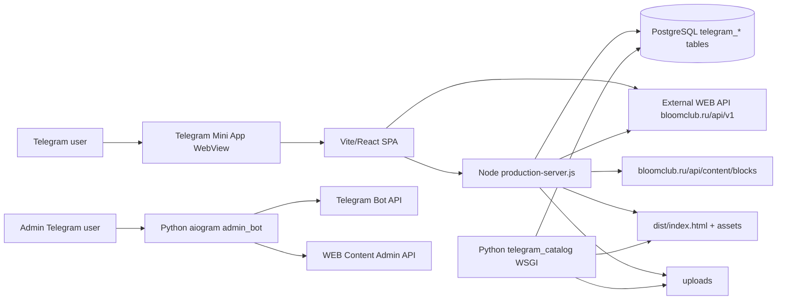
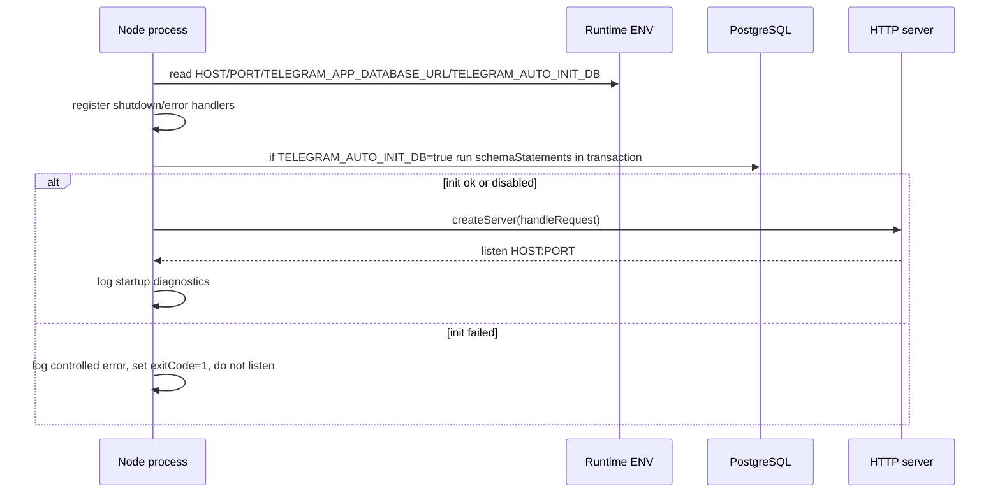
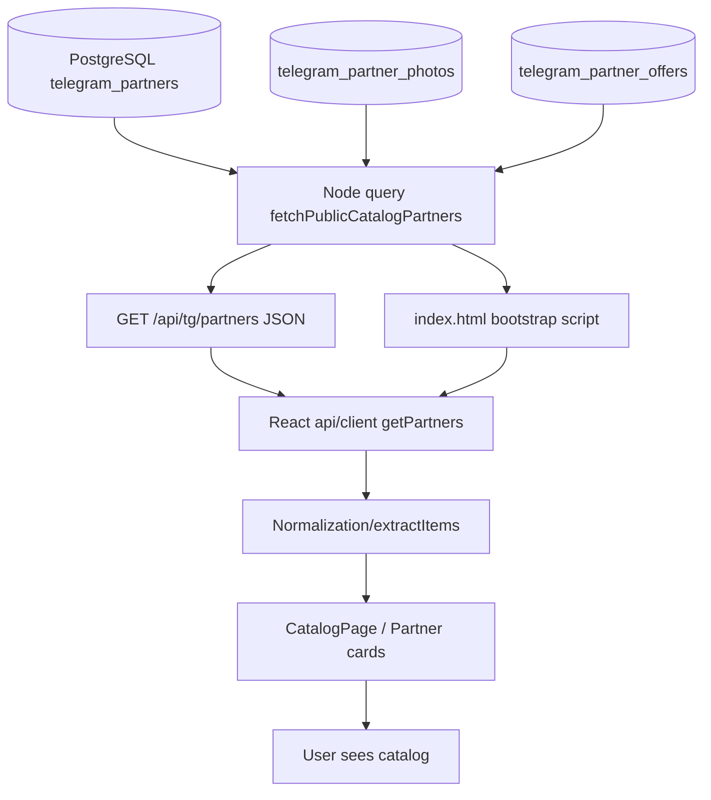
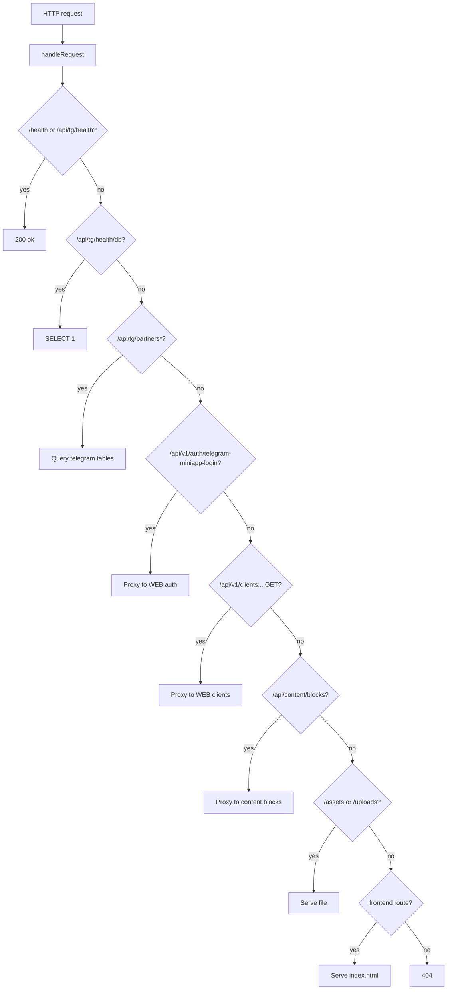
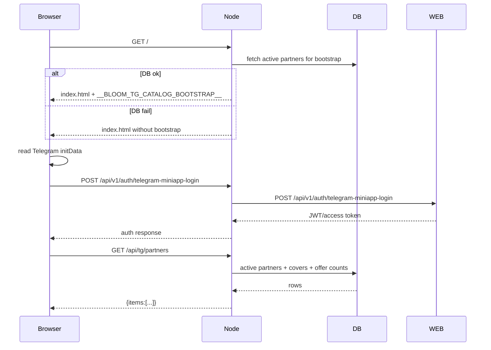

# Backend Bloom Telegram Mini App — техническая документация

> Документ описывает backend-часть репозитория без изменения логики приложения. Основан на статическом анализе Node.js production server, Python WSGI catalog backend, admin bot, frontend API-клиентов, Docker/deploy-файлов, тестов и существующих docs.

## 0. Что входит в backend в этом репозитории

Backend состоит из нескольких связанных слоёв:

1. **Node.js production server**: `telegram-mini-app/server/production-server.js`.
   - Отдаёт Vite SPA из `telegram-mini-app/dist`.
   - Отдаёт `/assets/*` и `/uploads/*`.
   - Реализует public Telegram catalog API `/api/tg/*` для production Docker-сценария.
   - Проксирует часть WEB API: Telegram login, client API и content blocks.
   - Может инициализировать PostgreSQL-схему при `TELEGRAM_AUTO_INIT_DB=true`.
2. **Python Telegram catalog WSGI backend**: `telegram-mini-app/backend/telegram_catalog/*`.
   - Отдельная WSGI API-реализация локального TG catalog.
   - Поддерживает SQLite и PostgreSQL через `TELEGRAM_APP_DATABASE_URL`.
   - Содержит public `/api/tg/*`, admin `/api/tg/admin/*` и upload `/api/content/uploads`.
   - Может запускаться напрямую или через `production_app.py`, который также отдаёт SPA.
3. **Python scripts**: `telegram-mini-app/telegram_app/scripts/*` и `telegram-mini-app/backend/*.py`.
   - Ручная инициализация БД.
   - Seed dev/test-данных.
   - Синхронизация content/admin API в TG catalog DB.
   - Проверка видимости DB env без печати секрета.
4. **Admin Telegram bot**: `admin_bot/admin_bot/*`.
   - Постоянный aiogram-процесс для управления контентом через Telegram.
   - Авторизует админов по `TELEGRAM_ADMIN_IDS`.
   - Работает с WEB Content Admin API через `ContentAdminApiClient`.
5. **External WEB backend**: `https://bloomclub.ru/api/v1` и `https://bloomclub.ru/api/content`.
   - Не реализован в этом репозитории.
   - Используется Mini App для авторизации, профиля, подписок, платежей, привязки аккаунта и legacy-каталога.
   - Используется Node как upstream для proxy endpoints.
6. **PostgreSQL/SQLite**.
   - Node production server рассчитан на PostgreSQL через `pg`.
   - Python catalog backend поддерживает SQLite/PostgreSQL.
7. **Telegram WebApp / Telegram Bot API**.
   - Mini App получает `initData` из Telegram WebApp JS API.
   - Admin bot работает через Telegram Bot API.

---

## 1. Общая архитектура backend

### 1.1 Компоненты



### 1.2 Технологии

- **Node.js ESM + native `http`**: без Express; весь роутинг вручную в `handleRequest`.
- **PostgreSQL**: Node использует пакет `pg` и schema statements для таблиц `telegram_*`.
- **Python WSGI**: стандартный WSGI app, `wsgiref.simple_server` для локального запуска.
- **Python DB layer**: `sqlite3` для SQLite и `psycopg2-binary` для PostgreSQL.
- **React/Vite**: frontend, который вызывает backend APIs.
- **aiogram + httpx**: admin Telegram bot и его HTTP-клиент к WEB admin API.
- **Docker/Compose**: production container строит frontend и запускает Node server.

### 1.3 Как взаимодействуют Node.js, Python и Telegram

- **User Mini App flow**:
  1. Telegram открывает WebView.
  2. React читает Telegram `initData`.
  3. React отправляет `POST /api/v1/auth/telegram-miniapp-login` на текущий origin или WEB base URL.
  4. Node endpoint с таким path является proxy на `https://bloomclub.ru/api/v1/auth/telegram-miniapp-login`.
  5. WEB backend валидирует Telegram `initData` и возвращает JWT/access token.
  6. React хранит token в `localStorage` и добавляет `Authorization: Bearer ...` для client API.
- **Catalog flow**:
  - При `VITE_TG_LOCAL_CATALOG_ENABLED=true` React берёт каталог из `/api/tg/partners` текущего origin или `VITE_TG_API_BASE_URL`.
  - Node отдаёт catalog из PostgreSQL.
  - Python WSGI может быть альтернативным backend для `/api/tg/*`.
- **Admin content flow**:
  - Python admin bot слушает Telegram Bot API.
  - Проверяет user id по `TELEGRAM_ADMIN_IDS`.
  - Отправляет запросы в WEB Content Admin API с `Authorization: Bearer <TELEGRAM_ADMIN_API_TOKEN>` и `X-Telegram-Admin-Token`.
- **Python scripts**:
  - Запускаются вручную для init/seed/sync.
  - Не являются постоянно работающими процессами.

### 1.4 Постоянные процессы

- Production Node server: `node telegram-mini-app/server/production-server.js` в Docker `CMD`.
- Python production WSGI app: альтернативный процесс `python -m backend.telegram_catalog.production_app` при Python deployment.
- Admin bot: `python -m admin_bot`, обычно как systemd service.
- External WEB backend и PostgreSQL — внешние сервисы.

### 1.5 Ручные процессы

- `npm run build` — сборка frontend.
- `npm run init:tg-db` / `python -m telegram_app.scripts.init_db` — ручная инициализация TG DB.
- `python -m telegram_app.scripts.seed_dev_data` или `backend/seed_telegram_catalog.py` — seed.
- `python -m telegram_app.scripts.sync_content_to_tg_catalog` — синхронизация content/admin API в TG DB.
- `python -m telegram_app.scripts.check_db_env` — безопасная проверка DB env.

---

## 2. Production Server: `telegram-mini-app/server/production-server.js`

### 2.1 Назначение

`production-server.js` — главный Node production entrypoint Docker-сборки. Он совмещает:

- HTTP server.
- Static file server для Vite assets.
- SPA fallback для frontend routes.
- Local Telegram catalog API.
- Proxy на внешние WEB APIs.
- Health/readiness/debug endpoints.
- Startup DB bootstrap при включённом env.
- Runtime diagnostics и graceful shutdown.

### 2.2 Запуск

1. Dockerfile задаёт `NODE_ENV=production`, `HOST=0.0.0.0`, `PORT=3000` и `CMD ["node", "telegram-mini-app/server/production-server.js"]`.
2. При импорте server file вычисляются constants: порт, host, project paths, DB URL, feature flags.
3. Регистрируются process handlers: `SIGTERM`, `SIGINT`, `uncaughtException`, `unhandledRejection`.
4. Вызывается `start()`.
5. `start()` выполняет optional DB auto-init.
6. Создаётся `http.createServer`.
7. Server начинает слушать `HOST:PORT` и печатает startup log.

### 2.3 Port resolution

Порт берётся из первого валидного значения:

1. `PORT`
2. `APP_PORT`
3. `HTTP_PORT`
4. `SERVER_PORT`
5. `WEB_PORT`
6. `LISTEN_PORT`
7. `CONTAINER_PORT`
8. `APP_PLATFORM_PORT`
9. `TIMEWEB_PORT`
10. fallback `3000`

Значение может быть положительным integer или URL с port. Невалидные значения логируются warning и пропускаются.

### 2.4 Middleware-like слой

Express middleware нет, но функционально есть такие слои:

- URL parsing и нормализация trailing slash.
- Request logging в первые 5 минут после старта и для health paths.
- Method guards: `GET`, `HEAD`, `POST`, `OPTIONS` в зависимости от endpoint.
- Body collection с лимитом для login proxy.
- Safe logging/redaction для секретов.
- Response helpers: JSON, text, HEAD.
- Global catch внутри `http.createServer`: если `handleRequest` падает, возвращает `500 {detail:'internal_server_error'}` или destroy response.

### 2.5 Роутинг Node server

Порядок в `handleRequest` критичен:

1. `/api/tg/health`, `/health` → non-DB health.
2. `/ready` → readiness text `ok`.
3. `/api/tg/health/db` → DB health.
4. `/debug/runtime-port` → safe runtime port diagnostics.
5. `/api/tg/status` → DB counts.
6. `/api/tg/me/verifications`, `/api/tg/me/savings` → stub 501.
7. `/api/tg/partners` и `/api/tg/partners/:id[/offers]` → local catalog.
8. `/api/content/blocks` → content blocks proxy.
9. `/api/v1/auth/telegram-miniapp-login` → Telegram login proxy.
10. `/api/v1/clients/cities`, `/api/v1/clients/me`, `/api/v1/clients/me/*` → client API proxy.
11. Любой другой `/api/*` → `404 {detail:'not_found'}`.
12. `/assets/*` → static assets.
13. `/uploads/*` → uploaded files.
14. Versioned frontend routes `/`, `/app`, `/app-v*`, `/miniapp/*`, `/telegram-app/*` → SPA.
15. Остальное → text 404.

### 2.6 Proxy

#### Telegram login proxy

- Endpoint: `POST /api/v1/auth/telegram-miniapp-login`.
- Upstream: `https://bloomclub.ru/api/v1/auth/telegram-miniapp-login`.
- Timeout: 30 секунд.
- Max body: 1 MiB.
- Пересылает JSON body как есть.
- Заголовки: `Content-Type: application/json`, `Accept: application/json`, `User-Agent`.
- Не пересылает cookies/authorization пользователя.
- Логирует start/response/error без initData/hash/token.
- На upstream response возвращает upstream status, content-type, body и request id/correlation id.
- На timeout возвращает 504, на прочую ошибку 502.

#### Client API proxy

- Endpoints:
  - `GET|HEAD|OPTIONS /api/v1/clients/cities`
  - `GET|HEAD|OPTIONS /api/v1/clients/me`
  - `GET|HEAD|OPTIONS /api/v1/clients/me/*`
- Upstream base: `https://bloomclub.ru/api/v1`.
- Target URL строится удалением prefix `/api/v1`, например `/api/v1/clients/me` → `https://bloomclub.ru/api/v1/clients/me`.
- Timeout: 30 секунд.
- Пересылает `Authorization` и `Content-Type`, если есть.
- Реально upstream method всегда `GET`, даже для HEAD; локальный response для HEAD завершается без body.
- `OPTIONS` возвращает 204 с `allow: GET, HEAD, OPTIONS`.
- POST/PATCH/DELETE не проксируются Node server и получают 405.

#### Content blocks proxy

- Endpoint: `GET|HEAD|OPTIONS /api/content/blocks`.
- Upstream: `https://bloomclub.ru/api/content/blocks` + query string.
- Timeout: 20 секунд.
- `OPTIONS` возвращает 204.
- На успешный upstream возвращает upstream status/body/content-type.
- На ошибку возвращает fallback `[]` со status 200.

### 2.7 Bootstrap и static files

- `DIST_DIR = telegram-mini-app/dist`.
- `ASSETS_DIR = dist/assets`.
- `INDEX_HTML = dist/index.html`.
- `UPLOADS_DIR = telegram-mini-app/uploads`.
- `/assets/*` и `/uploads/*` защищены от path traversal через `path.resolve` и проверку prefix.
- `serveFrontend()` читает `index.html`.
- Перед отдачей HTML пытается загрузить active partners из DB и инжектит:
  - `window.__BLOOM_TG_CATALOG_BOOTSTRAP__={items:[...]}`.
- JSON bootstrap сериализуется с экранированием `<`, `>`, `&`, U+2028, U+2029.
- Если index отсутствует, versioned routes получают fallback HTML `<!doctype html><title>Bloom Club</title><body>ok</body>` при `fallbackOnMissingIndex=true`; для прямого `serveFrontend` без fallback была бы ошибка 500.

### 2.8 SPA fallback

SPA отдаётся только для whitelist routes:

- `/`
- `/app`
- `/app-v*`
- `/miniapp`, `/miniapp/*`
- `/telegram-app`, `/telegram-app/*`

Неизвестные non-API paths не получают SPA fallback, а получают `404 Not found`.

### 2.9 Обработка ошибок

- DB errors в catalog/status/health-db превращаются в `503 database_unavailable`.
- Missing DB URL:
  - `/api/tg/partners` возвращает `{items:[]}`.
  - `/api/tg/health/db` возвращает 503 `database_not_configured`.
  - `/api/tg/status` возвращает 503 `database_not_configured`.
- Proxy errors:
  - login/client proxy возвращают 502/504 с user-friendly detail.
  - content blocks возвращает пустой массив.
- Unhandled `handleRequest` exception: 500 JSON, если headers ещё не отправлены.
- `uncaughtException`/`unhandledRejection` логируются, но process явно не завершается.
- Graceful shutdown закрывает HTTP server и PG pool, force exit через 10 секунд.

### 2.10 Диагностика Node server

- Startup log содержит host/port/pid/node_version/db_configured/auto_init/safe port env candidates/health paths.
- `/debug/runtime-port` возвращает actual port, host, whitelisted env candidates и uptime.
- Request logging ограничено первыми 5 минутами и health paths.
- Proxy diagnostics: `telegram_login_proxy_*`, `client_api_proxy_*`, `content_blocks_proxy_*`.
- Error redaction скрывает authorization/cookie/token/password/secret/database_url/postgres URLs/bearer token.

---

## 3. База данных TG catalog

### 3.1 Таблицы Node PostgreSQL schema

`production-server.js` создаёт при auto-init:

- `telegram_partners`
  - id, external_content_id, title, display_name, description, city, category, address, phone, is_active, sort_order, timestamps.
- `telegram_partner_photos`
  - id, partner_id, external_content_id, image_url, file_path, sort_order, is_cover, created_at.
- `telegram_partner_offers`
  - id, partner_id, external_content_id, title, description, conditions, base_price, member_price, discount_percent, is_active, sort_order, timestamps.
- `telegram_privilege_codes`
  - id, telegram_user_id, linked_client_id, web_client_id, linked_account_id, partner_id, offer_id, code, status, expires_at, used_at, source_platform, web_subscription_checked_at, access_snapshot, metadata.

### 3.2 Индексы

- Partners: `is_active`, `sort_order`.
- Photos: `partner_id`, `sort_order`.
- Offers: `partner_id`, `is_active`, `sort_order`.
- Privilege codes: `partner_id`, `offer_id`, `status`, `expires_at`, `telegram_user_id`, `linked_client_id`.

### 3.3 Public catalog query

Список партнёров выбирает только `p.is_active = 1`, сортирует по `sort_order ASC, id ASC`, добавляет:

- `cover`: первая photo по `is_cover DESC, sort_order ASC, id ASC`.
- `offers_count`: количество active offers.

---

## 4. Все API Node production server

### GET/HEAD `/api/tg/health`

- **Описание**: non-DB liveness endpoint.
- **Кто вызывает**: platform healthcheck, browser diagnostics, tests.
- **Параметры**: нет.
- **Проверки**: method; GET/HEAD only.
- **Таблицы**: нет.
- **Ответ**: `200 {status:'ok', service:'telegram-local-catalog'}`; HEAD без body.
- **Ошибки**: 405 для других methods.
- **После ответа**: request может быть залогирован как health path.

### GET/HEAD `/health`

То же, что `/api/tg/health`, alias для платформы.

### GET/HEAD `/ready`

- **Описание**: readiness endpoint без DB.
- **Ответ**: GET `200 text/plain ok`, HEAD `200`.
- **Ошибки**: 405.
- **Критичность**: рекомендуется для container readiness, потому что не зависит от DB.

### GET `/api/tg/health/db`

- **Описание**: проверка DB connectivity.
- **Параметры**: нет.
- **Проверки**: method, наличие `TELEGRAM_APP_DATABASE_URL`, успешный `SELECT 1`.
- **Таблицы**: нет, только DB connection.
- **Ответ**: `200 {status:'ok', database:'ok'}`.
- **Ошибки**: 405, 503 `database_not_configured`, 503 `database_unavailable`.

### GET `/debug/runtime-port`

- **Описание**: безопасная диагностика port/env.
- **Ответ**: `status`, `actual_port`, `host`, `port_candidates`, `uptime_seconds`.
- **Проверки**: method.
- **Секреты**: не выводит DB URL/admin token/full env.

### GET `/api/tg/status`

- **Описание**: статус TG catalog DB и counts.
- **Проверки**: method, DB URL, SQL aggregate query.
- **Таблицы**: `telegram_partners`, `telegram_partner_offers`.
- **Ответ**: service/database/counts/auto_init_enabled.
- **Ошибки**: 405, 503 not configured/unavailable.

### GET `/api/tg/partners`

- **Описание**: public список active partners.
- **Кто вызывает**: React catalog при local catalog enabled; bootstrap injection.
- **Параметры**: query не используется.
- **Проверки**: method; при отсутствии DB URL возвращает пустой список.
- **Таблицы**: partners, photos, offers.
- **Ответ**: `{items:[partner...]}` с normalized boolean/number полями.
- **Ошибки**: 405, 503 database_unavailable.
- **После ответа**: frontend нормализует и показывает каталог.

### GET `/api/tg/partners/:partnerId`

- **Описание**: public карточка active partner.
- **Параметры**: numeric path `partnerId`.
- **Проверки**: method, numeric regex, `p.is_active=1`.
- **Таблицы**: partners, photos, offers.
- **Ответ**: partner object с `cover` и `offers_count`.
- **Ошибки**: 404 `partner_not_found`, 405, 503.

### GET `/api/tg/partners/:partnerId/offers`

- **Описание**: active offers партнёра.
- **Параметры**: numeric partner id.
- **Проверки**: method; Node не проверяет существование active partner отдельно, просто выбирает offers по id.
- **Таблицы**: `telegram_partner_offers`.
- **Ответ**: `{items:[offer...]}`.
- **Ошибки**: 405, 503. Если партнёра нет — пустой список, не 404.

### GET/HEAD `/api/tg/me/verifications`

- **Описание**: stub пользовательских верификаций.
- **Проверки**: method.
- **Ответ**: GET `501 {detail:'user_context_not_configured'}`, HEAD 501.
- **Таблицы**: нет.
- **Frontend behavior**: при local catalog enabled 501 трактуется как empty list.

### GET/HEAD `/api/tg/me/savings`

- **Описание**: stub экономии пользователя.
- **Ответ**: GET `501 {detail:'user_context_not_configured'}`, HEAD 501.
- **Frontend behavior**: при 501 возвращает `{total:0, amount:0, items:[]}`.

### GET/HEAD/OPTIONS `/api/content/blocks`

- **Описание**: same-origin proxy для content blocks.
- **Upstream**: `https://bloomclub.ru/api/content/blocks`.
- **Параметры**: query string сохраняется.
- **Проверки**: method.
- **Ответ**: upstream status/body или fallback `[]`.
- **Ошибки**: 405 для non GET/HEAD/OPTIONS; network errors masked as `[]`.

### POST `/api/v1/auth/telegram-miniapp-login`

- **Описание**: proxy Telegram login в WEB backend.
- **Кто вызывает**: React bootstrap/auth flow.
- **Body**: JSON `{init_data: string}`; также diagnostics распознаёт `initData`/`telegram_payload`.
- **Проверки**: method, content-length, max 1 MiB.
- **Upstream**: `https://bloomclub.ru/api/v1/auth/telegram-miniapp-login`.
- **Ответ**: upstream response; frontend ищет access token в поддерживаемых полях.
- **Ошибки**: 405, 502, 504, body too large как 502 в catch.
- **После ответа**: frontend сохраняет JWT/access token.

### GET/HEAD/OPTIONS `/api/v1/clients/cities`

- **Описание**: proxy client cities.
- **Upstream**: `https://bloomclub.ru/api/v1/clients/cities`.
- **Кто вызывает**: Mini App profile/onboarding UI.
- **Headers**: `Authorization` пересылается при наличии.
- **Ошибки**: 405/502/504.

### GET/HEAD/OPTIONS `/api/v1/clients/me`

- **Описание**: proxy current client profile.
- **Upstream**: `https://bloomclub.ru/api/v1/clients/me`.
- **Кто вызывает**: Mini App profile/subscription/account UI.
- **Headers**: `Authorization` обязательно нужен upstream для приватных данных, Node только пересылает.
- **Ошибки**: upstream status или 502/504.

### GET/HEAD/OPTIONS `/api/v1/clients/me/*`

- **Описание**: proxy read-only subset для client account nested paths.
- **Примеры frontend**: `/clients/me/linking-status`, `/clients/me/verifications`, `/clients/me/savings`.
- **Важно**: Node proxy разрешает только GET/HEAD. Frontend POST/PATCH методы для linking/profile/payment идут через WEB API base напрямую, а не через этот proxy, если base URL абсолютный.

### GET/HEAD `/assets/*`

- **Описание**: static build assets.
- **Проверки**: method, path traversal protection, file exists.
- **Ответ**: stream файла с content-type.
- **Ошибки**: 404, 405.

### GET/HEAD `/uploads/*`

- **Описание**: public uploaded files.
- **Проверки**: method, path traversal protection, file exists.
- **Ответ**: stream файла.
- **Ошибки**: 404, 405.

### GET/HEAD frontend routes

- **Routes**: `/`, `/app`, `/app-v*`, `/miniapp/*`, `/telegram-app/*`.
- **Описание**: отдача SPA с optional catalog bootstrap.
- **Ошибки**: fallback HTML if index missing for versioned routes.

---

## 5. Python WSGI Telegram API `/api/tg/*`

Python API частично шире Node API и включает admin CRUD.

### GET `/api/tg/health`

- Возвращает `200 {status:'ok', service:'telegram-local-catalog'}`.
- Не зависит от DB.
- Только GET; другие методы в конце получат 404, не универсальный 405.

### GET `/api/tg/health/db`

- Выполняет `SELECT 1` через `connect()`.
- Ответ `200 {status:'ok', database:'ok'}` или 503 `database_unavailable`.

### GET `/api/tg/status`

- Считает rows в `telegram_partners` и `telegram_partner_offers`.
- Возвращает status/service/database/counts/auto_init flag/local_catalog hint.
- При DB exception возвращает 503.

### GET `/api/tg/partners`

- Возвращает `{items:list_active_partners(connection)}`.
- Использует repository layer.
- Только active partners.

### GET `/api/tg/partners/:id`

- Возвращает active partner.
- Если нет active partner — 404 `partner_not_found`.

### GET `/api/tg/partners/:id/offers`

- Сначала проверяет active partner.
- Если партнёр не найден — 404 `partner_not_found`.
- Потом возвращает active offers.

### POST `/api/tg/partners/:partnerId/offers/:offerId/verify`

- Stub проверки доступа.
- Возвращает 501 `access_check_not_configured`.
- Таблицы фактически не использует.

### GET `/api/tg/me/verifications`

- Stub user context.
- Возвращает 501 `user_context_not_configured`.

### GET `/api/tg/me/savings`

- Stub user savings.
- Возвращает 501 `user_context_not_configured`.

### Admin authorization for `/api/tg/admin/*`

- Требует `TELEGRAM_ADMIN_API_TOKEN`.
- Token можно передать:
  - `X-Telegram-Admin-Token: <token>`
  - `Authorization: Bearer <token>`
- Ошибки:
  - 501 `admin_api_token_not_configured`
  - 401 `admin_api_token_required`
  - 403 `admin_api_token_invalid`

### GET `/api/tg/admin/partners`

- Возвращает все admin partners через `list_admin_partners`.
- Использует `telegram_partners`.

### POST `/api/tg/admin/partners`

- Создаёт partner.
- Body object fields: `title` required; optional `display_name`, `description`, `city`, `category`, `address`, `phone`, `is_active`, `sort_order`.
- Defaults: `is_active=true`, `sort_order=100`.
- Ошибки validation: `*_required`, `*_must_be_string`, `*_must_be_boolean`, `*_must_be_number`.
- Ответ 201 created partner.

### PATCH `/api/tg/admin/partners/:id`

- Частично обновляет partner.
- Если id не найден — 404 `partner_not_found`.
- При изменениях обновляет `updated_at`.

### DELETE `/api/tg/admin/partners/:id`

- Soft delete: `is_active=0`, `updated_at=CURRENT_TIMESTAMP`.
- Возвращает partner или 404.

### GET `/api/tg/admin/partners/:id/photos`

- Проверяет существование partner любым статусом.
- Возвращает photos.
- Таблица: `telegram_partner_photos`.

### POST `/api/tg/admin/partners/:id/photos`

- Создаёт photo.
- Body: `image_url` required, optional `file_path`, `sort_order`, `is_cover`.
- Если `is_cover=true`, сбрасывает cover у других photos партнёра.
- Ответ 201 photo.

### PATCH `/api/tg/admin/photos/:photoId`

- Частично обновляет photo.
- Если `is_cover=true`, сбрасывает остальные covers.
- Ответ photo или 404 `photo_not_found`.

### DELETE `/api/tg/admin/photos/:photoId`

- Удаляет photo hard delete.
- Ответ `{detail:'photo_deleted', id}` или 404.

### GET `/api/tg/admin/partners/:id/offers`

- Проверяет partner.
- Возвращает admin offers, включая inactive.

### POST `/api/tg/admin/partners/:id/offers`

- Создаёт offer.
- Body: `title` required; optional `description`, `conditions`, `base_price`, `member_price`, `discount_percent`, `is_active`, `sort_order`.
- Money validation: finite number/null; `member_price > 0`; other money неотрицательные.
- Ответ 201 offer.

### PATCH `/api/tg/admin/offers/:offerId`

- Частично обновляет offer.
- Обновляет `updated_at`.
- Ответ offer или 404.

### DELETE `/api/tg/admin/offers/:offerId`

- Soft delete offer: `is_active=0`.
- Ответ offer или 404.

### `/api/content/uploads` in Python WSGI

Хотя path не `/api/tg/*`, это backend upload endpoint:

- Method: POST only.
- Authorization: same admin token requirement.
- Content-Type: `multipart/form-data` with part `file`.
- Allowed extensions/content-types: `.jpg`, `.jpeg`, `.png`, `.webp`.
- Max file: 10 MiB; request max: 11 MiB.
- Saves file to `telegram-mini-app/uploads/content/<uuid>.<ext>`.
- Returns `url`, `path`, `filename`, `content_type`, `size`.
- Public base URL hardcoded: `https://bloomclub.ru`.

---

## 6. WEB API `/api/v1/*`

### 6.1 WEB API реализован вне репозитория

Основной WEB backend не находится в этом репозитории. Здесь есть только:

- Frontend client definitions.
- Node proxy для ограниченного набора GET endpoints и login.
- Admin bot client для WEB Content Admin API.

### 6.2 Mini App WEB API calls

Frontend client uses default base `https://bloomclub.ru/api/v1`:

- `POST /auth/telegram-miniapp-login` — Telegram initData login; в Node same-origin proxy path выглядит как `/api/v1/auth/telegram-miniapp-login`.
- `GET /clients/catalog/partners` — legacy catalog if TG local catalog disabled.
- `GET /clients/partners/:partnerId/offers` — legacy offers.
- `POST /clients/partners/:partnerId/verify` — legacy offer verification.
- `GET /clients/cities` — city list.
- `GET /clients/me` — profile.
- `PATCH /clients/me` — update profile.
- `GET /clients/me/linking-status` — account linking state.
- `POST /clients/me/linking/start` — start linking.
- `POST /clients/me/linking/confirm` — confirm linking.
- `POST /clients/me/trial-subscription` — activate trial.
- `GET /clients/me/verifications` — WEB verifications when local catalog disabled.
- `GET /clients/me/savings` — WEB savings when local catalog disabled.
- `POST /clients/me/payment-requests` — create payment request.
- `POST /clients/me/payment-requests/:id/mark-paid` — mark paid.

### 6.3 Which `/api/v1/*` are Node proxy

Only these Node same-origin paths are proxied:

- `POST /api/v1/auth/telegram-miniapp-login`
- `GET|HEAD|OPTIONS /api/v1/clients/cities`
- `GET|HEAD|OPTIONS /api/v1/clients/me`
- `GET|HEAD|OPTIONS /api/v1/clients/me/*`

Everything else under `/api/v1/*` on Node origin returns 404 or 405 depending on path/method. Write operations are expected to use the absolute WEB API base URL, not Node proxy.

---

## 7. Bootstrap: первый запуск приложения

### 7.1 Server bootstrap



Critical:

- Valid port/host.
- If auto-init enabled: DB URL, DB connectivity, schema permissions.
- If auto-init disabled: DB may be absent and non-DB health still works.

Non-critical:

- Catalog bootstrap injection may fail; frontend HTML is still served.
- Content blocks proxy may fail; frontend receives `[]`.

### 7.2 Frontend Mini App bootstrap

Typical order inferred from client code:

1. Load `index.html` from Node/Python production app.
2. Optional `window.__BLOOM_TG_CATALOG_BOOTSTRAP__` is already present if server DB query succeeded.
3. React starts and startup trace records boot stages.
4. Telegram WebApp bridge reads `initData` / launch payload.
5. If production and no Telegram payload, auth cannot complete.
6. `loginWithTelegram()` posts `{init_data}` to `/api/v1/auth/telegram-miniapp-login`.
7. WEB backend returns JWT/access token.
8. Token stored under `bloom_club_tma_auth`.
9. App loads profile/cities/linking/subscription data through WEB API/client proxy.
10. Catalog page loads:
    - from bootstrap data if available,
    - then `/api/tg/partners` if local catalog enabled,
    - otherwise `/clients/catalog/partners`.

### 7.3 What may fail without killing app

- Catalog bootstrap DB read.
- Content blocks fetch.
- `/api/tg/me/verifications` and `/api/tg/me/savings` are 501 and frontend uses empty fallbacks.
- Local catalog disabled: app falls back to WEB legacy catalog.

### 7.4 What is critical

- Telegram login for personalized app features.
- WEB backend availability for auth/profile/subscription/account linking.
- DB availability if local catalog is the only catalog source and no bootstrap/fallback data exists.
- Correct `VITE_*` values at build time.

---

## 8. Авторизация

### 8.1 Telegram `initData`

- `initData` is produced by Telegram WebApp environment.
- Frontend sends it as JSON field `init_data`.
- Node does **not** validate Telegram signature itself; it proxies the body to WEB backend.
- WEB backend is responsible for Telegram signature/hash validation and user identity mapping.
- Diagnostics redact initData/hash/signature.

### 8.2 JWT / access token

- WEB backend returns auth response with token in one of supported fields.
- Frontend extracts token and stores it in `localStorage` key `bloom_club_tma_auth`.
- Later requests include `Authorization: Bearer <token>`.
- Node client API proxy preserves Authorization header for allowed GET paths.

### 8.3 Client API

- Private WEB APIs require Bearer token.
- Node proxy does not authenticate; it forwards token.
- For local TG catalog public endpoints, no user auth is currently enforced.
- User-specific TG endpoints are not configured and return 501.

### 8.4 Admin authorization

- Python `/api/tg/admin/*` and `/api/content/uploads` require `TELEGRAM_ADMIN_API_TOKEN`.
- Admin bot itself restricts Telegram users by `TELEGRAM_ADMIN_IDS`.
- Admin bot then uses `TELEGRAM_ADMIN_API_TOKEN` against WEB admin API.

---

## 9. Каталог: путь данных Postgres → Node → API → React → экран



Detailed path:

1. Data is inserted/updated by scripts, Python admin endpoints, or external sync.
2. Tables store partners/photos/offers with active flags.
3. Node selects active partners and computes cover/offers_count.
4. API returns `{items:[...]}`.
5. React `getPartners()` chooses source:
   - `tg_local_catalog` if `VITE_TG_LOCAL_CATALOG_ENABLED=true`.
   - `web_legacy_catalog` otherwise.
6. React handles retries and catalog diagnostics.
7. UI pages render partners and offers.

---

## 10. Все ENV

| ENV | Кто читает | Назначение | Обязателен | Default | Используется сейчас |
|---|---|---|---|---|---|
| `PORT` | Node, Python production app, Docker | Listen port | Production yes-ish | Node `3000`, Python `8000`, Docker `3000` | Да |
| `APP_PORT` | Node | Alternate port candidate | Нет | none | Да, если задан |
| `HTTP_PORT` | Node | Alternate port candidate | Нет | none | Да |
| `SERVER_PORT` | Node | Alternate port candidate | Нет | none | Да |
| `WEB_PORT` | Node | Alternate port candidate | Нет | none | Да |
| `LISTEN_PORT` | Node | Alternate port candidate | Нет | none | Да |
| `CONTAINER_PORT` | Node | Alternate port candidate | Нет | none | Да |
| `APP_PLATFORM_PORT` | Node | Alternate port candidate | Нет | none | Да |
| `TIMEWEB_PORT` | Node | Alternate port candidate | Нет | none | Да |
| `HOST` | Node, Docker | Bind host | Нет | `0.0.0.0` | Да |
| `HOSTNAME` | Node diagnostics | Safe runtime diagnostic only | Нет | OS/container | Только диагностика |
| `NODE_ENV` | Node diagnostics/Docker/Vite ecosystem | Runtime mode | Нет | Docker `production` | Да |
| `TELEGRAM_APP_DATABASE_URL` | Node, Python backend, scripts | TG catalog DB URL | Required for DB-backed catalog | Python default `sqlite:///./telegram_app.db`; Node empty disables DB | Да |
| `TELEGRAM_AUTO_INIT_DB` | Node, Python backend | Run idempotent schema init on startup if exact `true` | Нет | false | Да |
| `TELEGRAM_ADMIN_API_TOKEN` | Python backend, scripts, admin bot, compose | Admin shared secret | Required for admin/upload/sync/bot | none | Да |
| `TELEGRAM_BOT_TOKEN` | admin_bot config | Telegram Bot API token | Да for bot | none | Да |
| `TELEGRAM_ADMIN_IDS` | admin_bot config | Allowed Telegram admin IDs comma-separated | Да for bot | none | Да |
| `WEB_API_BASE_URL` | admin_bot config | WEB Content Admin API base | Да for bot | README example `https://bloomclub.ru/api/v1` | Да |
| `WEB_CONTENT_API_BASE_URL` | sync script | WEB content/admin API base for sync | Да for sync | none | Да in script |
| `VITE_API_BASE_URL` | frontend build, Docker ARG/ENV | WEB API base | Нет | `https://bloomclub.ru/api/v1` | Да, build-time |
| `VITE_TG_LOCAL_CATALOG_ENABLED` | frontend build | Switch local TG catalog | Нет | false unless exact `true` | Да |
| `VITE_TG_API_BASE_URL` | frontend build | Optional TG API origin | Нет | empty same-origin | Да |
| `VITE_CONTENT_API_BASE_URL` | frontend build | Content API base for non-block endpoints | Нет | `https://bloomclub.ru/api/content` | Да |
| `VITE_APP_VERSION` | frontend buildInfo | Version override | Нет | package version | Да |
| `VITE_APP_BUILD_TIMESTAMP` | frontend buildInfo | Build timestamp override | Нет | current time fallback | Да |
| `TG_ADMIN_TOKEN` | docs curl examples | Local shell convenience for admin curl | Нет | none | Docs only |

Security notes:

- Never put `TELEGRAM_ADMIN_API_TOKEN`, bot token, DB URL, JWT, or Telegram initData in `VITE_*` env.
- `VITE_*` values are compiled into frontend bundle.
- Node debug endpoint intentionally prints only whitelisted safe env names.

---

## 11. Интеграции

### Telegram

- Mini App: Telegram WebApp provides initData to frontend.
- Login validation: delegated to external WEB backend.
- Admin Bot: aiogram process talks to Telegram Bot API and receives admin commands/callbacks.

### Postgres

- Node: `pg.Pool({connectionString, max:5, idleTimeoutMillis:10000})`.
- Python: `psycopg2-binary` path through database helper.
- Schema is idempotently created by Node/Python init paths.

### WEB Backend

- Auth/login: `https://bloomclub.ru/api/v1/auth/telegram-miniapp-login`.
- Client API: `https://bloomclub.ru/api/v1/clients/...`.
- Content blocks: `https://bloomclub.ru/api/content/blocks`.
- Admin content API for bot: base from `WEB_API_BASE_URL`.

### Uploads

- Node serves `/uploads/*` from `telegram-mini-app/uploads`.
- Python upload endpoint writes to `uploads/content`.
- Python production app also serves `/uploads/*`.

### NGINX / platform proxy

- Not configured directly in repo.
- Expected to route external traffic to Node/Python process on configured port.
- Healthcheck should use `/ready` or `/health`, not DB health unless DB readiness is required.

### Node

- Main Docker production runtime.
- Proxies external APIs and serves frontend.

### Python

- Alternative production WSGI backend.
- Admin bot and operational scripts.

---

## 12. Диагностика

### 12.1 Startup trace

Frontend has startup trace modules and tests around `startupTrace`. It records bootstrap stages and module import timeout. Node startup log records server-level facts.

### 12.2 Runtime diagnostics

- Node `/debug/runtime-port`.
- Node startup safe env candidate log.
- Request logs for first 5 minutes and health paths.
- Proxy start/response/error logs.
- Safe error redaction.

### 12.3 Error boundary

Frontend has `RuntimeErrorBoundary` component that catches runtime UI errors and shows fallback instead of white screen. Backend documentation relevance: backend failures are surfaced through API errors and frontend boundary/diagnostics.

### 12.4 Bootstrap diagnostics

- Telegram login diagnostics include request URL/path/origin/status/request id/fetch phase/elapsed/attempt/payload presence without logging payload itself.
- Catalog diagnostics include source, URL, status, request id, phase, elapsed, attempt.

### 12.5 Catalog diagnostics

- Server logs `catalog bootstrap unavailable` if HTML injection DB read fails.
- Client throws `CatalogLoadError` with source `tg_local_catalog` or `web_legacy_catalog`.
- Tests assert secrets are not leaked in diagnostics.

---

## 13. Mermaid schemes

### 13.1 Architecture

```mermaid
flowchart TB
  subgraph Client
    TMA[Telegram WebView]
    React[React SPA]
  end
  subgraph NodeProduction[Node production-server.js]
    Router[Manual router]
    Static[Static assets/uploads]
    TgApi[/api/tg public API]
    Proxy[WEB API proxies]
    Bootstrap[Catalog bootstrap injection]
  end
  subgraph PythonBackend[Python]
    WSGI[telegram_catalog WSGI]
    Bot[admin_bot]
    Scripts[init/seed/sync scripts]
  end
  PG[(PostgreSQL/SQLite TG catalog)]
  WEB[External WEB backend]
  Telegram[Telegram Bot/WebApp]

  Telegram --> TMA --> React
  React --> Router
  Router --> Static
  Router --> TgApi --> PG
  Router --> Proxy --> WEB
  Bootstrap --> PG
  WSGI --> PG
  WSGI --> Static
  Scripts --> PG
  Bot --> Telegram
  Bot --> WEB
```

### 13.2 API routing



### 13.3 Bootstrap



### 13.4 Catalog flow

```mermaid
flowchart LR
  AdminSource[Admin/API/Sync] --> DB[(telegram_* tables)]
  DB --> NodeList[fetchPublicCatalogPartners]
  NodeList --> ApiList[GET /api/tg/partners]
  ApiList --> ClientGet[getPartners]
  ClientGet --> Normalize[normalize/extract items]
  Normalize --> CatalogPage[CatalogPage]
  CatalogPage --> PartnerPage[PartnerPage]
  PartnerPage --> Offers[GET /api/tg/partners/:id/offers]
  Offers --> UI[User UI]
```



---

## 14. Что ещё недостаточно документировано

1. **External WEB backend contracts**: exact schemas/status codes for `/api/v1/*` are inferred from frontend, not from server implementation.
2. **Telegram login validation internals**: signature validation happens outside this repo.
3. **JWT payload/expiration/refresh policy**: not implemented here.
4. **Production NGINX/Timeweb routing config**: only expectations are documented; actual platform config is external.
5. **Privilege verification business logic**: local `/verify`, `/me/verifications`, `/me/savings` are stubs.
6. **Admin bot full UX state machine**: bot handlers are large; this document covers integration/backend API role, not every callback transition.
7. **Content Admin API schemas**: admin bot client normalizes many resources, but upstream implementation is external.
8. **Monitoring/alerting**: logs exist, but no metrics/alerting pipeline is configured in repo.

---

## 15. Обнаруженные проблемы и риски

1. **Potential syntax issue in Node server**: after `getUptimeSeconds()` in `production-server.js` there is an extra closing brace in the inspected file. This document does not fix it because task explicitly forbids code changes.
2. **Node local catalog lacks `/api/tg/partners/:partnerId/offers/:offerId/verify`** while frontend calls it when local catalog is enabled; Node currently returns 404 for that path, Python WSGI returns 501.
3. **Node `/api/tg/partners/:id/offers` does not 404 when partner is missing**, unlike Python WSGI; it returns empty items.
4. **Node client API proxy is read-only**, but frontend has write operations to `/clients/me`, linking, payment and trial endpoints. This is fine only if frontend uses absolute WEB API base, but same-origin WEB API expectations would fail for writes.
5. **Content blocks proxy masks upstream failures as empty array**, useful for UX but can hide production content outages.
6. **Python and Node API behavior differs** for method handling and some 404/501 cases.
7. **Hardcoded production URLs** exist in Node/Python code (`bloomclub.ru`) rather than env-configurable values.
8. **Local TG user context is not implemented**: savings/verifications/access checks are placeholders.
