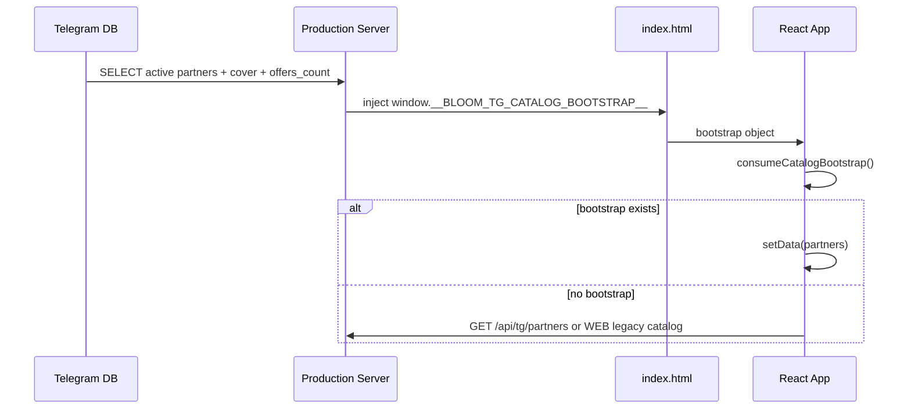
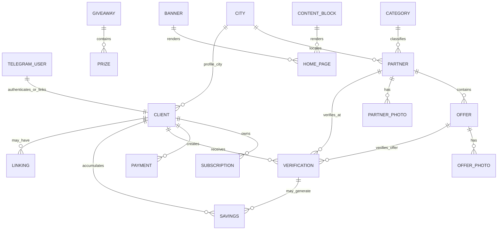

# Полный жизненный цикл данных Bloom Club

> Документ создан как отдельный слой анализа data flow. Существующий код проекта не изменялся: анализ выполнен по frontend, production server, Python backend, Telegram catalog, WEB-интеграциям, Admin Bot, sync scripts, database и Content API.

## 1. Границы анализа и карта систем

### 1.1. Системы

| Система | Роль в данных | Основные файлы/узлы |
|---|---|---|
| Frontend Telegram Mini App | Читает bootstrap, WEB API, TG catalog, Content API; хранит JWT в Local Storage; держит UI-state | `src/App.tsx`, `src/api/client.ts`, `src/content/*`, `src/pages/*` |
| Production Server Node | Отдаёт SPA, `/api/tg/*`, proxy login/client/content, uploads, bootstrap injection | `server/production-server.js` |
| Python backend / WSGI | Локальный Telegram Catalog API и admin API | `backend/telegram_catalog/app.py`, `repository.py`, `database.py` |
| Telegram Catalog DB | Локальная БД каталога партнёров/офферов/кодов | `telegram_partners`, `telegram_partner_photos`, `telegram_partner_offers`, `telegram_privilege_codes` |
| WEB Backend | Source of Truth для клиента, подписки, оплат, linking, savings, legacy catalog, Content CMS | внешние `https://bloomclub.ru/api/v1`, `https://bloomclub.ru/api/content` |
| Content API | Публичный и admin CMS для blocks/home blocks/partners/offers/media/cities/categories/banners/giveaways | `clientContentApi.ts`, `admin_bot/web_api.py`, sync script |
| Admin Bot | UI администратора поверх Content Admin API | `admin_bot/admin_bot/bot.py`, `web_api.py`, `states.py`, `keyboards.py` |
| Sync Scripts | Переносят WEB Content CMS catalog в TG DB | `telegram_app/scripts/sync_content_to_tg_catalog.py` |

### 1.2. Общая data-flow карта

```mermaid
flowchart TD
  Admin[Admin in Telegram] --> AdminBot[Admin Bot]
  AdminBot --> ContentAdmin[WEB Content Admin API]
  ContentAdmin --> WebDB[(WEB DB / CMS)]
  Sync[Sync Script] --> ContentAdmin
  Sync --> TgDB[(Telegram Catalog DB)]
  TgDB --> Prod[Production Server / Python TG API]
  Prod --> Bootstrap[Catalog Bootstrap Injection]
  Prod --> TgApi[/api/tg/*]
  WebDB --> WebApi[WEB Backend API]
  WebApi --> ProdProxy[Production Server Proxies]
  ProdProxy --> Frontend[React App]
  Bootstrap --> Frontend
  TgApi --> Frontend
  ContentPublic[Content Public API] --> ProdContentProxy[/api/content/blocks]
  ContentPublic --> Frontend
  ProdContentProxy --> Frontend
  Telegram[Telegram WebApp initData] --> Frontend
  Frontend --> LoginProxy[/api/v1/auth/telegram-miniapp-login]
  LoginProxy --> WebApi
  WebApi --> JWT[JWT]
  JWT --> LocalStorage[(localStorage bloom_club_tma_auth)]
```

## 2. Сквозные механизмы переноса данных

### 2.1. Bootstrap каталога

`Production Server` читает активных партнёров из `telegram_partners`, вычисляет `cover` и `offers_count`, сериализует payload и внедряет `window.__BLOOM_TG_CATALOG_BOOTSTRAP__`. Frontend читает bootstrap один раз, помечает `consumed=true`, очищает items и использует данные вместо сетевого запроса каталога. Если bootstrap отсутствует или пустой, Frontend делает fetch через `getPartners()`.



### 2.2. JWT и Telegram initData

`initData` появляется в Telegram WebApp. Frontend отправляет его на same-origin `/api/v1/auth/telegram-miniapp-login`; production server проксирует body в WEB backend login endpoint. WEB backend возвращает token/access token. Frontend сохраняет token в `localStorage` под ключом `bloom_club_tma_auth` и добавляет `Authorization: Bearer` к последующим клиентским запросам.

### 2.3. Retry, fallback, recovery

| Механизм | Где | Что делает |
|---|---|---|
| GET retry | `request()` в frontend API client | Повторяет только GET при Network/Timeout/502/503/504 |
| Telegram login retry | `loginWithTelegram()` | 1 повтор при сетевой/timeout/502/503/504 ошибке |
| Catalog bootstrap fallback | `App.tsx` | Использует bootstrap, иначе `getPartners()` |
| Catalog source fallback | `getPartners()` | TG local catalog или WEB legacy catalog в зависимости от env |
| Content fallback | `ContentProvider` | При ошибке оставляет пустые blocks/homeBlocks и UI fallback-тексты |
| Content blocks proxy fallback | production server | При ошибке `/api/content/blocks` возвращает `[]` |
| Startup recovery | `stateRecovery.ts`, diagnostics/watchdog | Показывает диагностические состояния запуска; не восстанавливает серверные данные |
| Image fallback | pages/components | Ошибки изображений скрываются локальным state failed images |

## 3. Жизненный цикл сущностей

### 3.1. Client

**Назначение:** профиль участницы клуба и основной контейнер персонального состояния.

| Атрибут | Значение |
|---|---|
| Источник появления | WEB Backend после Telegram login/JWT |
| Создаёт | WEB Backend при login или existing account linking; точный алгоритм не виден в repo |
| Обновляет | WEB Backend через клиентские profile endpoints; frontend имеет patch type, но в текущем UI явного submit update не обнаружен |
| Удаляет | Не определено в repo |
| Читает | Frontend `getProfile()`, страницы Home/Profile/Subscription/Partner, linking onboarding |
| Хранится | WEB DB; в frontend только React state `data.profile` |
| API | `/api/v1/clients/me` через production proxy на `/clients/me` |
| Функции | `getProfile`, bootstrap flow, refresh profile/subscription/linking |
| React state | `data.profile`, local form state `name/phone/email/city` в ProfilePage |
| Pages/components | HomePage, ProfilePage, SubscriptionPage, PartnerPage, AccountLinkingOnboarding |
| Context | Нет отдельного profile context; данные прокидываются props из App |
| Bootstrap | Нет |
| Diagnostics | `api_request_*`, `client_api_proxy_*`, `app_bootstrap_*` |
| Cache/storage | JWT в Local Storage; сам Client не кэшируется |
| Sync | Нет |
| Retry/recovery/fallback | GET retry; UI fallback для имени/города |

Схема:

```text
Telegram initData
↓
Frontend loginWithTelegram
↓
Production login proxy
↓
WEB Backend
↓
JWT in localStorage
↓
GET /clients/me
↓
Production client proxy
↓
React App data.profile
↓
Home/Profile/Subscription/Partner UI
```

### 3.2. Subscription

**Назначение:** право доступа клиента к привилегиям.

| Атрибут | Значение |
|---|---|
| Источник | WEB Backend |
| Создаёт | WEB Backend при покупке/активации trial |
| Обновляет | WEB Backend при trial/payment; frontend вызывает trial/payment endpoints |
| Удаляет | Не определено |
| Читает | `getSubscription()`, `isSubscriptionActive()`, `getSubscriptionEnd()` |
| Хранится | WEB DB; frontend `data.subscription` |
| API | GET `/clients/me/subscription`, POST `/clients/me/trial`, payment endpoints |
| React state | `data.subscription`, `trialMessage`, local trial loading states |
| Pages | HomePage, SubscriptionPage, PartnerPage, ProfilePage |
| Bootstrap | Нет |
| Diagnostics | API request/client proxy/bootstrap logs |
| Cache/storage | Нет, кроме JWT |
| Retry | GET retry; POST без generic retry |
| Fallback | UI считает inactive при отсутствии валидных дат/status |

```text
Payment/Trial action
↓
WEB Backend
↓
WEB DB subscription
↓
GET /clients/me/subscription
↓
React data.subscription
↓
Access gating for Partner verification + subscription UI
```

### 3.3. Partner

**Назначение:** организация-партнёр клуба, карточка каталога и родитель offer/photo.

| Атрибут | Значение |
|---|---|
| Источник | WEB Content CMS или Telegram admin API/manual TG DB |
| Создаёт | Admin Bot через Content Admin API; Python admin API может создать напрямую в TG DB; seed scripts могут создать demo данные |
| Обновляет | Admin Bot/Content API; sync upsert; Python admin patch; production auto-init только schema |
| Удаляет | Content API hide/publish неизвестно; TG admin soft-delete (`is_active=0`); sync `--prune` soft-deactivates missing external ids |
| Читает | Frontend catalog/home/partner pages; production bootstrap; Python/Node TG API; sync script |
| Хранится | WEB CMS DB и/или TG DB `telegram_partners`; frontend `data.partners` |
| API | WEB `/admin/partners`, public/legacy catalog `/clients/catalog/partners`, TG `/api/tg/partners`, `/api/tg/partners/:id` |
| Функции | `map_partner`, `upsert`, `list_active_partners`, `fetchPublicCatalogPartners`, `getPartners`, partner display utils |
| React state | `data.partners`, `selectedPartner`, catalog filters |
| Pages/components | HomePage partner list, CatalogPage cards, PartnerPage detail |
| Context | ContentContext only for surrounding texts, not partner data |
| Bootstrap | Yes: catalog bootstrap items |
| Diagnostics | catalog bootstrap/start/load, `catalog_request_*`, proxy logs |
| Cache/storage | Bootstrap once in window; no persistent partner cache |
| Sync | Yes WEB Content CMS → TG DB |
| Retry/recovery/fallback | Bootstrap fallback to fetch; catalog fetch retry; media URL normalization |

```text
Partner
↓
Admin Bot / Content Admin API / TG Admin API
↓
WEB CMS DB or Telegram DB
↓
Sync Script upsert by external_content_id
↓
Telegram DB telegram_partners
↓
Production Server /api/tg/partners + Bootstrap
↓
React data.partners
↓
Home partner strip / Catalog card / Partner page
```

### 3.4. Offer

**Назначение:** конкретная привилегия/услуга партнёра, может быть объектом verification.

| Атрибут | Значение |
|---|---|
| Источник | WEB Content CMS offer или TG admin API/manual TG DB |
| Создаёт | Admin Bot Content API; Python admin API `create_offer`; sync creates from WEB offers |
| Обновляет | Admin Bot/Content API; sync; Python admin patch |
| Удаляет | Python admin soft-delete; sync `--prune` soft-deactivates |
| Читает | PartnerPage via `getPartnerOffers`; production/Python TG API |
| Хранится | WEB CMS DB; TG DB `telegram_partner_offers`; frontend `partnerOffers` |
| API | `/api/tg/partners/:id/offers`, WEB `/clients/catalog/partners/:id/offers` equivalent via `getPartnerOffersPath` |
| Функции | `map_offer`, `list_active_offers`, `getPartnerOffers`, offer display helpers in PartnerPage |
| React state | `partnerOffers`, `partnerOffersStatus`, `partnerOffersError`, `selectedOffer`, `loadingOfferId` |
| Pages | PartnerPage |
| Bootstrap | Partner list may include embedded `offers`; detailed offer list fetched separately |
| Diagnostics | partner offer load diagnostic state |
| Cache/storage | In-memory only |
| Sync | Yes |
| Retry/fallback | GET retry; empty offers UI fallback |

```text
Offer
↓
Admin Bot / Content API
↓
WEB CMS DB
↓
Sync Script map_offer
↓
telegram_partner_offers
↓
GET /api/tg/partners/:id/offers
↓
React partnerOffers
↓
PartnerPage offer card
↓
Verification action
```

### 3.5. Category

**Назначение:** классификация партнёров и фильтр каталога.

| Атрибут | Значение |
|---|---|
| Источник | Content CMS references or free-text category field in partner |
| Создаёт/обновляет | Admin Bot via `/admin/categories` |
| Удаляет | Hide/publish through Content API; hard delete не виден |
| Читает | Sync (`category`, `category_title`, nested category), frontend display/filter utils |
| Хранится | WEB CMS reference table; in TG DB denormalized text `telegram_partners.category` |
| API | `/admin/categories`; partner catalog payloads |
| React state | `selectedCategory` in CatalogPage; computed category list |
| Pages | CatalogPage, PartnerPage, Home indirect |
| Bootstrap | As partner field inside bootstrap |
| Cache/storage | No |
| Sync | Denormalized during `map_partner` |

```text
Category reference
↓
Admin Bot
↓
Content API / WEB DB
↓
Partner.category or category_id
↓
Sync map_partner
↓
telegram_partners.category
↓
Bootstrap / /api/tg/partners
↓
Catalog filter selectedCategory
```

### 3.6. City

**Назначение:** город клиента и/или партнёра.

| Атрибут | Значение |
|---|---|
| Источник | Content CMS city reference; WEB client profile city; partner city text |
| Создаёт/обновляет | Admin Bot via `/admin/cities`; WEB backend for client profile |
| Удаляет | Hide/publish for reference; client city deletion не видно |
| Читает | Frontend profile/home/catalog; sync maps partner city |
| Хранится | WEB DB; TG DB denormalized `telegram_partners.city`; frontend state/profile form |
| API | `/admin/cities`, `/clients/cities`, `/clients/me`, catalog payloads |
| React state | `data.profile.city`, ProfilePage `city`, partner display city, catalog filters text |
| Bootstrap | Partner city inside catalog bootstrap |
| Sync | Yes for partner city |

```text
City reference/profile
↓
WEB Backend / Content CMS
↓
Partner payload or Client profile
↓
Sync to telegram_partners.city OR GET /clients/me
↓
React data.partners/data.profile
↓
Home/Profile/Catalog/Partner UI
```

### 3.7. Content Block

**Назначение:** текстовые строки и home blocks для управляемого контента.

| Атрибут | Значение |
|---|---|
| Источник | WEB Content CMS |
| Создаёт/обновляет | Admin Bot `/admin/blocks`; Content Admin API |
| Удаляет | Hide/publish, update active flags; hard delete не виден |
| Читает | Frontend `ContentProvider`; Admin Bot lists/edits |
| Хранится | WEB CMS DB; frontend `blocks` and `homeBlocks` React state |
| API | Public `/api/content/blocks`, home blocks endpoint; admin `/admin/blocks` |
| Functions | `getContentBlocks`, `getHomeBlocks`, `normalizeContentBlock`, `normalizeHomeBlock`, `mapBlocks` |
| Context | `ContentContext`, `useContent`, `useContentText` |
| Pages/components | Almost all pages use `useContentText`; HomePage uses `homeBlocks` |
| Bootstrap | No |
| Diagnostics | `content_request_*`, content proxy logs |
| Cache/storage | No persistent cache |
| Fallback | Fallback strings passed to `useContentText`; proxy returns `[]` on failure |

```text
Content Block
↓
Admin Bot
↓
WEB Content Admin API
↓
WEB CMS DB
↓
Public Content API / Production content proxy
↓
ContentProvider blocks/homeBlocks
↓
useContentText / HomePage dynamic blocks
```

### 3.8. Banner

**Назначение:** управляемый рекламный/hero/home контент, отдельный CMS resource в Admin Bot и возможно home block type `banner`.

| Атрибут | Значение |
|---|---|
| Источник | WEB Content CMS |
| Создаёт/обновляет | Admin Bot `create_banner`, `update_banner`, upload media |
| Удаляет | hide/publish через active flag |
| Читает | Admin Bot; frontend через home blocks если Content API отдаёт block type `banner` |
| Хранится | WEB CMS DB; media in uploads/CDN |
| API | `/admin/banners`, `/admin/banners/:id`; public home blocks |
| React state | `homeBlocks` if banner rendered as home block |
| Pages | HomePage |
| Bootstrap | No |
| Cache/storage | No |
| Fallback | Home default sections remain if no home blocks |

```text
Banner
↓
Admin Bot + upload_file
↓
Content Admin API
↓
WEB CMS DB/media
↓
Content public home blocks
↓
ContentProvider.homeBlocks
↓
HomePage banner/home section
```

### 3.9. Prize

**Назначение:** приз/элемент розыгрыша. В коде представлен как giveaway item.

| Атрибут | Значение |
|---|---|
| Источник | WEB Content CMS giveaways/items |
| Создаёт/обновляет | Admin Bot `create_giveaway_item`, `update_giveaway_item` |
| Удаляет | hide/publish item via `is_active` |
| Читает | Admin Bot; frontend напрямую не читает prize model, только может увидеть giveaway/home block |
| Хранится | WEB CMS DB |
| API | `/admin/giveaways/:id/items`, `/admin/giveaway-items/:id` |
| React state | Нет явного prize state |
| Bootstrap | Нет |
| Fallback | Невозможно определить публичный rendering prize без WEB API схемы |

```text
Prize / Giveaway Item
↓
Admin Bot
↓
Content Admin API
↓
WEB CMS DB
↓
Admin Bot list/edit OR public giveaway payload if exposed
```

### 3.10. Giveaway

**Назначение:** розыгрыш/акция, может выводиться на главной через home block type `giveaway`.

| Атрибут | Значение |
|---|---|
| Источник | WEB Content CMS |
| Создаёт/обновляет | Admin Bot `create_giveaway`, `update_giveaway`, photos/items |
| Удаляет | hide/publish |
| Читает | Admin Bot; frontend через `homeBlocks` если API отдаёт type `giveaway` |
| Хранится | WEB CMS DB; photos/media |
| API | `/admin/giveaways`, `/admin/giveaways/:id`, photos/items endpoints |
| React state | `homeBlocks` only when exposed |
| Pages | HomePage |
| Bootstrap | No |

```text
Giveaway
↓
Admin Bot
↓
Content Admin API
↓
WEB CMS DB
↓
Public Content API home block
↓
ContentProvider.homeBlocks
↓
HomePage giveaway block
```

### 3.11. Verification

**Назначение:** код/подтверждение использования привилегии у партнёра.

| Атрибут | Значение |
|---|---|
| Источник | WEB Backend in legacy path; TG backend has table but public verify returns 501 |
| Создаёт | WEB endpoint `POST /clients/partners/:partnerId/verify`; planned TG endpoint `/api/tg/partners/:id/offers/:id/verify` not implemented |
| Обновляет | Не определено; table has `status`, `used_at`, `expires_at` |
| Удаляет | Не определено |
| Читает | PartnerPage selectedVerification modal; potential `/api/tg/me/verifications` returns 501 |
| Хранится | WEB DB; TG DB `telegram_privilege_codes` exists but access check/user context not configured |
| API | WEB verify; TG verify 501; `/api/tg/me/verifications` 501 |
| React state | `selectedVerification`, `loadingOfferId`, `message` |
| Pages | PartnerPage |
| Bootstrap | No |
| Diagnostics | API request logs |
| Retry | POST no generic retry |
| Fallback | If TG local catalog enabled, verify returns not configured unless routed to WEB fallback depending client function path |

```text
Offer + Subscription + Client
↓
PartnerPage verify button
↓
verifyPartnerOffer()
↓
WEB /clients/partners/:id/verify OR TG /api/tg/.../verify
↓
Verification code/token/status
↓
PartnerPage modal
↓
Savings may later reflect usage
```

### 3.12. Savings

**Назначение:** накопленная экономия клиента после использования привилегий.

| Атрибут | Значение |
|---|---|
| Источник | WEB Backend, вероятно из verification/payment usage events |
| Создаёт/обновляет | WEB Backend; алгоритм не виден |
| Удаляет | Не определено |
| Читает | `getSavings()` during bootstrap/refresh; SavingsPage |
| Хранится | WEB DB; frontend `data.savings` |
| API | `/clients/me/savings`; TG `/api/tg/me/savings` returns 501 |
| React state | `data.savings` |
| Pages | SavingsPage |
| Bootstrap | No |
| Retry/fallback | GET retry; SavingsPage empty state fallback |

```text
Verification usage
↓
WEB Backend computes savings
↓
WEB DB
↓
GET /clients/me/savings
↓
React data.savings
↓
SavingsPage list and total
```

### 3.13. Payment

**Назначение:** запрос оплаты/продления подписки.

| Атрибут | Значение |
|---|---|
| Источник | Frontend user action `openPayment()` |
| Создаёт | WEB Backend via POST `/clients/me/payment-requests` |
| Обновляет | WEB Backend; `markPaymentRequestPaid` exists for `/paid` endpoint |
| Удаляет | Не определено |
| Читает | Frontend state; WEB backend |
| Хранится | WEB DB; frontend `paymentRequest` |
| API | `/clients/me/payment-requests`, `/clients/me/payment-requests/:id/paid` |
| React state | `paymentRequest`, `isCreatingPayment`, `paymentMessage` |
| Pages | SubscriptionPage |
| Bootstrap | No |
| Retry | POST no generic retry |
| Fallback | Error message only |

```text
SubscriptionPage payment CTA
↓
createPaymentRequest()
↓
WEB Backend payment request
↓
Payment provider URL/status
↓
React paymentRequest
↓
Open payment_url / show status
↓
WEB updates subscription after paid
```

### 3.14. Trial

**Назначение:** бесплатный пробный период подписки.

| Атрибут | Значение |
|---|---|
| Источник | Client profile/subscription flags and user CTA |
| Создаёт/обновляет | WEB Backend via trial activation |
| Удаляет | Не определено |
| Читает | HomePage, PartnerPage, SubscriptionPage |
| Хранится | WEB DB; flags in ClientProfile/Subscription; frontend messages |
| API | `activateTrialSubscription()`; then refresh subscription/profile |
| React state | `trialMessage`, local `isActivatingTrial`, `localTrialMessage` |
| Bootstrap | No |
| Retry | POST no generic retry |
| Fallback | UI reports trial already used/unavailable |

```text
trial_available flag
↓
Home/Partner/Subscription CTA
↓
activateTrialSubscription()
↓
WEB Backend creates trial subscription
↓
GET subscription/profile refresh
↓
React access state
```

### 3.15. Linking

**Назначение:** связывание Telegram пользователя с существующим WEB-профилем.

| Атрибут | Значение |
|---|---|
| Источник | WEB Backend linking status and frontend onboarding decision |
| Создаёт | `startAccountLinking()` starts flow; `confirmAccountLinking()` confirms and may return new token |
| Обновляет | WEB Backend linked account mapping |
| Удаляет | Не определено |
| Читает | `getLinkingStatus()` and AccountLinkingOnboarding |
| Хранится | WEB DB; frontend `data.linkingStatus`; dismissed key in Local Storage |
| API | `/clients/me/linking-status`, `/clients/me/linking/start`, `/clients/me/linking/confirm` |
| React state | `data.linkingStatus`, `shouldShowLinking`; local storage dismissal |
| Components | AccountLinkingOnboarding |
| Bootstrap | No |
| Retry | status GET retry through client proxy; start/confirm POST no retry |
| Fallback | If dismissed or profile linked, onboarding hidden |

```text
Telegram-authenticated Client
↓
GET linking-status
↓
shouldShowLinkingOnboarding
↓
AccountLinkingOnboarding
↓
startAccountLinking / confirmAccountLinking
↓
WEB linked profile + optional JWT refresh
↓
refresh profile/subscription/linking
```

### 3.16. Telegram User

**Назначение:** Telegram identity source for Mini App session.

| Атрибут | Значение |
|---|---|
| Источник | Telegram WebApp `initData` and user fields |
| Создаёт | Telegram platform |
| Обновляет | Telegram platform; WEB backend stores mapping after login |
| Удаляет | Не определено |
| Читает | Frontend Telegram WebApp utilities; WEB login endpoint; TG privilege table fields |
| Хранится | WEB DB mapping; possible TG DB fields `telegram_user_id`; frontend not persistently storing raw initData |
| API | login endpoint body `{init_data}` |
| React state | `isTelegramApp`; profile has telegram fields |
| Diagnostics | login diagnostics include payload length only, redacted sensitive content |
| Storage | Raw initData not stored in localStorage/sessionStorage by shown code |

```text
Telegram app launch
↓
window.Telegram.WebApp.initData
↓
Frontend loginWithTelegram
↓
Production login proxy
↓
WEB Backend validates Telegram signature
↓
Client/JWT/profile telegram fields
```

### 3.17. JWT

**Назначение:** bearer token for WEB client API.

| Атрибут | Значение |
|---|---|
| Источник | WEB Backend auth response after Telegram login or linking confirm |
| Создаёт | WEB Backend |
| Обновляет | New login/linking response overwrites Local Storage |
| Удаляет | `clearStoredAuthToken()` removes; not a server delete |
| Читает | Frontend API client `getStoredToken()` |
| Хранится | Browser `localStorage.bloom_club_tma_auth` |
| API | Added as `Authorization: Bearer` to client requests |
| React state | Not state; storage-backed utility |
| Bootstrap | No |
| Diagnostics | only boolean `hasAuthToken`, token redacted |
| Cache | Yes: Local Storage |
| Recovery | Existing token can be reused if present; login can force reset in-flight |

```text
AuthResponse.access_token/token
↓
extractAuthToken
↓
localStorage bloom_club_tma_auth
↓
requestAttempt Authorization header
↓
WEB client API
```

### 3.18. InitData

**Назначение:** signed Telegram launch payload.

| Атрибут | Значение |
|---|---|
| Источник | Telegram WebApp runtime |
| Создаёт | Telegram |
| Обновляет | On each app launch |
| Удаляет | Not stored; disappears with runtime |
| Читает | Frontend login function; production login proxy; WEB backend |
| Хранится | Transient JS variable/request body only |
| API | `/api/v1/auth/telegram-miniapp-login` body `init_data` |
| Diagnostics | `hasLaunchPayload`, `launchPayloadLength`, redacted logs |
| Retry | Telegram login retry |
| Fallback | Missing payload fails before network |

```text
Telegram runtime
↓
initData
↓
loginWithTelegram prefetch validation
↓
POST same-origin login proxy
↓
WEB backend signature validation
↓
JWT
```

### 3.19. Catalog Bootstrap

**Назначение:** one-shot server-injected catalog payload for fastest initial render.

| Атрибут | Значение |
|---|---|
| Источник | Production server reading TG DB active partners |
| Создаёт | Production server during HTML response |
| Обновляет | Per page response; frontend consumes and clears |
| Удаляет | Frontend replaces global with empty consumed object |
| Читает | `consumeCatalogBootstrap()` |
| Хранится | `window.__BLOOM_TG_CATALOG_BOOTSTRAP__` only |
| API | Not HTTP JSON endpoint; script injection into HTML |
| React state | becomes `data.partners` |
| Diagnostics | `catalog_bootstrap_available/missing/consumed` |
| Cache | Browser may cache HTML depending server headers; app-level no persistent cache |
| Fallback | If missing: network catalog fetch |

```text
Telegram DB
↓
fetchPublicCatalogPartners()
↓
injectCatalogBootstrap(indexHtml,payload)
↓
window.__BLOOM_TG_CATALOG_BOOTSTRAP__
↓
consumeCatalogBootstrap()
↓
data.partners
```

## 4. Полная карта моделей данных

### 4.1. Frontend API models

| Model | Required by TS | Optional/nullable fields | Computed/normalized | Bootstrap-only | API-only | Local-only |
|---|---:|---|---|---|---|---|
| `ClientProfile` | none | `id,name,full_name,first_name,last_name,phone,email,city,city_id,avatar_url,telegram_user_id,telegram_* ,user,trial_*` | display name/city from multiple fields | no | yes | no |
| `ClientProfilePatch` | none | `name,full_name,phone,email,contact_email,city,city_slug,custom_city,city_id` | no | no | request body | ProfilePage form state is local |
| `Subscription` | none | `id,status,active,is_active,starts_at,ends_at,end_date,paid_until,expires_at,active_until,subscription_until,trial_*,price` | active/end derived by utils | no | yes | no |
| `City` | none | `id,name,title,label,display_name,slug` | display city from first non-empty | as partner nested city maybe | yes | no |
| `Partner` | `id` | slug/name/legal/description/category/categories/city/contact/media/offers/discount fields | media absolute URLs, display name/category/city/privilege | yes | yes | no |
| `PartnerPhoto` | none | ids, urls, alt, sort, active, cover | image source | nested in Partner/TG API detail | yes | no |
| `Offer` | none | id, partner_id, title, description, benefit/terms/prices/discount/photos/active/saving | price/saving formatting | possibly embedded in partner | yes | no |
| `OfferPhoto` | none | ids, urls, alt, sort, active | image source | no | yes | no |
| `Verification` | none | ids, partner, offer, code/display_code/token/status/expires/price/saving | modal display code | no | yes | selectedVerification local points to API object |
| `SavingsSummary` | none | total/amount/currency/items | display total fallback | no | yes | no |
| `SavingItem` | none | id, partner, partner_name, amount/value/created/description | partner label fallback | no | yes | no |
| `PaymentRequest` | `id` | status, amount, payment_url, created_at | payment message | no | yes | `paymentRequest` state |
| `LinkingStatus` | none | linked/is_linked/has_linked_account/needs_linking/status/provider/linked_profile_id | `isProfileLinked()` | no | yes | dismissal localStorage |
| `ContentBlock` | `key,value` after normalization | title, placement, updated_at | key/value fallback | no | yes | no |
| `HomeBlock` | all normalized fields have defaults | updated_at optional | metadata parsed; sort_order default | no | yes | no |

### 4.2. Telegram Catalog database models

| Table | Required fields | Optional fields | Computed/derived | Delete semantics | Source of fields |
|---|---|---|---|---|---|
| `telegram_partners` | `id`, `title`, `is_active`, `sort_order`, timestamps | `external_content_id`, `display_name`, `description`, `city`, `category`, `address`, `phone` | `cover`, `offers_count` in SELECT/API | soft delete `is_active=0`; cascade hard delete only via FK if row deleted | Admin API/manual/sync |
| `telegram_partner_photos` | `id`, `partner_id`, `sort_order`, `is_cover`, `created_at`, one of `image_url/file_path` | `external_content_id` | cover selected by is_cover/sort/id | hard delete photo; cascade on partner hard delete | Admin API/sync/upload |
| `telegram_partner_offers` | `id`, `partner_id`, `title`, `is_active`, `sort_order`, timestamps | external id, description, conditions, base/member price, discount | discount may be computed during sync | soft delete `is_active=0`; cascade on partner hard delete | Admin API/sync |
| `telegram_privilege_codes` | `id`, `partner_id`, `code`, `status`, `created_at`, `source_platform` | telegram/user/linking ids, offer_id, expires/used, subscription check, snapshot, metadata | access_snapshot is serialized data | no delete/update API in repo | planned verification/user context |

### 4.3. Content Admin API inferred models

| Model | Fields used by bot/normalizers | Required known? | Optional/may be absent | Notes |
|---|---|---|---|---|
| Partner CMS | `id,title,name,display_name,description,city,city_name,city_id,category,category_title,category_id,address,phone,is_active,active,sort_order,cover/photo_url/image_url` | id needed for sync; title/name fallback | most fields optional | Sync denormalizes references to strings |
| Offer CMS | `id,title,name,description,terms,conditions,regular_price,base_price,club_price,member_price,discount_percent,saving,is_active,active,sort_order` | id needed for sync; title/name fallback | prices optional | discount computed from prices when missing |
| Photo CMS | `id,cover,photo_url,image_url,url,src,is_active,sort_order` | url needed to sync | sort/id optional | synthetic ext_id possible |
| Block CMS | `id,key/block_key/name,value/text/content/body,title,placement,updated_at,is_active` | key and value after normalization | title/placement optional | frontend drops invalid keys |
| Banner CMS | `id,title,subtitle/body/image_url/cta/sort/is_active` inferred | unknown | unknown | exposed mainly through Admin Bot |
| City/Category | `id,title/name,slug,sort_order,is_active/active` | name/title for create | slug/sort optional | Bot normalizes both title/name for category |
| Giveaway | arbitrary payload plus photos/items | unknown | unknown | frontend only sees if projected to home block |
| Giveaway Item/Prize | arbitrary item payload, `is_active`, media | unknown | unknown | not directly rendered by frontend code |

## 5. Полная карта зависимостей данных



### 5.1. Critical chains

```text
Partner → Offer → Verification → Savings → Client
Partner → Offer → Verification → Subscription → Client
Telegram User → InitData → JWT → Client → Subscription → Partner access
Content Block → ContentContext → Page text → UX fallback
Category/City → Partner → Catalog filter/display
Payment → Subscription → Partner access
Trial → Subscription → Client access
Linking → Client identity → Subscription/Savings/Profile continuity
Catalog Bootstrap → Partner list → Offer fetch → Verification
```

## 6. Data Ownership / Source of Truth

| Entity | Source of Truth | Secondary copies | Comments |
|---|---|---|---|
| Client | WEB Backend/WEB DB | React state | Frontend cannot authoritatively create/delete |
| Subscription | WEB Backend/WEB DB | React state | Trial/payment mutate through WEB |
| Partner | WEB Content CMS for synced content; TG DB for local/manual catalog | Bootstrap, React state | Dual ownership risk: manual TG data not in WEB; synced WEB data keyed by `external_content_id` |
| Offer | WEB Content CMS or TG DB local | React `partnerOffers` | Same dual ownership as Partner |
| Category | WEB Content CMS | TG partner.category denormalized | TG has no category table |
| City | WEB DB/CMS | TG partner.city denormalized; profile state | Client city and partner city are separate concepts |
| Content Block | Content API/WEB CMS | ContentContext state | Frontend fallback text is not source of truth |
| Banner | Content API/WEB CMS | HomeBlock state if exposed | Admin Bot manages |
| Prize | Content API/WEB CMS | None/possibly giveaway payload | Not enough public frontend model |
| Giveaway | Content API/WEB CMS | HomeBlock state if exposed | Not locally stored |
| Verification | WEB Backend/WEB DB currently; TG DB table planned | React selectedVerification | TG verify endpoint is 501 |
| Savings | WEB Backend/WEB DB | React state | TG savings endpoint 501 |
| Payment | WEB Backend/WEB DB/payment provider | React state | Payment provider details outside repo |
| Trial | WEB Backend/WEB DB | React messages/subscription state | Frontend only triggers |
| Linking | WEB Backend/WEB DB | React state + dismissal localStorage | Dismissal is UX-only local ownership |
| Telegram User | Telegram platform + WEB mapping | Profile telegram fields; TG code table fields | initData validates ownership |
| JWT | WEB Backend signs/issues | Browser Local Storage | Frontend owns storage, not validity |
| InitData | Telegram platform | transient request body | Never authoritative after WEB validates |
| Catalog Bootstrap | Production Server from TG DB | window global then React state | Snapshot, not source of truth |

## 7. API, service and function map

### 7.1. Frontend API endpoints

| Function | Method/path | Base | Entity |
|---|---|---|---|
| `loginWithTelegram` | POST `/api/v1/auth/telegram-miniapp-login` | same-origin proxy | InitData/JWT/Client |
| `getProfile` | GET `/api/v1/clients/me` | same-origin proxy | Client |
| `getSubscription` | GET `/api/v1/clients/me/subscription` | same-origin proxy | Subscription |
| `getPartners` | GET `/api/tg/partners` or WEB catalog | TG/local or WEB | Partner |
| `getPartnerOffers` | GET `/api/tg/partners/:id/offers` | TG/local or WEB | Offer |
| `getSavings` | GET `/clients/me/savings` via proxy or WEB fallback | WEB | Savings |
| `getLinkingStatus` | GET `/clients/me/linking-status` | WEB | Linking |
| `startAccountLinking` | POST `/clients/me/linking/start` | WEB | Linking |
| `confirmAccountLinking` | POST `/clients/me/linking/confirm` | WEB | Linking/JWT |
| `activateTrialSubscription` | POST trial endpoint | WEB | Trial/Subscription |
| `verifyPartnerOffer` | POST TG verify or WEB verify | TG/WEB | Verification |
| `createPaymentRequest` | POST `/clients/me/payment-requests` | WEB | Payment |
| `markPaymentRequestPaid` | POST `/clients/me/payment-requests/:id/paid` | WEB | Payment/Subscription |
| `getContentBlocks` | GET `/api/content/blocks` | same-origin content proxy | ContentBlock |
| `getHomeBlocks` | GET content API home blocks | Content API | HomeBlock/Banner/Giveaway |

### 7.2. Python/TG API endpoints

| Path | Method | Entity | Mutation |
|---|---|---|---|
| `/api/tg/health`, `/api/tg/health/db`, `/api/tg/status` | GET | diagnostics/status | read |
| `/api/tg/partners` | GET | Partner list | read |
| `/api/tg/partners/:id` | GET | Partner detail/photos/count | read |
| `/api/tg/partners/:id/offers` | GET | Offer list | read |
| `/api/tg/partners/:id/offers/:id/verify` | POST | Verification | not implemented |
| `/api/tg/me/verifications`, `/api/tg/me/savings` | GET | Verification/Savings | not implemented |
| `/api/tg/admin/partners` | GET/POST | Partner | read/create |
| `/api/tg/admin/partners/:id` | PATCH/DELETE | Partner | update/soft-delete |
| `/api/tg/admin/partners/:id/photos` | GET/POST | PartnerPhoto | read/create |
| `/api/tg/admin/partner-photos/:id` | PATCH/DELETE | PartnerPhoto | update/delete |
| `/api/tg/admin/partners/:id/offers` | GET/POST | Offer | read/create |
| `/api/tg/admin/offers/:id` | PATCH/DELETE | Offer | update/soft-delete |
| `/api/content/uploads` | POST | uploaded media | create file |

## 8. Diagnostics map

| Diagnostic | Data covered | Sensitive handling |
|---|---|---|
| `telegram_login_prefetch`, login diagnostic object | initData presence/length, URL, status, phase | initData/token/hash redacted |
| `api_request_start/success/failed/error_body` | generic API requests, status, request id | token redacted; only hasAuth boolean |
| `catalog_request_*`, `CatalogLoadError` | partner catalog source/path/status/request id/phase | safe fields only |
| `content_request_*` | content blocks/home request lifecycle | credential/token redaction |
| `app_bootstrap_*`, startup trace | bootstrap sequence, loading stages, counts | no raw tokens |
| Production proxy logs | login/client/content proxy request/response | safe log helpers redact tokens/initData |
| DB health/status | counts and database availability | database URL summarized/redacted |

## 9. Cache, Local Storage, Session Storage, Bootstrap Injection

| Storage/cache | Entity | Exists | Details |
|---|---|---:|---|
| Local Storage | JWT | yes | `bloom_club_tma_auth` |
| Local Storage | linking dismissed | yes | key based on profile identity |
| Local Storage | Client/Partner/Subscription | no | not stored directly |
| Session Storage | any entity | no evidence | no explicit `sessionStorage` use found in analyzed paths |
| Window bootstrap | Catalog Bootstrap/Partner | yes | one-shot `__BLOOM_TG_CATALOG_BOOTSTRAP__` |
| React state | almost all UI data | yes | source for rendering only |
| HTTP/browser cache | assets | possible | not an app-level data cache; API responses generally `no-store` in production server |

## 10. Что невозможно определить

1. Полные WEB Backend schemas for Client, Subscription, Payment, Verification, Savings, Linking are external and not included.
2. Exact WEB DB tables, constraints, required fields and deletion policies are not visible.
3. Whether WEB Content API public home blocks exposes banners/giveaways/prizes exactly as Admin Bot resources is inferred, not proven.
4. Exact payment provider lifecycle after `payment_url` creation is outside repo.
5. Verification redemption flow at partner side is not implemented in TG backend and WEB implementation is external.
6. Hard deletion semantics in Content Admin API are not visible; bot exposes hide/publish rather than delete for many CMS entities.
7. Client profile update function exists by type but a full update UI/API function is not clearly present in current frontend paths.

## 11. Потенциальные проблемы и риски данных

1. **Dual source of truth for catalog:** Partner/Offer may live in WEB CMS and TG DB. Manual TG edits can diverge from WEB CMS; sync only maps rows with `external_content_id`.
2. **Denormalized references:** City/Category become plain text in TG DB, so renaming CMS references requires resync and has no FK integrity locally.
3. **TG verification not configured:** TG DB has `telegram_privilege_codes`, but public verify and user savings/verifications return 501 in Python backend.
4. **No persistent frontend cache except JWT:** On reload, all client state refetches; bootstrap reduces only first catalog fetch.
5. **Content fallback hides CMS outages:** Content blocks proxy can return `[]`, causing fallback strings rather than a hard failure.
6. **POST operations generally do not retry:** Trial/payment/linking/verification failures require user retry.
7. **LocalStorage token lifetime unknown:** Frontend stores token but expiration handling depends on WEB backend responses.
8. **Sync prune is soft and optional:** Missing WEB rows are deactivated only when `--prune` is used.
9. **Home CMS model is flexible:** `metadata_json` accepts arbitrary object, so frontend rendering depends on conventions not strongly typed in repo.
10. **Bootstrap snapshot staleness:** Injected partner data is current at HTML render time only; subsequent TG DB changes require reload/refetch.

## 12. Итог анализа

### Что изучено

- Frontend API client, bootstrap logic, React state, pages and ContentContext.
- Node production server: proxies, TG catalog reads, bootstrap injection, health/status/uploads/static serving.
- Python Telegram catalog backend: WSGI routes, admin CRUD, validation, DB schema, repositories.
- Sync script from WEB Content CMS to Telegram Catalog DB.
- Admin Bot Content Admin API client and major managed resources.
- Database tables and field lifecycle for local Telegram Catalog.

### Что найдено

- 18 key entities: Client, Subscription, Partner, Offer, Category, City, Content Block, Banner, Prize/Giveaway Item, Giveaway, Verification, Savings, Payment, Trial, Linking, Telegram User, JWT, InitData, Catalog Bootstrap.
- Three major data planes: authenticated WEB client data, local TG catalog data, public/admin content data.
- Two major identity artifacts: Telegram `initData` and WEB JWT.
- One explicit bootstrap injection path for catalog partner list.

### Какие сущности обнаружены

Client, Subscription, Partner, PartnerPhoto, Offer, OfferPhoto, Category, City, ContentBlock, HomeBlock, Banner, Giveaway, Prize/GiveawayItem, Verification/PrivilegeCode, Savings/SavingItem, PaymentRequest, Trial, LinkingStatus, TelegramUser, JWT, InitData, CatalogBootstrap, Upload/Media.

### Какие зависимости обнаружены

- Client depends on Telegram User/JWT for authenticated reads.
- Subscription depends on Client and gates Partner/Offer verification.
- Partner depends on City/Category and owns Offer/Photo.
- Offer depends on Partner and feeds Verification.
- Verification depends on Client, Subscription, Partner and Offer, and may feed Savings.
- Payment and Trial mutate Subscription.
- Linking mutates Client identity continuity.
- Content Blocks/Banners/Giveaways feed HomePage/UI texts.
- Catalog Bootstrap depends on Telegram DB partner rows.

### Количество строк документации

989

### Hash коммита

Финальный hash коммита см. после выполнения `git rev-parse HEAD`; сам hash невозможно надежно встроить в содержимое того же коммита без изменения hash.

### Commit message

docs: add data flow analysis

### Все команды проверки

- `git status --short`
- `git diff --check`
- `wc -l data-flow.md`
- `git diff --stat -- .`

### Подтверждение, что код проекта не изменялся

Создан только новый файл `data-flow.md`. Существующие файлы исходного кода, конфигурации и тестов не изменялись.
