# Frontend. Часть 1: техническая документация React-приложения Bloom Club Telegram Mini App

> Документ описывает существующее поведение frontend-части репозитория без изменения бизнес-логики, исправлений и рефакторинга. Основная зона описания — приложение `telegram-mini-app`, его запуск, bootstrap, навигация, runtime, диагностика и recovery.

## 1. Общая архитектура Frontend

### 1.1. Назначение приложения

Frontend представляет собой Telegram Mini App для клиентского интерфейса Bloom Club. Приложение открывается внутри Telegram WebApp runtime, авторизует пользователя через Telegram `initData`, получает профиль и подписку, показывает главную страницу, каталог партнёров, карточку партнёра, привилегии, экономию, профиль и экран подписки.

Приложение также может быть открыто как обычная веб-страница. Такое открытие частично поддерживается в dev-режиме, но в production при отсутствии Telegram SDK и launch payload bootstrap завершится ошибкой с диагностикой.

### 1.2. Используемые технологии

| Технология | Где используется | Роль |
|---|---|---|
| React | `src/main.tsx`, `src/App.tsx`, компоненты и страницы | Отрисовка UI, состояние, эффекты, обработчики пользовательских действий. |
| TypeScript | весь `src` | Типизация данных API, страниц, diagnostics, Telegram WebApp wrappers. |
| Vite | `package.json`, `vite.config.ts`, `index.html` | Dev server, сборка, обработка `import.meta.env`, точка входа `/src/main.tsx`. |
| Telegram Web App SDK | внешний скрипт `https://telegram.org/js/telegram-web-app.js` в `index.html` и wrapper `src/telegram/webapp.ts` | Доступ к `window.Telegram.WebApp`, `initData`, `initDataUnsafe`, `ready()`, `expand()`, viewport. |
| Browser Fetch API | `src/api/client.ts`, `src/content/clientContentApi.ts` | HTTP-запросы к backend, content API, Telegram login endpoint, каталогу. |
| localStorage / sessionStorage | `src/api/client.ts`, `src/stateRecovery.ts`, `src/App.tsx` | Хранение auth token, dismissal-флага account linking onboarding, очистка устаревших screen/partner/offer ключей. |
| Mermaid | этот документ | Архитектурные схемы. |

### 1.3. Структура frontend-приложения

Ключевые файлы и директории:

```text
telegram-mini-app/
├── index.html
├── package.json
├── vite.config.ts
└── src/
    ├── main.tsx
    ├── App.tsx
    ├── api/
    │   ├── client.ts
    │   └── types.ts
    ├── components/
    │   ├── AppShell.tsx
    │   ├── BottomNav.tsx
    │   ├── ErrorState.tsx
    │   ├── LoadingState.tsx
    │   ├── RuntimeErrorBoundary.tsx
    │   └── AccountLinkingOnboarding.tsx
    ├── content/
    │   ├── ContentContext.tsx
    │   └── clientContentApi.ts
    ├── diagnostics/
    │   ├── index.ts
    │   └── startupTrace.ts
    ├── pages/
    │   ├── HomePage.tsx
    │   ├── CatalogPage.tsx
    │   ├── PartnerPage.tsx
    │   ├── PrivilegesPage.tsx
    │   ├── SavingsPage.tsx
    │   ├── ProfilePage.tsx
    │   └── SubscriptionPage.tsx
    ├── telegram/
    │   └── webapp.ts
    ├── stateRecovery.ts
    ├── buildInfo.ts
    ├── styles.css
    └── utils/
```

### 1.4. Принципы построения

1. **Single React root.** В DOM используется один контейнер `#root`. Если контейнер отсутствует, `main.tsx` создаёт его динамически.
2. **Ранняя диагностика до React.** До динамического импорта `App` устанавливаются `window.onerror` и `window.onunhandledrejection`, отрисовывается plain DOM fallback и ведётся startup trace.
3. **Динамический импорт приложения.** `App` и `RuntimeErrorBoundary` импортируются после установки pre-React диагностики. Импорт ограничен timeout 3000 мс.
4. **App как orchestrator.** `App.tsx` управляет bootstrap, состояниями API, навигацией, каталогом, партнёром, подпиской, профилем, account linking и diagnostics UI.
5. **Компоненты страниц mostly presentation + local forms.** Страницы получают данные и callbacks из `App`. Часть локальных состояний живёт внутри страниц, например форма профиля и активация trial на странице подписки.
6. **API layer отделён.** HTTP, timeout, retries, Telegram login, хранение token, нормализация каталога и errors находятся в `src/api/client.ts`.
7. **Content layer отделён.** Тексты и блоки главной страницы загружаются через `ContentProvider`, но при ошибках возвращаются пустые данные и fallback-тексты.
8. **Recovery ориентирован на безопасные экраны.** При runtime error boundary очищает устаревшие ключи storage, ставит `#catalog` и перезагружает страницу. При stale partner state приложение показывает диагностическую ошибку и предлагает открыть каталог.

### 1.5. Архитектурная схема Frontend

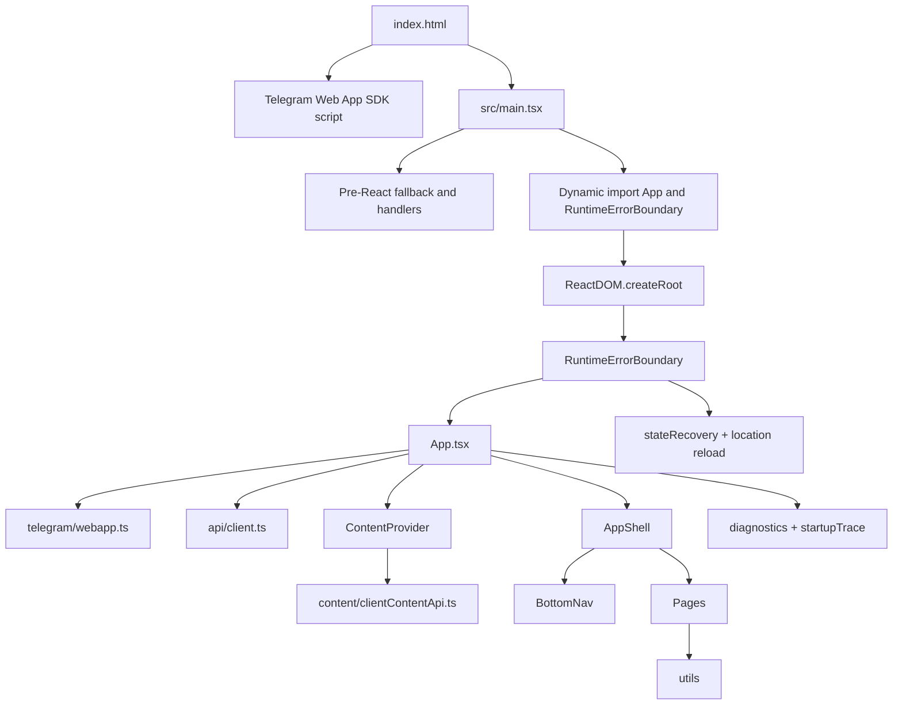

## 2. Точка входа

### 2.1. `index.html`

`telegram-mini-app/index.html` — HTML-точка входа Vite-приложения.

Файл содержит:

1. `<!doctype html>` и `<html lang="ru">` — язык интерфейса русский.
2. `<meta charset="UTF-8" />`.
3. `<meta name="viewport" content="width=device-width, initial-scale=1.0, viewport-fit=cover" />` — viewport адаптирован под mobile и safe areas.
4. `<meta name="theme-color" content="#f8eef0" />` — цвет темы.
5. `<title>Bloom Club</title>`.
6. `<div id="root"></div>` — основной DOM-контейнер React.
7. `<script src="https://telegram.org/js/telegram-web-app.js"></script>` — загрузка Telegram Web App SDK до приложения.
8. `<script type="module" src="/src/main.tsx"></script>` — запуск Vite module entry.

Порядок выполнения браузером:

1. Браузер загружает HTML.
2. Создаётся DOM-узел `#root`.
3. Загружается внешний Telegram SDK. После успешной загрузки он может определить `window.Telegram.WebApp`.
4. Загружается ES module `/src/main.tsx` через Vite.
5. Начинается pre-React startup-процесс.

Возможные ошибки на этом уровне:

- Telegram SDK может не загрузиться из-за сети, CSP, блокировщика, Telegram runtime отсутствует.
- `/src/main.tsx` может не загрузиться, если dev/prod server недоступен или сборка повреждена.
- `#root` теоретически может отсутствовать при изменении HTML; `main.tsx` имеет fallback и создаёт div сам.

### 2.2. `main.tsx`: импортируемые модули

`main.tsx` статически импортирует:

- `React` из `react`;
- `ReactDOM` из `react-dom/client`;
- глобальные стили `./styles.css`;
- startup trace helpers: `getStartupTrace`, `traceFail`, `traceMark`, `traceOk`, `traceStart` из `./diagnostics/startupTrace`.

`App` и `RuntimeErrorBoundary` не импортируются статически. Они загружаются динамически после установки ранних обработчиков ошибок.

### 2.3. `main.tsx`: последовательность запуска

Последовательность запуска:

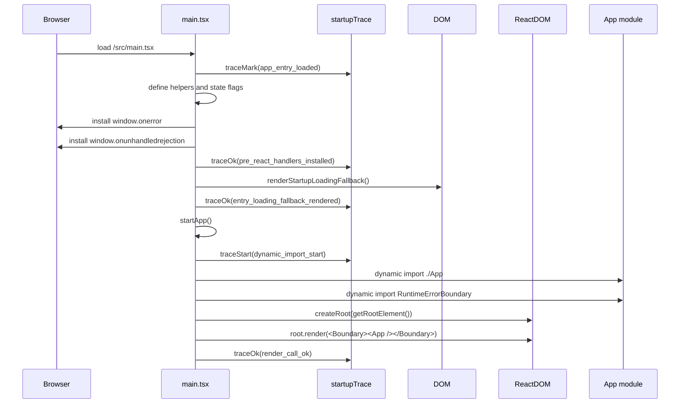

Детально:

1. **`traceMark('app_entry_loaded')`.** Самый ранний marker после загрузки entry module.
2. **Определяются типы и флаги:**
   - `EarlyErrorSource`;
   - `MODULE_IMPORT_TIMEOUT_MS = 3000`;
   - `reactRenderStarted = false`;
   - `startupFailureRendered = false`.
3. **`getRootElement()`.** Ищет `document.getElementById('root')`. Если его нет, добавляет `<div>` в `document.body`. Если у найденного/созданного элемента нет id, ставит `id="root"`.
4. **`sanitizeDiagnosticValue()`.** Преобразует раннюю ошибку в безопасный короткий текст.
5. **`renderStartupLoadingFallback()`.** До React создаёт `<section role="status" aria-live="polite" class="startup-entry-fallback">` с заголовком `Bloom Club загружается...` и текстом про подготовку диагностики.
6. **`renderModuleLoadErrorPanel()`.** Если React ещё не начал render и startup failure panel ещё не отрисована, показывает plain DOM error panel с JSON-диагностикой: marker, source, message, errorName, последние 20 startup events, кнопка reload.
7. **Ранние обработчики ошибок.** `window.onerror` и `window.onunhandledrejection` направляют ошибки в `renderEarlyErrorDiagnostic()`.
8. **`createImportTimeout()`.** Создаёт Promise, который через 3000 мс:
   - создаёт `Error('Dynamic import timeout after 3000ms')`;
   - пишет `traceFail('dynamic_import_timeout')`;
   - показывает module load error panel;
   - reject-ит promise.
9. **`importApplicationModules()`.** Последовательно импортирует `./App`, затем `./components/RuntimeErrorBoundary`, помечая success/fail каждого импорта.
10. **`startApp()`.** Запускает race между dynamic import и timeout, затем создаёт React root и вызывает `root.render()`.
11. **StrictMode.** В dev-режиме приложение рендерится внутри `<React.StrictMode>`, в production — без StrictMode.
12. **Catch `startApp()`.** Любая ошибка dynamic import или запуска передаётся в `traceFail('dynamic_import_fail')` и early error diagnostic.

### 2.4. Что может завершиться ошибкой в entrypoint

- Нет DOM API или root container не может быть создан.
- Ошибка загрузки `./App`.
- Ошибка загрузки `RuntimeErrorBoundary`.
- Dynamic import дольше 3000 мс.
- Ошибка при `ReactDOM.createRoot()`.
- Ошибка при `root.render()` до установки boundary.
- Любая синхронная window error или unhandled rejection до старта React.

## 3. `App`

### 3.1. Ответственность `App`

`App.tsx` — центральный координатор frontend. Он отвечает за:

- определение стартовой страницы;
- bootstrap Telegram окружения;
- Telegram login через `initData`;
- работу с сохранённым auth token;
- загрузку профиля и подписки;
- загрузку вторичных данных: verification codes, savings, cities, linking status;
- lazy-загрузку каталога партнёров;
- открытие карточки партнёра и загрузку offers;
- создание verification;
- активацию trial-подписки;
- сохранение профиля;
- подготовку payment request;
- account linking onboarding;
- runtime startup watchdog;
- переключение страниц;
- отображение loading/error/safe fallback состояний;
- передачу данных и callbacks в page components.

### 3.2. Основные типы и состояния

`PageId` включает:

- `home`;
- `catalog`;
- `partner`;
- `privileges`;
- `savings`;
- `profile`;
- `subscription`.

`AsyncStatus` для offers:

- `idle`;
- `loading`;
- `success`;
- `empty`;
- `error`;
- `timeout`.

`BootstrapReason`:

- `initial`;
- `retry`;
- `manual`.

`AppData` хранит:

- `profile`;
- `subscription`;
- `partners`;
- `verifications`;
- `savings`;
- `cities`;
- `linkingStatus`.

Состояния React в `App`:

| State | Назначение |
|---|---|
| `page` | Текущая страница. Начинается с `#catalog` или `home`. |
| `data` | Нормализованный набор бизнес-данных. |
| `selectedPartner` | Текущий выбранный партнёр для `PartnerPage`. |
| `partnerOffers` | Offers выбранного партнёра. |
| `partnerOffersStatus` | Статус загрузки offers. |
| `partnerOffersError` | Сообщение ошибки offers. |
| `partnerOffersDiagnostic` | Безопасные diagnostic-поля offers. |
| `paymentRequest` | Результат создания payment request. |
| `isLoading` | Глобальный loading bootstrap. |
| `error` | Глобальная bootstrap diagnostic error. |
| `isCreatingPayment` | Статус создания payment request. |
| `trialMessage` | Сообщение после trial activation. |
| `paymentMessage` | Сообщение payment flow. |
| `isPartnersLoading` | Статус загрузки каталога. |
| `partnersError` | Текст ошибки каталога. |
| `partnersErrorTitle` | Заголовок ошибки каталога. |
| `partnersErrorDetails` | Безопасная диагностика каталога. |
| `catalogErrorCreatedAt` | ISO time возникновения ошибки каталога. |
| `catalogLoadStartedAt` | ISO time старта загрузки каталога. |
| `catalogLoadRequestId` | Локальный sequence id загрузки каталога. |
| `hasPartnersLoaded` | Флаг успешной загрузки каталога. |
| `shouldShowLinking` | Показывать ли account linking onboarding. |
| `isTelegramApp` | Обнаружен ли Telegram WebApp runtime. |
| `showStartupDiagnostics` | Показывать ли startup diagnostic panel. |
| `watchdogMessage` | Сообщение watchdog. |
| `isBootstrapDone` | Завершён ли bootstrap. |
| `hasRenderedPageContent` | Был ли отрисован контент страницы после loading. |

Refs:

- `partnersPromiseRef` — dedupe in-flight загрузки каталога;
- `catalogLoadSequenceRef` — sequence id загрузок каталога;
- `pageRef` — актуальная page для async callbacks/watchdogs;
- `bootstrapPromiseRef` — dedupe in-flight bootstrap;
- `bootstrapSequenceRef` — актуальный bootstrap attempt;
- `mountedRef` — защита от setState после unmount и устаревших async результатов.

### 3.3. Жизненный цикл `App`

1. При первом render state инициализируется.
2. `page` берётся из `getStartupPage()`:
   - `#catalog` → `catalog`;
   - всё остальное → `home`.
3. `useEffect` синхронизирует `pageRef.current` с `page`.
4. Mount effect:
   - пишет `app_component_mount_start` в console;
   - пишет trace marks `app_component_mount` и `app_initial_state`;
   - ставит `mountedRef.current = true`;
   - при unmount ставит `false`.
5. Watchdog effect ставит два таймера:
   - через 5 секунд, если bootstrap не done и нет error, пишет `startup_watchdog_5s`, console warning, ставит `watchdogMessage`;
   - через 8 секунд, если page content не rendered, пишет `startup_watchdog_8s`, включает diagnostic panel и ставит `watchdogMessage`.
6. Bootstrap effect вызывает `loadAppData()`.
7. После окончания loading/error выбирается active page и отрисовываются страницы внутри `ContentProvider` и `AppShell`.
8. Runtime effect при `!isLoading && !error` пишет `render_page_start/render_page_ok` и ставит `hasRenderedPageContent=true`.

### 3.4. Какие страницы переключает `App`

`App` переключает:

- `HomePage` для `home`;
- `CatalogPage` для `catalog`;
- `PartnerPage` для `partner`;
- `PrivilegesPage` для `privileges`;
- `SavingsPage` для `savings`;
- `ProfilePage` для `profile`;
- `SubscriptionPage` для `subscription`.

Навигационный active state отличается от фактической страницы:

- если `page === 'partner'`, активной вкладкой BottomNav считается `catalog`;
- если `page === 'subscription'`, активной вкладкой считается `profile`;
- иначе активная вкладка равна `page`.

### 3.5. Какие компоненты подключает `App`

`App` подключает:

- `ContentProvider` — контекст динамических текстов и home blocks;
- `AppShell` — layout + bottom navigation;
- `LoadingState` — глобальная загрузка;
- `ErrorState` — bootstrap/unknown-state errors;
- `AccountLinkingOnboarding` — привязка Telegram-профиля к аккаунту;
- страницы из `src/pages`.

### 3.6. Какие API вызывает `App`

Bootstrap и runtime используют следующие функции API layer:

- `getStoredAuthToken()`;
- `clearStoredAuthToken()`;
- `resetTelegramLoginInFlight()`;
- `loginWithTelegram()`;
- `getProfile()`;
- `getSubscription()`;
- `getVerifications()`;
- `getSavings()`;
- `getCities()`;
- `getLinkingStatus()`;
- `getPartners()`;
- `getPartnerOffers()`;
- `getPartnerOffersPath()`;
- `verifyPartnerOffer()`;
- `updateProfile()`;
- `activateTrialSubscription()`;
- `createPaymentRequest()`.

Telegram wrapper:

- `prepareTelegramViewport()`;
- `isTelegramRuntime()`;
- `getTelegramLaunchPayloadWithRetry()`.

Recovery:

- `clearStaleAppState()`.

### 3.7. Какие ошибки обрабатывает `App`

`App` обрабатывает несколько классов ошибок:

1. **Bootstrap errors.** Любая ошибка внутри `loadAppData()` конвертируется в `AppDiagnostic` через `createDiagnostic(stage, caughtError)` и показывается через `ErrorState`.
2. **401 на сохранённом token.** Если `getProfile/getSubscription` с сохранённым token падают с `ApiError.status === 401`, token очищается, выполняется Telegram login и повторно запрашиваются profile/subscription.
3. **Secondary requests failure.** Ошибки `getVerifications/getSavings/getCities/getLinkingStatus` не останавливают приложение. Используется `Promise.allSettled`, успешные результаты сохраняются, неуспешные trace-ятся.
4. **Catalog load failure.** Ошибка `CatalogLoadError` преобразуется в `partnersError`, `partnersErrorTitle`, `partnersErrorDetails`, timestamps. UI остаётся на странице каталога с кнопкой retry.
5. **Partner offers failure.** Ошибки offers дают status `timeout` или `error`, diagnostic с path/status/backendDetail и сообщение. 401 превращается в сообщение `Сессия истекла, откройте приложение заново`.
6. **Unknown page.** Неизвестный `page` даёт `unknown_app_state` и ErrorState с retry на `home`.
7. **Stale partner page.** Если `page === 'partner'`, но `selectedPartner === null`, active page становится `catalog`, а пользователь видит ErrorState `Не удалось восстановить карточку партнёра`.
8. **Profile save errors.** `saveProfile` пробрасывает ошибку в `ProfilePage`, а страница показывает local error.
9. **Trial activation errors.** `activateTrial` пробрасывает ошибку в `SubscriptionPage`, где статус код/timeout превращаются в user-facing text.
10. **Payment request errors.** `openPayment` не пробрасывает ошибку, а выставляет `paymentMessage`.

## 4. Bootstrap

### 4.1. Общая цепочка bootstrap

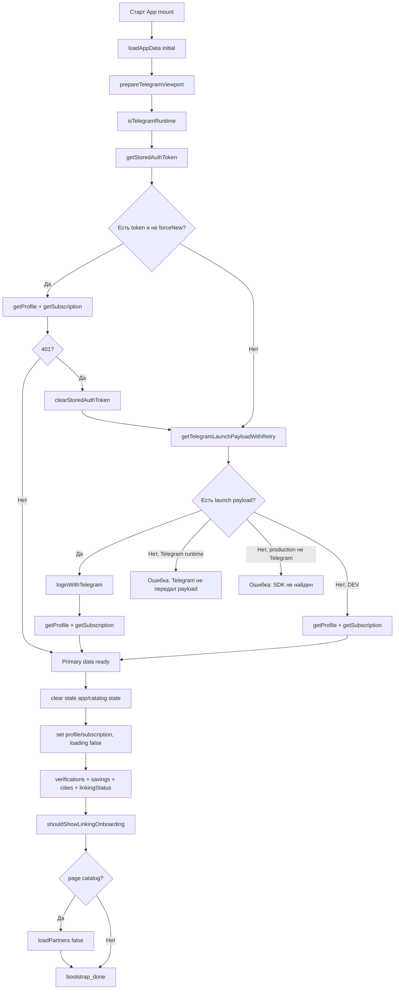

### 4.2. Последовательное описание bootstrap

#### Этап 1. Старт

`useEffect(() => void loadAppData(), [loadAppData])` запускает bootstrap после mount. Если уже есть in-flight bootstrap и `forceNew=false`, возвращается существующий promise. Если `forceNew=true`, сбрасывается `bootstrapPromiseRef` и `resetTelegramLoginInFlight()`.

#### Этап 2. Sequence protection

Каждый запуск получает `sequenceId`. Функция `isActive()` проверяет:

- компонент смонтирован;
- текущий `bootstrapSequenceRef.current` равен `sequenceId`.

Если async-результат устарел, он не должен менять state.

#### Этап 3. Loading state

Если запуск активен, `isLoading=true`, `error=null`.

#### Этап 4. Telegram SDK preparation

`prepareTelegramViewport()`:

- получает `window.Telegram?.WebApp`;
- если WebApp отсутствует — просто возвращается;
- если есть — вызывает `ready?.()`;
- вызывает `expand?.()`;
- читает `viewportStableHeight || viewportHeight`;
- если есть высота, записывает CSS custom property `--tg-viewport-height`.

Ошибки этого этапа не подавляются: catch внутри bootstrap пишет trace fail и пробрасывает дальше.

#### Этап 5. Проверка Telegram runtime

`isTelegramRuntime()` возвращает `Boolean(getTelegramWebApp())`. Результат сохраняется в `isTelegramApp`.

#### Этап 6. Проверка сохранённого token

`getStoredAuthToken()` читает `localStorage['bloom_club_tma_auth']`. Если token есть и запуск не forced, приложение пытается без Telegram login запросить:

- `getProfile()`;
- `getSubscription()`.

Оба запроса идут параллельно.

#### Этап 7. Recovery при 401 сохранённого token

Если profile/subscription с сохранённым token падают не с 401 — ошибка завершает bootstrap. Если ошибка — `ApiError` со status 401:

1. Пишутся trace fail для stored token profile/subscription.
2. `clearStoredAuthToken()` удаляет token.
3. Запускается Telegram login path.
4. После login повторяются `getProfile()` и `getSubscription()`.

#### Этап 8. Чтение Telegram initData

`getTelegramLaunchPayloadWithRetry()` делает до 3 попыток чтения `window.Telegram.WebApp.initData` с задержкой 350 мс между пустыми результатами. Возвращается строка payload или пустая строка.

Правила:

- если payload пустой и Telegram runtime есть — bootstrap падает с сообщением, что Telegram WebApp доступен, но launch payload не передан;
- если payload пустой, Telegram runtime нет и не DEV — bootstrap падает с сообщением, что Telegram WebApp SDK не найден;
- если payload есть — выполняется `loginWithTelegram(payload, { reason, bootstrapAttemptId, forceNew: true })`;
- если payload пустой в DEV и Telegram runtime отсутствует, сетевой login не вызывается, но далее всё равно выполняется profile/subscription request, который зависит от backend/session условий.

#### Этап 9. Telegram login

`loginWithTelegram()`:

- дедуплицирует in-flight login, если `forceNew=false`;
- при `forceNew=true` сбрасывает старый in-flight;
- если payload пустой — создаёт `TelegramLoginError` на стадии `telegram_login_prefetch`, fetch не выполняется;
- делает POST на `/api/v1/auth/telegram-miniapp-login` same-origin;
- body: `{ init_data: telegramLaunchPayload }`;
- timeout: 30000 мс;
- credentials: `include`;
- mode: `cors`;
- при успешном JSON извлекает `access_token` или `token`;
- сохраняет token в localStorage;
- retry выполняется для network/abort или HTTP 502/503/504, всего 1 retry.

#### Этап 10. Получение профиля и подписки

После успешного login или при валидном stored token `App` получает:

- `getProfile()` → `/api/v1/clients/me` через same-origin proxy;
- `getSubscription()` → `/api/v1/clients/me/subscription` через same-origin proxy.

#### Этап 11. Очистка stale state

После получения primary data:

- `resetCatalogStateForForceReload()` сбрасывает catalog in-flight/error/loading flags;
- `clearStaleAppState()` удаляет из localStorage/sessionStorage проектные stale ключи, связанные с active screen, selected partner/offer, verifications, offers status;
- `resetPartnerFlowState()` очищает selected partner, offers, offer diagnostics и переводит страницу в `catalog` или `home` в зависимости от startup hash.

#### Этап 12. Установка primary app data

`setData(normalizeAppData({ profile, subscription, partners: [], verifications: [], savings: null, cities: [], linkingStatus: null }))`.

После этого `isLoading=false`, то есть UI может показать страницу даже до окончания secondary requests.

#### Этап 13. Secondary requests

Параллельно через `Promise.allSettled` запрашиваются:

- `getVerifications()`;
- `getSavings()`;
- `getCities()`;
- `getLinkingStatus()`.

Неуспешные secondary requests не ломают bootstrap. Успешные значения добавляются в `data`, неуспешные оставляют прежние значения.

#### Этап 14. Account linking decision

Вычисляется dismissal key: `bloom_club_tma_linking_dismissed_${telegram_user_id || id}`. `shouldShowLinkingOnboarding()` вернёт true только если:

- приложение в Telegram runtime;
- есть profile;
- есть linking status;
- profile не считается linked;
- есть dismissal key;
- localStorage по этому key не равен `1`.

#### Этап 15. Каталог после bootstrap

Если текущая страница `catalog`, вызывается `loadPartners(false)`. Это позволяет использовать bootstrap catalog payload из `window.__BLOOM_TG_CATALOG_BOOTSTRAP__`, если он есть и не consumed.

#### Этап 16. Завершение bootstrap

Ставится `isBootstrapDone=true`, пишется `traceOk('bootstrap_done')` и `console.info('app_bootstrap_success')` с elapsed time и статусами secondary requests.

### 4.3. Bootstrap Trace

Bootstrap пишет startup trace events:

- `loadAppData_start`;
- `telegram_prepare_start/ok/fail`;
- `telegram_runtime_check_start/ok`;
- `stored_token_check_start/ok`;
- `launch_payload_read_start/ok`;
- `telegram_login_start/ok`;
- `stored_token_profile_start/ok/fail`;
- `stored_token_subscription_start/ok/fail`;
- `fresh_profile_start/ok`;
- `fresh_subscription_start/ok`;
- `stale_state_cleanup_start/ok`;
- `partner_flow_reset_start/ok`;
- `app_data_set_start/ok`;
- `secondary_requests_start`;
- `verifications_start/ok/fail`;
- `savings_start/ok/fail`;
- `cities_start/ok/fail`;
- `linking_status_start/ok/fail`;
- `bootstrap_done`;
- `${stage}_fail` при ошибке.

## 5. Telegram SDK

### 5.1. Как SDK подключается

SDK подключается в HTML внешним скриптом:

```html
<script src="https://telegram.org/js/telegram-web-app.js"></script>
```

После загрузки Telegram SDK ожидается объект `window.Telegram.WebApp`.

### 5.2. Wrapper `telegram/webapp.ts`

Frontend не обращается к Telegram SDK напрямую по всему коду. Доступ сосредоточен в `src/telegram/webapp.ts`.

Функции:

| Функция | Поведение |
|---|---|
| `getTelegramWebApp()` | Возвращает `window.Telegram?.WebApp ?? null`. |
| `getTelegramLaunchPayload()` | Читает `WebApp['initData']` через динамическую строку ключа. Если значение не string — возвращает `''`. |
| `getTelegramLaunchPayloadWithRetry()` | До 3 раз пытается получить initData, задержка 350 мс. |
| `getTelegramUnsafeUserId()` | Читает `WebApp['initDataUnsafe'].user.id`, если это string или number. |
| `getTelegramRuntimeDiagnostics()` | Возвращает безопасную диагностику Telegram runtime без payload: наличие объектов, platform, version, colorScheme, длина launch payload, признаки unsafe user/start_param, host, userAgent short. |
| `prepareTelegramViewport()` | Вызывает `ready()`, `expand()`, записывает `--tg-viewport-height`. |
| `isTelegramRuntime()` | Возвращает `Boolean(getTelegramWebApp())`. |

### 5.3. Как определяется Telegram

Telegram считается доступным, если `window.Telegram?.WebApp` truthy. Это не проверяет валидность `initData`; это только runtime detection.

Отдельно проверяется launch payload:

- `getTelegramLaunchPayloadWithRetry()` возвращает `initData`;
- наличие Telegram runtime без initData считается ошибкой bootstrap;
- отсутствие runtime и отсутствие initData в production считается ошибкой bootstrap.

### 5.4. Что происходит если Telegram отсутствует

Если SDK/WebApp отсутствует:

1. `prepareTelegramViewport()` ничего не делает.
2. `isTelegramRuntime()` возвращает false.
3. `getTelegramLaunchPayloadWithRetry()` вернёт пустую строку.
4. В production `loginWithTelegramPayload()` выбросит error `Telegram WebApp SDK не найден. Приложение открыто как обычная веб-страница.`
5. В dev-режиме эта конкретная ошибка не выбрасывается, но приложение продолжит попытку запросить profile/subscription. Если нет действующей сессии/token, backend-запросы могут завершиться ошибкой.

### 5.5. Как используется initData

`initData` используется только как payload авторизации:

- frontend не парсит и не валидирует подпись;
- frontend отправляет строку `init_data` на backend login endpoint;
- backend должен валидировать Telegram payload;
- frontend сохраняет полученный auth token и дальше использует Bearer Authorization.

### 5.6. Подготовка окружения Telegram

`prepareTelegramViewport()` вызывается до авторизации:

1. Получает WebApp.
2. Если WebApp отсутствует — no-op.
3. Вызывает `ready?.()` — сигнал Telegram, что Mini App готово.
4. Вызывает `expand?.()` — запрос расширения viewport.
5. Если известна высота viewport, пишет CSS переменную `--tg-viewport-height`.

## 6. Навигация

### 6.1. Общая модель навигации

Навигация реализована локальным React state `page`. React Router в приложении не используется. URL hash используется только при стартовом определении `#catalog`; дальнейшие переходы меняют state, а не URL.

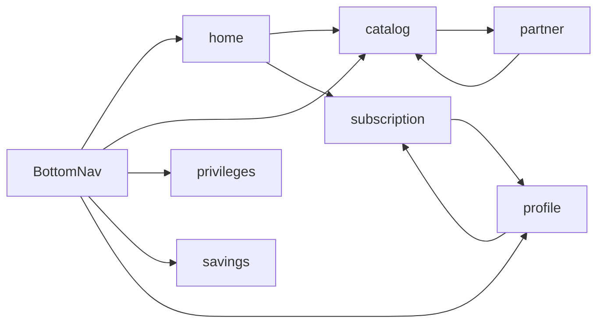

### 6.2. Стартовая страница

`getStartupPage()`:

- если `window` отсутствует — `home`;
- если `window.location.hash === '#catalog'` — `catalog`;
- иначе — `home`.

### 6.3. Переключение страниц

`navigate(nextPage)`:

- если `nextPage === 'catalog'`, вызывается `openCatalog()`;
- иначе `setPage(nextPage)`.

`openCatalog()`:

- логирует `catalog_open_requested`;
- очищает selected partner;
- очищает offers;
- сбрасывает offers status/error/diagnostic;
- ставит `page='catalog'`;
- вызывает `loadPartners(false)`.

`openPartner(partner)`:

- пишет trace `partner_open_start`;
- сохраняет selectedPartner;
- ставит `page='partner'`;
- вызывает `loadPartnerOffers(partner)`.

### 6.4. BottomNav

`BottomNav` содержит только пять основных вкладок:

- `home` — Главная;
- `catalog` — Партнёры;
- `privileges` — Мои привилегии;
- `savings` — Экономия;
- `profile` — Профиль.

`partner` и `subscription` не являются отдельными bottom-nav вкладками. Для них active tab мапится:

- `partner` → `catalog`;
- `subscription` → `profile`.

### 6.5. Безопасные и небезопасные страницы

С точки зрения recovery в коде явно выделена небезопасная startup screen:

- `partner` считается unsafe (`isUnsafeStartupScreen(page) => page === 'partner'`).

Причина: `PartnerPage` требует `selectedPartner`, который не восстанавливается из URL или storage. Поэтому при сбросе partner flow unsafe page заменяется на `catalog`.

Практически безопасные страницы:

- `home` — может отображаться при наличии primary data;
- `catalog` — может загрузить partners отдельно;
- `privileges` — умеет показывать empty state;
- `savings` — умеет показывать empty state;
- `profile` — получает profile/subscription из `data`;
- `subscription` — открывается из home/profile и имеет back в profile.

Небезопасные/условные:

- `partner` — требует live `selectedPartner`;
- unknown page — всегда diagnostic fallback.

## 7. Startup

### 7.1. Startup отличается от bootstrap

В этом приложении есть два уровня запуска:

1. **Startup entrypoint** — всё, что происходит в `main.tsx` до mount `App`: plain DOM fallback, ранние handlers, dynamic import, create root, render.
2. **App bootstrap** — всё, что происходит внутри `App`: Telegram, auth, profile/subscription, secondary requests, catalog.

### 7.2. Startup схема

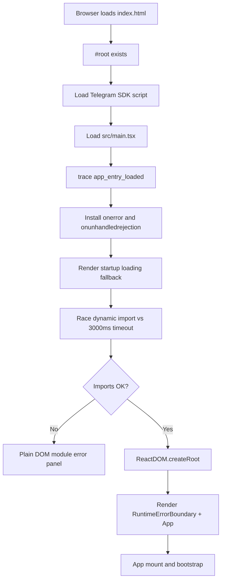

### 7.3. Все проверки startup

- Наличие/создание root element.
- Установка ранних global error handlers.
- Успешность dynamic import `App`.
- Успешность dynamic import `RuntimeErrorBoundary`.
- Ограничение dynamic import timeout 3000 мс.
- Успешность `ReactDOM.createRoot()`.
- Успешность `root.render()`.

### 7.4. Возможные ошибки startup

| Ошибка | Где ловится | Recovery / fallback |
|---|---|---|
| `window.onerror` до React | `window.onerror` в `main.tsx` | Plain DOM error panel, если React render ещё не начался. |
| Unhandled rejection до React | `window.onunhandledrejection` | Plain DOM error panel. |
| App import fail | `.then(..., error)` в dynamic import | `traceFail('import_app_fail')`, catch `startApp`, error panel. |
| Boundary import fail | `.then(..., error)` | `traceFail('import_boundary_fail')`, error panel. |
| Dynamic import timeout | `createImportTimeout` | `traceFail('dynamic_import_timeout')`, error panel. |
| Render после boundary | `RuntimeErrorBoundary` | React ErrorState с recovery в catalog. |

### 7.5. Startup fallback

До появления React пользователь видит `Bloom Club загружается...`. Если загрузка модулей не удалась, fallback заменяется панелью:

- title: `Не удалось загрузить модуль приложения`;
- description: диагностика не содержит token/initData;
- `<pre>` с marker, source, message, errorName, lastEvents;
- кнопка `Перезагрузить`.

## 8. Runtime

### 8.1. Что происходит после запуска

После успешного startup и bootstrap приложение работает как stateful SPA без router. Постоянно живут:

- React tree под `RuntimeErrorBoundary`;
- `App` state;
- `ContentProvider` state;
- bottom navigation;
- global listeners RuntimeErrorBoundary для `error` и `unhandledrejection`;
- startup trace buffer в `window.__BLOOM_STARTUP_TRACE__`;
- auth token в localStorage;
- optional linking dismissed flag в localStorage.

### 8.2. Runtime схема

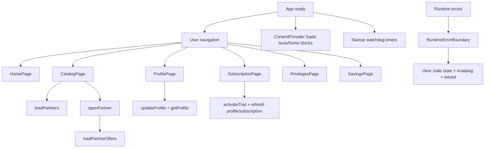

### 8.3. Постоянные процессы

1. **RuntimeErrorBoundary listeners.** После mount boundary слушает `window.error` и `window.unhandledrejection`. При ошибке state boundary получает diagnostic и весь UI заменяется на ErrorState.
2. **ContentProvider loading.** При mount `ContentProvider` запрашивает static texts и home blocks. Ошибки превращаются в fallback empty arrays/default texts.
3. **Startup trace.** Любые вызовы `traceStart/Ok/Fail/Mark` продолжают писать в global trace до лимита 300 событий.
4. **Watchdog timers.** Пока `App` mounted, timers отслеживают зависание bootstrap/render в первые секунды.
5. **Catalog in-flight dedupe.** `partnersPromiseRef` предотвращает дублирование загрузки каталога при повторном open catalog.
6. **Bootstrap in-flight dedupe.** `bootstrapPromiseRef` предотвращает дублирование bootstrap, кроме forced manual retry.

### 8.4. Runtime пользовательские flows

#### Каталог

- Пользователь открывает tab `catalog`.
- `openCatalog()` сбрасывает partner/offers state.
- `loadPartners(false)` либо использует `window.__BLOOM_TG_CATALOG_BOOTSTRAP__`, либо вызывает `getPartners()`.
- При успехе `data.partners` обновляется.
- При ошибке CatalogPage получает error и diagnostics.

#### Партнёр

- Пользователь выбирает партнёра в `CatalogPage`.
- `openPartner(partner)` сохраняет партнёра и page.
- `loadPartnerOffers(partner)` проверяет numeric partner id.
- При отсутствии numeric id сразу показывается error diagnostic.
- При успехе offers status: `success` или `empty`.
- При timeout/error/401 ставится соответствующее состояние.

#### Профиль

- `ProfilePage` получает profile, subscription, cities.
- Локально хранит значения form.
- Перед сохранением валидирует phone/email.
- Вызывает `onSaveProfile`, который делает `updateProfile()` и затем `getProfile()`.

#### Подписка

- `SubscriptionPage` получает subscription и callbacks.
- Trial activation вызывает `activateTrial()`.
- `activateTrial()` вызывает backend, обновляет subscription/profile, затем пытается refresh profile/subscription.

#### Привилегии и экономия

- Эти страницы читают `verifications` и `savings`, загруженные secondary requests.
- При пустых данных показывают empty state.
- В режиме Telegram local catalog используют специальные empty тексты о будущем подключении.

## 9. Diagnostics

### 9.1. Startup Trace

`startupTrace.ts` хранит события в `window.__BLOOM_STARTUP_TRACE__`. Каждое событие содержит:

- `timestamp` ISO;
- `elapsedMs` от загрузки module;
- `step`;
- `status`: `start`, `ok`, `fail`, `mark`;
- `details` после sanitation.

Sanitization:

- скрываются ключи вроде authorization, initData, token, signature, hash, credential;
- строки обрезаются до 500 символов;
- массивы обрезаются до 20 элементов;
- вложенность ограничена depth 3;
- max events — 300, старые удаляются.

### 9.2. Bootstrap Trace

Bootstrap trace — подмножество startup trace, создаваемое `loadAppData()`. Оно фиксирует readiness Telegram, stored token, login, profile/subscription, cleanup, secondary requests, catalog reload after bootstrap.

### 9.3. Runtime Trace

Runtime trace включает:

- `app_component_mount`;
- `app_initial_state`;
- `render_page_start`;
- `render_page_ok`;
- `partner_open_start`;
- `offers_load_start/ok/fail`;
- watchdog marks.

Runtime errors дополнительно оформляются через `createRuntimeErrorDiagnostic()`.

### 9.4. Catalog Trace

Каталог имеет два слоя диагностики:

1. Startup trace markers в `App`: `catalog_load_start`, `catalog_load_ok`, `catalog_load_fail`, bootstrap catalog markers.
2. Console diagnostics в API layer: `catalog_fetch_start`, `catalog_fetch_response`, `catalog_fetch_json`, `catalog_fetch_error`, `catalog_fetch_abort`.

`CatalogErrorDiagnostic` содержит:

- source: `tg_local_catalog` или `web_legacy_catalog`;
- requestUrl;
- requestUrlPath;
- requestOrigin;
- httpStatus;
- backendDetail;
- requestId;
- fetchPhase;
- elapsedMs;
- errorName;
- isAbortError;
- attempt.

В UI `App` намеренно передаёт только безопасные request fields и freshness markers.

### 9.5. Recovery diagnostics

Recovery diagnostics отображаются в `ErrorState`:

- `stage`;
- `message`;
- `errorName`;
- `errorMessageShort`;
- `componentStackShort`;
- HTTP status;
- detail;
- network technicalMessage;
- Telegram login diagnostic;
- Telegram runtime diagnostic;
- last startup trace events;
- startup context: currentPage, bootstrapStatus, catalogStatus, offersStatus;
- buildInfo.

### 9.6. Error Boundary

`RuntimeErrorBoundary` ловит:

- React render/lifecycle errors через `getDerivedStateFromError` и `componentDidCatch`;
- global `error` events;
- global `unhandledrejection` events.

При ошибке показывает `ErrorState` с title `Не удалось показать интерфейс Bloom Club` и retry label `Вернуться в каталог`.

## 10. Error Recovery

### 10.1. Recovery схема

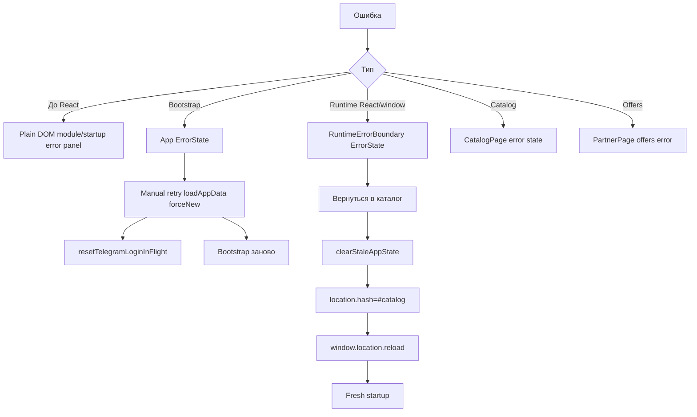

### 10.2. Что происходит после bootstrap ошибки

Если ошибка случилась в `loadAppData()`:

1. Определяется текущий `stage`.
2. Пишется trace fail `${stage}_fail`.
3. Пишется `app_bootstrap_error` в console с безопасным текстом ошибки.
4. `setError(createDiagnostic(stage, caughtError))`.
5. `finally` ставит `isLoading=false`.
6. UI показывает `ErrorState`.
7. Кнопка retry вызывает `loadAppData('manual', true)`.
8. Forced retry сбрасывает in-flight login и начинает bootstrap заново.

### 10.3. Что очищается

`clearStaleAppState()` очищает только project keys, которые одновременно:

- начинаются с одного из префиксов:
  - `bloom_club_tma_`;
  - `bloomClubTma`;
  - `bloom_tma_`;
- и matching one of stale patterns:
  - `activeScreen`;
  - `selectedPartner`;
  - `selectedOffer`;
  - `verification`;
  - `partnerOffers`;
  - `offersStatus`.

Очищаются оба storage:

- `localStorage`;
- `sessionStorage`.

Отдельно при 401 очищается auth token key `bloom_club_tma_auth`.

### 10.4. Что остаётся

После stale cleanup остаются:

- auth token, если cleanup не был 401 flow;
- dismissal key linking onboarding, потому что он не matches stale patterns;
- другие unrelated localStorage/sessionStorage keys;
- startup trace до перезагрузки;
- browser memory state до reload.

### 10.5. Что происходит после повторного открытия Mini App

При повторном открытии или reload:

1. Browser заново загружает `index.html`.
2. Telegram SDK снова предоставляет WebApp, если открыт внутри Telegram.
3. `main.tsx` снова создаёт startup trace buffer.
4. `App` снова запускает bootstrap.
5. Если auth token валиден, profile/subscription берутся по stored token.
6. Если token невалиден и backend возвращает 401, token удаляется и выполняется Telegram login через fresh initData.
7. Stale partner screen не восстанавливается: startup hash `#catalog` ведёт в catalog, иначе home.

### 10.6. Recovery без исправления ошибки

Важно: recovery не исправляет backend/API/SDK ошибки. Он:

- показывает безопасную диагностику;
- даёт retry;
- очищает stale UI state;
- переводит в безопасный экран;
- reload-ит приложение при runtime boundary recovery.

## 11. Mermaid-схемы

### 11.1. Архитектура Frontend

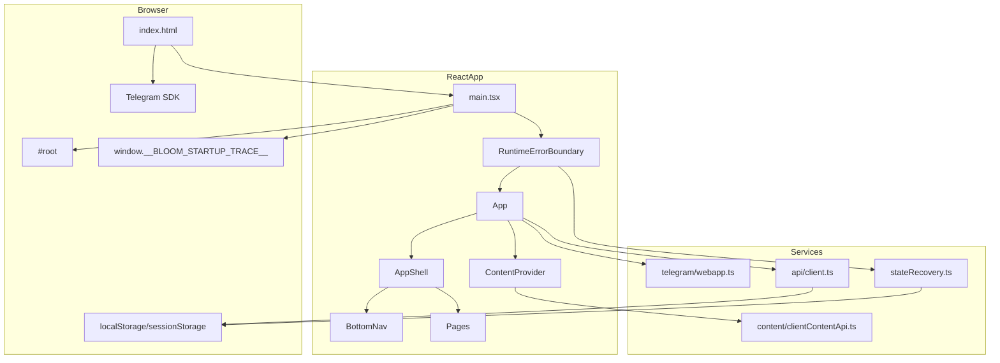

### 11.2. Bootstrap

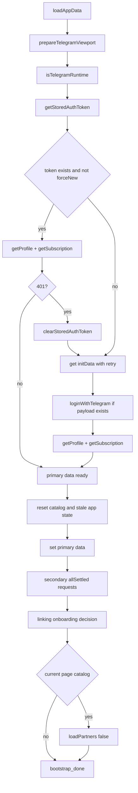

### 11.3. Startup

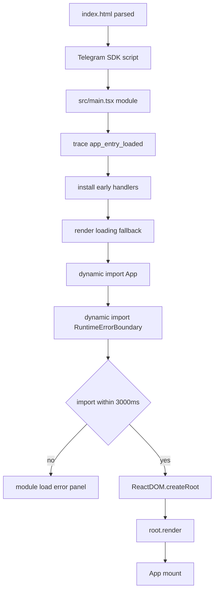

### 11.4. Runtime

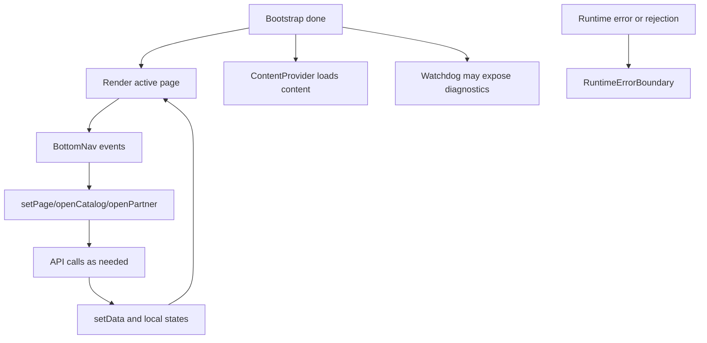

### 11.5. Recovery

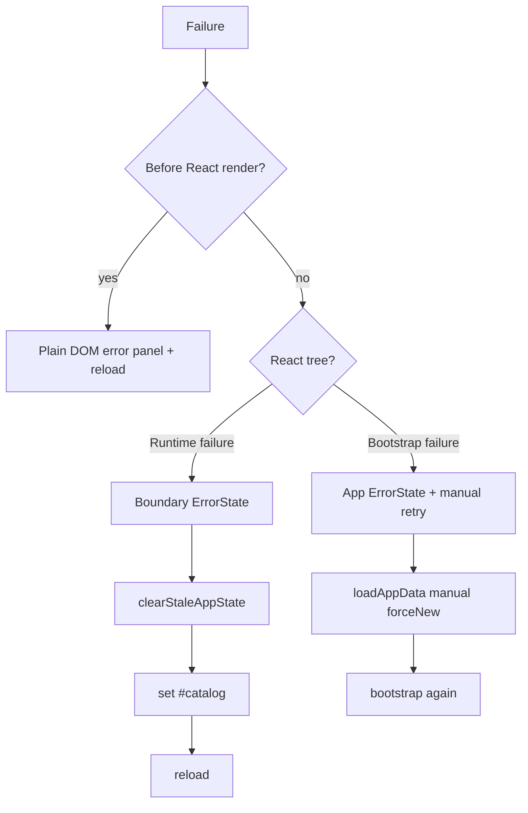

### 11.6. Навигация

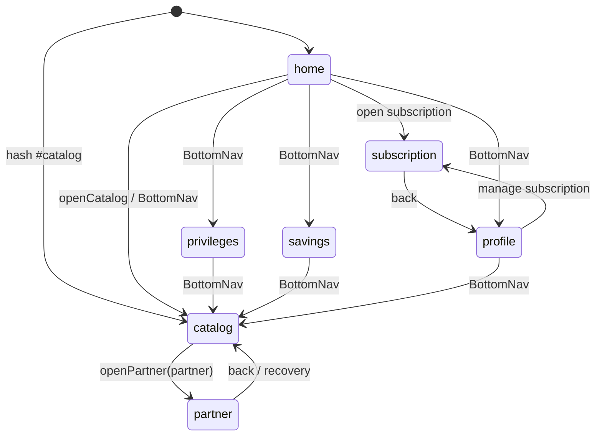

## 12. Недостаточно документированные части Frontend

В репозитории не хватает следующих frontend-документов или они недостаточно подробны:

1. **Контракт Telegram login.** Нет отдельной спецификации, какие поля backend принимает на `/api/v1/auth/telegram-miniapp-login`, какие ответы допустимы, какие ошибки считаются retryable, какие поля token поддерживаются официально.
2. **Контракт клиентского API.** Нет frontend-facing OpenAPI/markdown-контракта для `/clients/me`, `/clients/me/subscription`, `/clients/me/verifications`, `/clients/me/savings`, `/clients/cities`, `/clients/me/linking/status`, profile update, trial activation, payment request.
3. **Контракт Telegram local catalog.** В коде есть режим `VITE_TG_LOCAL_CATALOG_ENABLED`, но frontend-документация должна отдельно описывать различия `tg_local_catalog` и `web_legacy_catalog`, включая auth, media URL normalization и disabled user context.
4. **Семантика `window.__BLOOM_TG_CATALOG_BOOTSTRAP__`.** В коде есть consume-once bootstrap catalog payload, но не хватает отдельного документа, кто наполняет этот объект, в каком формате и в каких окружениях.
5. **Навигационная модель.** Нет отдельного документа, явно фиксирующего отсутствие React Router, hash-only startup behavior и unsafe screen policy.
6. **Recovery policy.** Нет документа о том, какие storage keys можно чистить, почему partner screen считается stale/unsafe, что можно сохранять между сессиями.
7. **Diagnostics policy.** Нет полного описания безопасной диагностики: какие поля считаются sensitive, где они redacted, какие console events являются публичным диагностическим контрактом.
8. **Content API contract.** Нет отдельного frontend-документа по static texts и home blocks: допустимые block types, поля, fallback behavior, placement/type query.
9. **Design system / UI states.** Нет документа по CSS-классам, layout, safe area, Telegram viewport CSS variable, loading/error/empty state conventions.
10. **Страницы и props.** Нет единой документации по каждой странице: входные props, callbacks, local state, empty/error states.
11. **Environment variables.** Нет frontend matrix по `VITE_API_BASE_URL`, `VITE_TG_API_BASE_URL`, `VITE_TG_LOCAL_CATALOG_ENABLED`, `VITE_CONTENT_API_BASE_URL` и их fallback behavior.
12. **Testing strategy.** Есть тесты, но нет документа, какие frontend invariants они покрывают, какие проверки обязательны перед релизом, какие static tests проверяют startup/catalog.
13. **Known limitations.** Не оформлены явно ограничения dev-mode без Telegram, production open-as-web behavior, content fallback behavior и неполная интеграция payment request в UI.
14. **Runtime incident playbook.** Нет инструкции для поддержки: как читать `startupTrace`, `telegramLogin` diagnostics, `CatalogErrorDiagnostic`, как интерпретировать `requestId`, `fetchPhase`, `isAbortError`.
15. **Build/deploy frontend flow.** Нет отдельного frontend-only описания Vite build, production static serving/proxy, same-origin API expectations.

## 13. Потенциальные проблемы, обнаруженные при документировании без исправления

Этот раздел фиксирует наблюдения, но не меняет код и не исправляет ошибки:

1. `createRoot` trace в `main.tsx` использует `traceOk('create_root_start')`, то есть ok-событие имеет то же имя, что и start-событие. Это не ломает сборку, но может усложнять ручное чтение startup trace.
2. `openPayment()` в `App.tsx` создаёт `paymentRequest`, но `SubscriptionPage` в текущем UI показывает блок «Оплата скоро появится» и не демонстрирует пользователю созданный payment request. Это может быть намеренным продуктовым состоянием, но требует отдельной фиксации в документации оплаты.
3. Production без Telegram SDK/payload намеренно завершается bootstrap error, поэтому обычное web-открытие не является полноценным supported runtime. Это важно явно указывать в эксплуатационной документации.
4. Secondary requests (`verifications`, `savings`, `cities`, `linkingStatus`) не блокируют основной экран. Это повышает устойчивость запуска, но может скрывать частичные backend-инциденты от пользователя и требует мониторинга по console/server logs.
