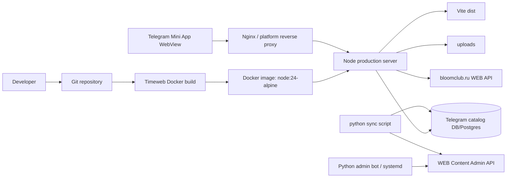
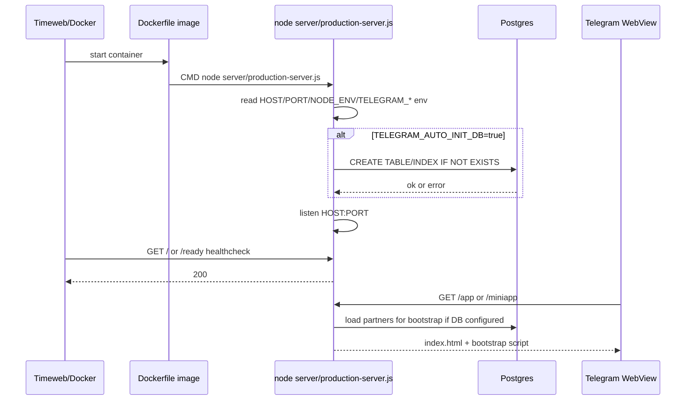
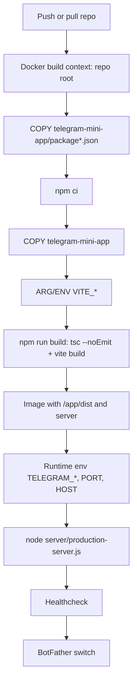
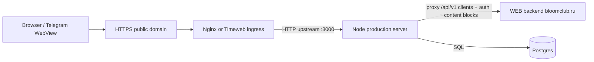
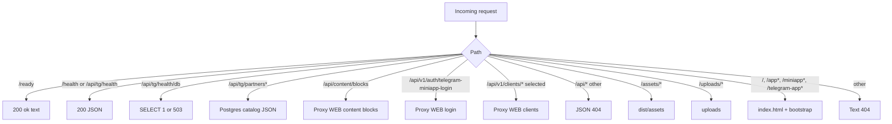

# Infrastructure

Документ фиксирует только инфраструктуру production-запуска Telegram Mini App. Существующий код не менялся; восстановление выполнено по Dockerfile, docker-compose, Node production server, Python WSGI, systemd example, Vite/TypeScript build, sync scripts и deployment docs.

## Что изучено

- `Dockerfile`, `docker-compose.yml`, `.dockerignore` по косвенным упоминаниям в docs.
- `telegram-mini-app/package.json`, `vite.config.ts`, `tsconfig.json`, `server/production-server.js`.
- Python WSGI: `backend/telegram_catalog/production_app.py`, `app.py`, `database.py`, `config.py`.
- Sync/admin scripts: `telegram_app/scripts/*`, `admin_bot/*`, `bloomclub-admin-bot.service.example`.
- Timeweb deployment docs: `telegram-mini-app/docs/timeweb-docker-deploy.md`, `timeweb-docker-healthcheck-audit.md`, `timeweb-tg-db-setup.md`.

## Infrastructure overview

Production mode в текущем Docker-пути — один контейнер с Node.js server. Node отдаёт Vite `dist`, `/assets/*`, `/uploads/*`, `/api/tg/*`, proxy-routes к WEB backend и health/diagnostics endpoints. Python WSGI существует как альтернативный/исторический production app и как backend/admin/upload implementation для non-Docker или WSGI-хостинга. Admin bot — отдельный systemd-сервис.



## Production Startup



### Startup owner

- Docker production: platform/container runtime starts `CMD ["node", "server/production-server.js"]`.
- Docker Compose fallback: `docker compose up` starts service `telegram-mini-app`; compose does not override command.
- Python WSGI alternative: process manager or direct `python -m backend.telegram_catalog.production_app` starts WSGI wrapper on `PORT` or `8000`.
- Admin bot: systemd unit starts `/usr/bin/python3 -m admin_bot` from `admin_bot` working directory.

### Startup order

1. Build image or install dependencies.
2. Run TypeScript check and Vite build.
3. Start Node process.
4. Optional DB schema init when `TELEGRAM_AUTO_INIT_DB=true`.
5. Bind to `HOST:PORT`.
6. Healthcheck `/`, `/ready`, `/health`, or `/api/tg/health`.
7. BotFather points Telegram Mini App URL to the production HTTPS domain only after checks pass.

## Deployment Pipeline

Canonical production pipeline:

```text
git pull
↓
npm ci / npm install
↓
npm run build
↓
restart container or systemd service
↓
Node production server
↓
Nginx / platform reverse proxy
↓
Telegram Mini App URL from BotFather
↓
User
```

Docker/Timeweb pipeline:



Rollback pipeline:

1. Switch BotFather URL back to previous working Mini App domain.
2. Keep old app alive until Docker app is verified.
3. If catalog issue is frontend-only, rebuild with `VITE_TG_LOCAL_CATALOG_ENABLED=false`.
4. Do not delete or reseed Postgres during rollback.

## Build Pipeline

- `npm run build` runs `tsc --noEmit && vite build`.
- TypeScript build validates sources and emits nothing.
- Vite creates `telegram-mini-app/dist` with `index.html` and hashed `/assets/*`.
- Dockerfile runs build inside `/app` after mapping build args to `VITE_*` env.
- `VITE_*` values are compile-time; changing them requires rebuild, not only restart.
- `__APP_BUILD_TIMESTAMP__` and `__APP_PACKAGE_VERSION__` are injected by Vite config.

## Docker Services

### `Dockerfile`

| Field | Value |
| --- | --- |
| Base image | `node:24-alpine` |
| Workdir | `/app` |
| Install | `npm ci` |
| Build | `npm run build` |
| Expose | `3000` |
| Runtime command | `node server/production-server.js` |

Purpose: build and run the Telegram Mini App in one Node container.

Who starts: Docker runtime / Timeweb App Platform.

Depends on: committed package lock, source under `telegram-mini-app`, build args `VITE_*`, runtime env, optional Postgres network.

Processes: one Node process; no Vite dev/preview, no Python process in Docker runtime.

Errors: build fails on `npm ci`, TypeScript, Vite; runtime startup can fail if auto-init DB is enabled and DB is unreachable/invalid.

Diagnostics: Docker logs, startup line, `curl /ready`, `curl /debug/runtime-port`, `docker ps`, platform healthcheck logs.

Restart: `docker restart <container>`, `docker compose restart telegram-mini-app`, or Timeweb redeploy/restart.

### `docker-compose.yml`

Purpose: local/fallback deployment with explicit `3000:3000` mapping.

Service: `telegram-mini-app`.

Build args: `VITE_API_BASE_URL`, `VITE_TG_LOCAL_CATALOG_ENABLED`, `VITE_TG_API_BASE_URL`.

Runtime env: `NODE_ENV=production`, `PORT=3000`, `HOST=0.0.0.0`, `TELEGRAM_APP_DATABASE_URL`, `TELEGRAM_ADMIN_API_TOKEN`, `TELEGRAM_AUTO_INIT_DB`.

Restart policy: `unless-stopped`.

Ports: host `3000` to container `3000`.

Restart commands:

```bash
docker compose up -d --build
docker compose restart telegram-mini-app
docker compose logs -f telegram-mini-app
```

## Systemd Services

Only committed systemd unit is admin bot example:

- Unit: `bloomclub-admin-bot.service.example`.
- Working directory: `/opt/bloomclub/-fed_women_club_mini-app_TELEGA/admin_bot`.
- Environment file: `admin_bot/.env` in that deployed path.
- ExecStart: `/usr/bin/python3 -m admin_bot`.
- Restart: `always`, `RestartSec=5`.

Purpose: keep Telegram admin bot alive. It is separate from Mini App hosting.

Dependencies: network, Python deps from `admin_bot/requirements.txt`, `TELEGRAM_BOT_TOKEN`, `TELEGRAM_ADMIN_IDS`, WEB URLs, `TELEGRAM_ADMIN_API_TOKEN`.

Diagnostics:

```bash
systemctl status bloomclub-admin-bot.service
journalctl -u bloomclub-admin-bot.service -f
```

Restart:

```bash
sudo systemctl daemon-reload
sudo systemctl restart bloomclub-admin-bot.service
sudo systemctl enable --now bloomclub-admin-bot.service
```

No committed systemd unit for Node production server was found; if Node is run under systemd, unit details are external to repo and cannot be determined from files.

## Nginx / Platform Reverse Proxy

No committed Nginx config was found. In production, Nginx is therefore inferred as either Timeweb/platform ingress or an external reverse proxy in front of Node/Python.

Expected responsibility:

- terminate HTTPS for Telegram WebView;
- route public host to container port `3000` for Docker Node mode;
- preserve paths (`/`, `/assets/*`, `/api/*`, `/uploads/*`);
- return 502 when upstream is down/unreachable;
- return 404 only if proxy or upstream route rejects path.

Inferred proxy map:



Diagnostics: platform access logs, Nginx error log if self-managed, `curl -I https://domain/ready`, `curl http://127.0.0.1:3000/ready` on host/container.

Restart: platform restart or `sudo systemctl reload nginx` / `sudo systemctl restart nginx` only for self-managed Nginx.

## Node Services

Entrypoint: `telegram-mini-app/server/production-server.js`.

Purpose:

- serve SPA routes and static assets;
- serve `/uploads/*`;
- expose local TG catalog API from Postgres;
- proxy selected WEB backend endpoints;
- inject catalog bootstrap into `index.html`;
- expose health/ready/debug endpoints.

Starts: by Docker CMD, package scripts `start`, `start:production`, `start:api`, or manual `node server/production-server.js`.

When: after Vite build exists in `dist`.

Depends on:

- Node runtime;
- `/app/dist/index.html` for full frontend;
- `TELEGRAM_APP_DATABASE_URL` for DB-backed catalog/bootstrap/status;
- external `https://bloomclub.ru` APIs for proxy routes;
- optional `/app/uploads`.

Ports:

- default `3000`;
- selected from `PORT`, `APP_PORT`, `HTTP_PORT`, `SERVER_PORT`, `WEB_PORT`, `LISTEN_PORT`, `CONTAINER_PORT`, `APP_PLATFORM_PORT`, `TIMEWEB_PORT`;
- host from `HOST`, default `0.0.0.0`.

Files read: `dist/index.html`, `dist/assets/*`, `uploads/*`.

Files written: none in Node server runtime except logs to stdout/stderr; DB writes only during `TELEGRAM_AUTO_INIT_DB=true` schema init.

Services called:

- Postgres via `pg` pool;
- `https://bloomclub.ru/api/content/blocks`;
- `https://bloomclub.ru/api/v1/auth/telegram-miniapp-login`;
- `https://bloomclub.ru/api/v1/clients/*` selected paths.

Errors:

- missing `dist/index.html`: root/frontend route returns minimal fallback for versioned routes with fallback, otherwise 500 message;
- missing DB URL: catalog returns empty items; DB health returns 503;
- DB failure: DB endpoints return 503;
- proxy timeout/error: login/client proxy returns 502/504; content blocks falls back to `[]`;
- invalid method: 405;
- unknown `/api/*`: JSON 404.

Diagnostics:

```bash
curl -i http://127.0.0.1:3000/ready
curl -i http://127.0.0.1:3000/health
curl -i http://127.0.0.1:3000/api/tg/health/db
curl -i http://127.0.0.1:3000/debug/runtime-port
```

## Python Services

Entrypoints:

- `backend.telegram_catalog.production_app:application` WSGI wrapper.
- `python -m backend.telegram_catalog.production_app` direct simple server.
- `backend.telegram_catalog.app:application` catalog/admin/upload WSGI app.
- scripts under `telegram_app/scripts`.

Purpose:

- alternative production WSGI hosting of Vite SPA and TG API;
- admin CRUD `/api/tg/admin/*`;
- upload endpoint `/api/content/uploads` writing files;
- DB init/seed/check/sync scripts.

Ports: direct WSGI wrapper reads `PORT`, fallback `8000`; raw app direct main listens `8000`.

Directories: repo root, `dist`, `dist/assets`, `uploads`, `uploads/content`.

Files writes: uploads to `uploads/content/<uuid>.<ext>`; DB schema/data through SQLite/Postgres.

Errors: DB unavailable returns 503; invalid upload returns 400; missing token returns 401/403/501; missing `dist` returns 500 in WSGI wrapper.

Restart: restart owning process manager, systemd unit if configured, or stop/start direct Python process.

## Request Routing



Browser map required by task:

```text
Browser / Telegram WebView
↓
Nginx / Timeweb ingress
↓
Node production server
↓
Proxy handlers in Node
↓
WEB Backend on bloomclub.ru
↓
Postgres / WEB data stores
```

## Asset Routing

- `/assets/*` maps to `DIST_DIR/assets` in Node and Python wrapper.
- Path traversal is blocked by resolving path and checking it remains under assets root.
- Content type is selected from extension.
- Vite hashed assets should be immutable in practice, but Node server does not set long-cache headers in current code.
- 404 when asset file is missing.

## Static Files

- `dist/index.html` is read per frontend request.
- `dist/assets/*` is streamed by Node.
- `/favicon.ico` is explicitly handled only in Python WSGI wrapper; Node treats it as non-versioned route and returns 404 unless served via SPA route pattern.

## Uploads

Node:

- serves `/uploads/*` from `telegram-mini-app/uploads` or `/app/uploads` inside image;
- does not write uploads.

Python WSGI:

- accepts `POST /api/content/uploads`;
- requires admin token;
- accepts jpg/jpeg/png/webp up to 10 MB;
- writes `uploads/content/<uuid>.<ext>`;
- returns public URL with `https://bloomclub.ru/uploads/content/...`.

Operational risk: Docker container filesystem uploads are ephemeral unless mounted/persisted externally.

## Proxy Routing

Node proxies:

| Incoming | Target | Timeout | Error behavior |
| --- | --- | --- | --- |
| `GET/HEAD /api/content/blocks` | `https://bloomclub.ru/api/content/blocks` | 20s | fallback `[]` |
| `POST /api/v1/auth/telegram-miniapp-login` | `https://bloomclub.ru/api/v1/auth/telegram-miniapp-login` | 30s | 502/504 JSON detail |
| `GET/HEAD /api/v1/clients/cities`, `/me`, `/me/*` | `https://bloomclub.ru/api/v1/...` | 30s | 502/504 JSON detail |

Headers: selected authorization/content-type/user-agent are forwarded for client API; login proxy uses JSON and user-agent.

## SPA Routing

Versioned/frontend routes served by Node:

- `/`
- `/app`
- `/app-v*`
- `/miniapp`, `/miniapp/*`
- `/telegram-app`, `/telegram-app/*`

Purpose: support BotFather URL changes and versioned URLs without Nginx rewrite rules. Unknown non-API paths return 404, so new SPA base paths must be added to server code before using in BotFather.

## Bootstrap Injection

For SPA requests, Node reads `dist/index.html`, queries active partners, and injects:

```js
window.__BLOOM_TG_CATALOG_BOOTSTRAP__ = { items: [...] }
```

If DB/bootstrap query fails, server logs a warning and still returns HTML without bootstrap. This avoids white screen caused solely by bootstrap DB failure; frontend then falls back to API/client behavior.

## Telegram Hosting

- Telegram opens the URL configured in BotFather inside WebView.
- Production URL should be HTTPS public domain routed to Node container.
- Recommended one-domain mode: `VITE_TG_API_BASE_URL=` so frontend calls same origin `/api/tg/...`.
- BotFather URL must be switched only after `/ready`, `/health`, `/api/tg/health/db`, `/api/tg/status`, `/api/tg/partners`, `/`, and main Mini App route pass.

## Versioned URLs

Purpose: deploy or roll out new frontend paths while preserving old BotFather/deep-link URLs. Node supports `/app-v*` generically. If BotFather points to `/app-v123`, Node serves the same built `index.html`; client-side app decides UI route behavior.

## Health Checks

| Endpoint | DB required | Expected |
| --- | --- | --- |
| `/ready` | No | `200 ok` |
| `/health` | No | `200 {status:"ok"}` |
| `/api/tg/health` | No | `200 {status:"ok"}` |
| `/api/tg/health/db` | Yes | `200` or `503` |
| `/api/tg/status` | Yes | counts or `503` |
| `/debug/runtime-port` | No | selected port diagnostics |

Platform liveness should use `/`, `/ready`, `/health`, or `/api/tg/health`, not DB health unless DB outage should kill deployment.

## Diagnostics and Logging

Node logs:

- startup line with host, port, pid, node version, DB configured flag, auto-init flag and safe port env candidates;
- request logs for first 5 minutes and health paths thereafter;
- proxy start/response/error events with secrets redacted;
- shutdown signal logs.

Python logs:

- `logging` messages for startup DB init;
- direct simple server prints startup URL.

Admin bot diagnostics:

- systemd status/journal;
- bot-specific stdout/stderr through journald.

Safe commands:

```bash
docker compose logs -f telegram-mini-app
journalctl -u bloomclub-admin-bot.service -f
curl -i https://<domain>/debug/runtime-port
```

## Content Sync

Executable: `python -m telegram_app.scripts.sync_content_to_tg_catalog`.

Purpose: copy WEB Content CMS partners/photos/offers into local Telegram catalog DB idempotently.

Requires env:

- `TELEGRAM_APP_DATABASE_URL`
- `WEB_CONTENT_API_BASE_URL`
- `TELEGRAM_ADMIN_API_TOKEN`

Reads: WEB Content Admin endpoints `/admin/partners`, partner photos, offers, offer photos.

Writes: Telegram local DB tables `telegram_partners`, `telegram_partner_photos`, `telegram_partner_offers`, optional `telegram_offer_photos` if table exists.

Flags:

- `--dry-run` calculates stats without writes.
- `--prune` marks unseen external partners/offers inactive.

Errors: missing env exits 2; WEB HTTP errors raise runtime error; DB errors fail script.

## Environment Variables

| ENV | Scope | When read | Purpose |
| --- | --- | --- | --- |
| `VITE_API_BASE_URL` | Build/frontend | Vite build | WEB API base, default `https://bloomclub.ru/api/v1` |
| `VITE_TG_LOCAL_CATALOG_ENABLED` | Build/frontend | Vite build | Switch local TG catalog when `true` |
| `VITE_TG_API_BASE_URL` | Build/frontend | Vite build | TG API base; empty means same origin |
| `VITE_CONTENT_API_BASE_URL` | Build/frontend | Vite build | Content API base in frontend content client |
| `VITE_APP_VERSION` | Build/frontend | build info | optional version override |
| `VITE_APP_BUILD_TIMESTAMP` | Build/frontend | build info | optional timestamp override |
| `NODE_ENV` | Node/Docker | runtime | production mode marker |
| `HOST` | Node/Docker | runtime startup | listen host, default `0.0.0.0` |
| `PORT` | Node/Python/Docker | runtime startup | primary listen port |
| `APP_PORT` | Node | runtime startup | alternate listen port |
| `HTTP_PORT` | Node | runtime startup | alternate listen port |
| `SERVER_PORT` | Node | runtime startup | alternate listen port |
| `WEB_PORT` | Node | runtime startup | alternate listen port |
| `LISTEN_PORT` | Node | runtime startup | alternate listen port |
| `CONTAINER_PORT` | Node | runtime startup | alternate listen port |
| `APP_PLATFORM_PORT` | Node | runtime startup | alternate listen port |
| `TIMEWEB_PORT` | Node | runtime startup | alternate listen port |
| `TELEGRAM_APP_DATABASE_URL` | Node/Python/scripts | runtime | TG catalog DB connection string |
| `TELEGRAM_AUTO_INIT_DB` | Node/Python | startup | exact `true` runs schema init |
| `TELEGRAM_ADMIN_API_TOKEN` | Python/admin/scripts/compose | runtime | admin/upload/sync shared token |
| `TELEGRAM_BOT_TOKEN` | admin bot | bot startup | Telegram Bot API token |
| `TELEGRAM_ADMIN_IDS` | admin bot | bot startup | allowed admin user IDs |
| `WEB_CONTENT_API_BASE_URL` | sync/admin bot | runtime | WEB Content Admin API base |
| `WEB_API_BASE_URL` | admin bot | runtime | WEB public/API base reserved by bot config |

Secrets must not be placed in `VITE_*` because Vite embeds them into frontend bundles.

## Ports

| Port | Owner | Notes |
| --- | --- | --- |
| `3000` | Node Docker production | Dockerfile `EXPOSE`, compose mapping, recommended Timeweb port |
| `5174` | Vite dev server | local development only |
| `8000` | Python WSGI direct | fallback for direct Python app |
| `5432` | Postgres | inferred from sample `TELEGRAM_APP_DATABASE_URL` |
| `443` | public HTTPS | Nginx/platform/TLS for Telegram |
| `80` | public HTTP | optional redirect to HTTPS, not configured in repo |

## Directories

| Directory | Used by | Read/write |
| --- | --- | --- |
| repo root | Docker build context | read |
| `telegram-mini-app` | app root copied to `/app` | read |
| `telegram-mini-app/dist` | Node/Python static serving | read after build |
| `telegram-mini-app/dist/assets` | static assets | read |
| `telegram-mini-app/uploads` | uploads serving | read by Node/Python |
| `telegram-mini-app/uploads/content` | Python upload endpoint | write |
| `telegram-mini-app/server` | Node entrypoint | read/execute |
| `telegram-mini-app/backend` | Python WSGI | read/execute |
| `telegram-mini-app/telegram_app/scripts` | operational scripts | execute |
| `admin_bot` | admin bot | read/execute |
| `/app` | Docker image workdir | read/write during build, read runtime |
| `/etc/systemd/system` | deployed systemd unit target | write during install outside repo |

## Entry Points, executables, startup scripts

| Kind | Command |
| --- | --- |
| Docker runtime | `node server/production-server.js` |
| npm production | `npm run start` / `npm run start:production` |
| npm build | `npm run build` |
| npm typecheck | `npm run typecheck` |
| Vite dev | `npm run dev` |
| Vite preview | `npm run preview` |
| Python production wrapper | `python -m backend.telegram_catalog.production_app` |
| Python API app direct | `python -m backend.telegram_catalog.app` |
| DB init | `python -m telegram_app.scripts.init_db` |
| DB seed | `python -m telegram_app.scripts.seed_dev_data` |
| DB env check | `python -m telegram_app.scripts.check_db_env` |
| Content sync | `python -m telegram_app.scripts.sync_content_to_tg_catalog` |
| Admin bot | `python -m admin_bot` |

## Restart Flow

Docker:

```bash
docker compose restart telegram-mini-app
docker compose up -d --build
```

Systemd admin bot:

```bash
sudo systemctl restart bloomclub-admin-bot.service
sudo systemctl status bloomclub-admin-bot.service
```

Self-managed Nginx if present:

```bash
sudo nginx -t
sudo systemctl reload nginx
```

Timeweb:

- use panel redeploy/restart;
- ensure healthcheck path `/` or `/ready`;
- check logs for Node startup and request lines.

## Monitoring

Minimum monitoring probes:

- uptime/liveness: `GET /ready`;
- app health: `GET /health` or `/api/tg/health`;
- DB health: `GET /api/tg/health/db`;
- catalog integrity: `GET /api/tg/status` and non-empty `/api/tg/partners` when content expected;
- runtime port: `GET /debug/runtime-port` after routing works;
- external Telegram open check after BotFather changes.

## Recovery

### 502

Meaning: reverse proxy cannot reach upstream or Node proxy failed to WEB backend.

Actions:

1. `curl -i http://127.0.0.1:3000/ready` inside host/container.
2. Check platform/Nginx upstream port matches Node actual port.
3. Check Node logs for startup line and request lines.
4. If only proxy route fails, check `bloomclub.ru` target availability and Node proxy error logs.
5. Restart Node/container.

### 404

Actions:

1. For `/api/*`, verify route exists in Node.
2. For SPA, verify path is one of `/`, `/app*`, `/miniapp*`, `/telegram-app*`.
3. For assets/uploads, verify file exists under `dist/assets` or `uploads`.
4. Check BotFather URL path is supported.

### White screen

Actions:

1. Open browser devtools or Telegram WebView logs if available.
2. Check `GET /` returns `index.html`.
3. Check `/assets/*.js` returns JavaScript, not 404/HTML.
4. Check Vite build completed and `dist` is present.
5. Verify `VITE_*` build values were correct at build time.

### Catalog does not load

Actions:

1. `curl -i /api/tg/partners`.
2. `curl -i /api/tg/health/db`.
3. Check `TELEGRAM_APP_DATABASE_URL` and Postgres network.
4. Run sync dry run and status endpoint.
5. If frontend was built with local catalog disabled, rebuild with `VITE_TG_LOCAL_CATALOG_ENABLED=true`.

### Bootstrap does not work

Actions:

1. View page source and search `__BLOOM_TG_CATALOG_BOOTSTRAP__`.
2. Check Node logs for `catalog bootstrap unavailable`.
3. Check DB status and partners count.
4. Confirm route is served by Node SPA handler and not a static old app.

### TG API does not work

Actions:

1. Check `/api/tg/health`.
2. Check `/api/tg/status`.
3. Verify DB schema exists and auto init setting.
4. Check DB URL secret visibility without printing it.
5. Restart Node after env changes.

### WEB API does not work

Actions:

1. Check direct `https://bloomclub.ru/api/v1/...` from server.
2. Check Node proxy logs for status and timeout.
3. Verify authorization header from client where required.
4. Distinguish WEB backend failure from Node route failure.

### Proxy does not work

Actions:

1. Confirm route is one of implemented proxy paths.
2. Check timeout in logs: 20s content blocks, 30s login/client.
3. Inspect redacted request/response logs.
4. Confirm outbound network from container.

### Node does not start

Actions:

1. Run `node server/production-server.js` in `telegram-mini-app` or `/app`.
2. Check env port parse and conflicts.
3. Set `TELEGRAM_AUTO_INIT_DB=false` to isolate DB init.
4. Check `npm run build` created `dist`.
5. Inspect uncaught exception logs.

### Python does not start

Actions:

1. Verify Python dependencies from `requirements.txt`.
2. Run `python -m backend.telegram_catalog.production_app`.
3. Check `PORT` integer and DB URL scheme.
4. For Postgres, ensure `psycopg2-binary` is installed.
5. Check `TELEGRAM_AUTO_INIT_DB` and DB permissions.

## Production Checklist

Before release:

- [ ] Branch contains expected commit.
- [ ] No secrets committed.
- [ ] `npm ci` succeeds.
- [ ] `npm run typecheck` succeeds.
- [ ] `npm run build` succeeds.
- [ ] Docker image builds.
- [ ] Runtime env set: `NODE_ENV`, `HOST`, `PORT`, `TELEGRAM_APP_DATABASE_URL`, `TELEGRAM_AUTO_INIT_DB`, `TELEGRAM_ADMIN_API_TOKEN` as needed.
- [ ] Build env set: `VITE_API_BASE_URL`, `VITE_TG_LOCAL_CATALOG_ENABLED`, `VITE_TG_API_BASE_URL`.
- [ ] `/ready`, `/health`, `/api/tg/health` return 200.
- [ ] `/api/tg/health/db` returns 200 when DB-backed catalog is required.
- [ ] `/api/tg/status` counts are plausible.
- [ ] `/api/tg/partners` returns expected items.
- [ ] `/`, `/app`, BotFather path return HTML.
- [ ] `/assets/*` JS/CSS return correct content type.
- [ ] Proxy routes work or degrade as designed.
- [ ] Logs do not expose tokens, DB URLs, cookies, auth headers, initData.
- [ ] BotFather URL switched only after public HTTPS checks.
- [ ] Rollback URL/domain still known.

## Disaster Recovery

Full server loss recovery:

1. Provision host/platform app and Postgres in same/private network if possible.
2. Restore Postgres from backup before starting write/sync jobs.
3. Clone repository and checkout known good commit.
4. Configure runtime secrets in platform/env store, not git.
5. Build Docker image with correct `VITE_*` build args.
6. Start container with `HOST=0.0.0.0`, `PORT=3000`.
7. Temporarily set `TELEGRAM_AUTO_INIT_DB=true` only if schema is absent; then set it back to `false`.
8. Run health checks.
9. Run content sync if restored DB lacks current content.
10. Restore/mount `uploads` if they are required and were not in object storage/CDN.
11. Restore admin bot systemd unit and `.env`.
12. Verify from public domain.
13. Update BotFather URL only after successful smoke tests.
14. Keep rollback domain until Telegram test succeeds.

## Operational Runbook quick commands

```bash
# local repo checks
npm --prefix telegram-mini-app ci
npm --prefix telegram-mini-app run typecheck
npm --prefix telegram-mini-app run build

# Docker
RUN_ID=$(docker ps --filter name=telegram-mini-app --format '{{.ID}}' | head -n1)
docker logs "$RUN_ID"
docker exec -it "$RUN_ID" sh

# HTTP
curl -i https://<domain>/ready
curl -i https://<domain>/health
curl -i https://<domain>/api/tg/health/db
curl -i https://<domain>/api/tg/status
curl -i https://<domain>/api/tg/partners
curl -i https://<domain>/debug/runtime-port

# Sync
cd telegram-mini-app
python -m telegram_app.scripts.check_db_env
python -m telegram_app.scripts.sync_content_to_tg_catalog --dry-run
python -m telegram_app.scripts.sync_content_to_tg_catalog --prune
```

## Что найдено

- Основной production runtime — Node server в Docker, а не Vite preview.
- Dockerfile собирает frontend заранее и запускает прямой Node command без npm wrapper.
- Compose нужен как fallback/локальный режим с явным `3000:3000`.
- Python WSGI существует и может serving SPA/API/uploads, но Docker docs утверждают, что Python не используется в Docker runtime.
- Nginx config в repo отсутствует; reverse proxy слой внешний/platform-managed.
- BotFather switch описан как последний шаг после проверки Docker domain.
- DB health отделён от liveness: `/ready` и `/health` не требуют DB.
- Bootstrap injection выполняется Node server на SPA responses и деградирует без падения HTML.

## Что невозможно определить из репозитория

- Реальный production domain и текущий BotFather URL.
- Фактическая Timeweb/Nginx конфигурация, TLS certificates, access logs.
- Реальные значения секретов и env в production.
- Наличие persistent volume для `uploads`.
- Реальные Postgres backup/restore procedures и retention.
- Наличие внешнего мониторинга/alerting.
- Существование systemd unit для Node/Python production кроме admin bot example.

## Потенциальные проблемы

- Uploads в контейнере могут потеряться без volume/object storage.
- `VITE_*` меняются только rebuild; простой restart не меняет frontend behavior.
- Использование `/api/tg/health/db` как platform liveness может убить healthy app при временной DB проблеме.
- BotFather URL на unsupported path даст 404.
- Отсутствие committed Nginx config затрудняет восстановление self-managed ingress.
- Python WSGI и Node server имеют пересекающиеся, но не полностью одинаковые route capabilities.
- Secrets в `VITE_*` недопустимы, потому что попадут в bundle.

## Итоговые сведения

- Количество строк в этом документе: вычисляется командой `wc -l infrastructure.md`.
- Hash коммита: будет указан после commit.
- Commit message: `docs: add infrastructure analysis`.
- Проверки: см. финальный ответ агента.
- Подтверждение: изменён только новый файл `infrastructure.md`; существующий код проекта не изменялся.
