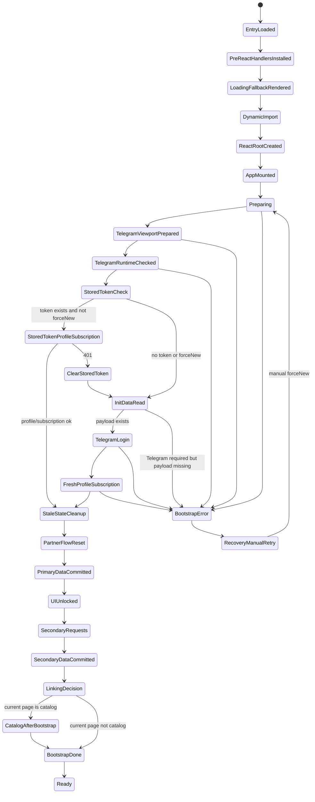
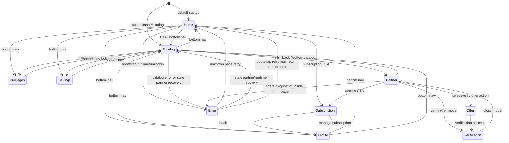
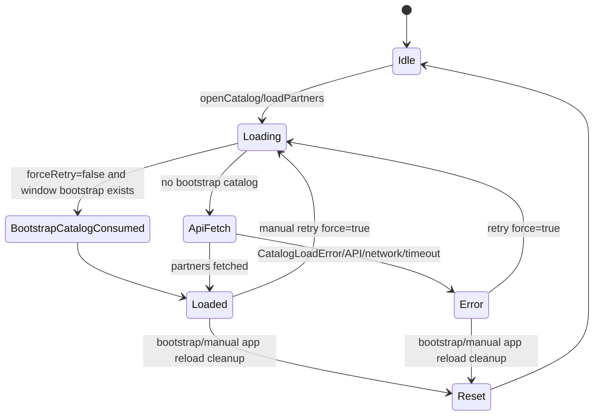
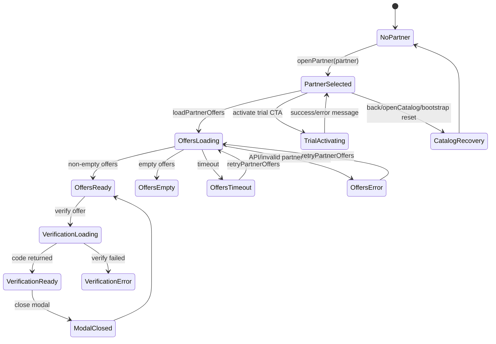
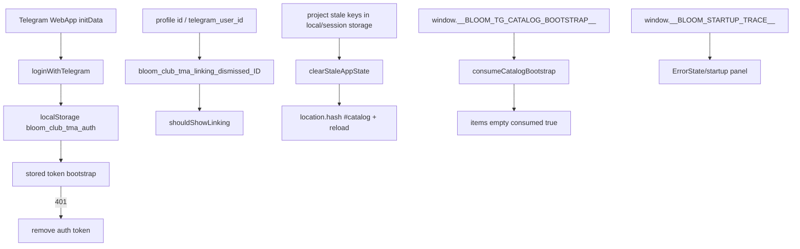
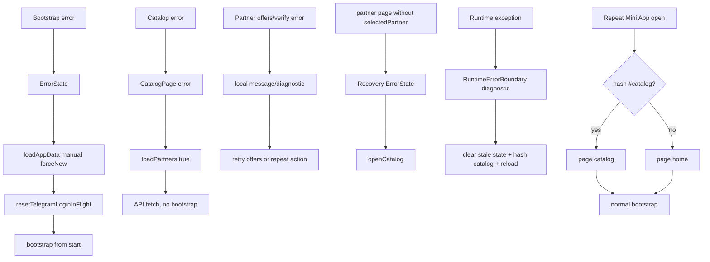

# State Management: Telegram Mini App Frontend

Документ описывает управление состоянием frontend-части Telegram Mini App Bloom Club. Область анализа: `telegram-mini-app/src`, включая React-приложение, API-клиент, Telegram WebApp-интеграцию, диагностику запуска, восстановление и browser storage. Существующая бизнес-логика не изменялась.

## 1. Общая архитектура состояния

### 1.1. Главный принцип

Frontend построен как React-приложение с одним корневым владельцем бизнес-состояния — компонентом `App`. Он хранит:

- текущую страницу;
- авторизованные данные пользователя;
- каталог партнёров;
- выбранного партнёра и предложения;
- статусы загрузки bootstrap, каталога и partner flow;
- диагностические состояния ошибок;
- состояния платежа, trial и account linking.

Компоненты страниц в основном получают данные через props и держат только UI-состояния: формы, выбранные фильтры, модальные окна, локальные сообщения, gallery/lightbox, ошибки изображений.

### 1.2. Уровни состояния

| Уровень | Где находится | Назначение | Время жизни |
|---|---|---|---|
| Entry/runtime state | `main.tsx`, `RuntimeErrorBoundary` | ранний запуск, ошибки до/после React render | до reload вкладки |
| Global app state | `App.tsx` | данные приложения, навигация, bootstrap, catalog, partner flow | пока смонтирован `App` |
| Context state | `ContentContext.tsx` | текстовые блоки и блоки главной страницы | пока смонтирован `ContentProvider` |
| Local component state | pages/components | формы, UI-модалки, локальные ошибки | пока смонтирован компонент |
| Refs | `App.tsx`, `PartnerPage.tsx` | in-flight promise, sequence guard, mounted guard, latest page, timeout id | пока смонтирован владелец ref |
| Module state / singleton | `api/client.ts`, `startupTrace.ts`, `main.tsx` | login in-flight, startup trace, флаги раннего render | до reload вкладки/module instance |
| Browser storage | `localStorage`, `sessionStorage` | auth token, dismiss onboarding, очистка stale state | между открытиями Mini App, пока storage не очищен |
| Window state | `window.__BLOOM_*`, Telegram WebApp, location/hash | bootstrap catalog, startup trace, Telegram payload, recovery hash | до reload или ручного изменения |

### 1.3. Что не используется как полноценный state layer

- Redux/Zustand/MobX отсутствуют.
- URL routing library отсутствует.
- `history.pushState`/`replaceState` не используются.
- `sessionStorage` не используется для записи текущей логикой, но сканируется recovery-механизмом.
- `window.location.hash` используется только как ограниченный startup/recovery-сигнал для каталога.

## 2. Полная карта состояний

### 2.1. Global state в `App`

| Состояние | Тип | Где объявлено | Кто создаёт | Кто читает | Кто изменяет | Когда очищается | Ошибка | Повторное открытие Mini App |
|---|---|---|---|---|---|---|---|---|
| `page` | `PageId` | `App` | `useState(getStartupPage)` | `AppShell`, page rendering, diagnostics, `pageRef` | `setPage`, `openCatalog`, `navigate`, `openPartner`, retry unknown state, subscription/profile callbacks | при размонтировании/reload; partner reset переводит unsafe `partner` в `catalog` | неизвестная page даёт `ErrorState`; `partner` без `selectedPartner` восстанавливается в catalog error | стартует как `catalog`, если hash `#catalog`, иначе `home` |
| `data.profile` | `ClientProfile|null` | `AppData` в `App` | bootstrap через `getProfile` | Home, Profile, linking, trial, dismiss key | bootstrap, `saveProfile`, `activateTrial`, `refreshProfileAndSubscription`, `refreshAfterLinking` | сбрасывается на `emptyData` при новом mount; bootstrap ставит свежие данные | bootstrap error останавливает app; save error пробрасывается странице | загружается заново; token может позволить без Telegram login |
| `data.subscription` | `Subscription|null` | `AppData` | bootstrap через `getSubscription` | Home, Partner, Profile, Subscription | bootstrap, `activateTrial`, refresh после linking/profile | как `data` | ошибки trial пробрасываются локально; bootstrap error останавливает app | загружается заново |
| `data.partners` | `Partner[]` | `AppData` | initial `[]`, catalog load | Home, Catalog | bootstrap reset to `[]`, `loadPartners` | force retry ставит loaded=false, но массив очищается только bootstrap reset/load success заменой | catalog error сохраняет прежний массив, выставляет error state | не персистится; может прийти из `window.__BLOOM_TG_CATALOG_BOOTSTRAP__` один раз |
| `data.verifications` | `Verification[]` | `AppData` | secondary bootstrap | Privileges | bootstrap secondary, `createVerification`, refresh verifications | bootstrap initial reset to `[]` | secondary fail оставляет текущее значение; verify error пробрасывается PartnerPage | загружается заново |
| `data.savings` | `SavingsSummary|null` | `AppData` | secondary bootstrap | Savings | bootstrap secondary | bootstrap reset to `null` | secondary fail оставляет текущее значение | загружается заново |
| `data.cities` | `City[]` | `AppData` | secondary bootstrap | Home, Profile | bootstrap secondary | bootstrap reset to `[]` | secondary fail оставляет текущее значение | загружается заново |
| `data.linkingStatus` | `LinkingStatus|null` | `AppData` | secondary bootstrap | linking decision | bootstrap secondary, `refreshAfterLinking` | bootstrap reset to `null` | fail даёт `null`, onboarding может не показаться | загружается заново |
| `selectedPartner` | `Partner|null` | `App` | user click in catalog | PartnerPage, active page guard, retry offers | `openPartner`, `openCatalog`, `resetPartnerFlowState` | при возврате в каталог, bootstrap cleanup, reload | если `page=partner`, но null, показывается recovery error и предлагается catalog | не сохраняется; повторное открытие всегда null |
| `partnerOffers` | `Offer[]` | `App` | `loadPartnerOffers` | PartnerPage | `loadPartnerOffers`, `openCatalog`, `resetPartnerFlowState` | при открытии партнёра перед загрузкой, уходе в каталог/bootstrap | при ошибке становится `[]` | не сохраняется |
| `partnerOffersStatus` | `AsyncStatus` | `App` | initial `idle` | PartnerPage, diagnostics | `loadPartnerOffers`, `openCatalog`, retry | reset to `idle` при catalog/bootstrap | `timeout` для timeout, `error` для API/unknown, `empty` для пустого ответа | `idle` |
| `partnerOffersError` | `string` | `App` | initial `""` | PartnerPage | `loadPartnerOffers`, reset | reset при retry/catalog/bootstrap | user-facing text | empty |
| `partnerOffersDiagnostic` | `PartnerOffersDiagnostic|null` | `App` | errors in offers | PartnerPage diagnostics | `loadPartnerOffers`, reset | reset при retry/catalog/bootstrap | хранит safe backend/http/partner id diagnostics | null |
| `paymentRequest` | `PaymentRequest|null` | `App` | `openPayment` | SubscriptionPage | `openPayment` | только reload/remount; не очищается при уходе со страницы | payment error не очищает старый request | null при новом открытии |
| `isLoading` | `boolean` | `App` | initial true | App render | `loadAppData` | false в finally | true показывает `LoadingState`; false с `error` показывает `ErrorState` | true до bootstrap |
| `error` | `AppDiagnostic|null` | `App` | bootstrap catch | App render | `loadAppData` | retry/manual clears at start | показывает bootstrap `ErrorState` | null до новой ошибки |
| `isCreatingPayment` | `boolean` | `App` | initial false | SubscriptionPage | `openPayment` | finally false | предотвращает/показывает создание | false |
| `trialMessage` | `string|null` | `App` | `activateTrial` | Home/Subscription | `activateTrial` | set null перед активацией; reload | errors не пишутся сюда, пробрасываются | null |
| `paymentMessage` | `string|null` | `App` | `openPayment` | SubscriptionPage | `openPayment` | set null перед payment; reload | error пишет retry/fail text | null |
| `isPartnersLoading` | `boolean` | `App` | initial false | Catalog, diagnostics | `loadPartners`, reset | finally false, reset | loading spinner/catalog status | false |
| `partnersError` | `string` | `App` | initial `""` | Catalog | `loadPartners`, reset | reset при retry/bootstrap | user-facing catalog error | empty |
| `partnersErrorTitle` | `string` | `App` | initial title | Catalog | catalog catch | не сбрасывается force reset кроме initial state; success не меняет | может сохранить последний title | initial on remount |
| `partnersErrorDetails` | safe catalog diagnostic | `App` | catalog catch | Catalog diagnostics | catalog catch/reset | reset при retry/bootstrap/start load | safe fields only | undefined |
| `catalogErrorCreatedAt` | `string|undefined` | `App` | catalog catch | Catalog | catch/reset | reset при retry/bootstrap/start load | timestamp of error | undefined |
| `catalogLoadStartedAt` | `string|undefined` | `App` | `loadPartners` | Catalog | load start/reset | reset retry/bootstrap | helps diagnostics | undefined |
| `catalogLoadRequestId` | `number|undefined` | `App` | sequence in `loadPartners` | Catalog | load start/reset | reset retry/bootstrap | correlates local requests | undefined |
| `hasPartnersLoaded` | `boolean` | `App` | initial false | catalog open diagnostics/status | load success/reset | force retry/bootstrap reset | false with error means not loaded | false |
| `shouldShowLinking` | `boolean` | `App` | bootstrap decision | App render | bootstrap, dismiss, linked | dismiss/linking/reload | false if status request failed | recomputed; localStorage dismiss may suppress |
| `isTelegramApp` | `boolean` | `App` | `isTelegramRuntime` | linking render | bootstrap | remount | false can suppress onboarding | recalculated |
| `showStartupDiagnostics` | `boolean` | `App` | initial false | App render | watchdog, diagnostic button, hide button | reload | true reveals startup trace | false |
| `watchdogMessage` | `string|null` | `App` | watchdog timers | diagnostic panel | 5s/8s timers | reload; not actively cleared after success | stale warning can remain if set | null |
| `isBootstrapDone` | `boolean` | `App` | initial false | diagnostics/ErrorState/watchdog | bootstrap success | reload; not set true on error | bootstrap error leaves pending | false then true on success |
| `hasRenderedPageContent` | `boolean` | `App` | initial false | watchdog | render effect after not loading/no error | reload | if false after 8s diagnostics shown | false then true |

### 2.2. Refs в `App`

| Ref | Тип | Назначение | Кто пишет/читает | Очистка | Ошибки/повторное открытие |
|---|---|---|---|---|---|
| `partnersPromiseRef` | `Promise<void>|null` | дедупликация загрузки каталога | `loadPartners`, reset | finally/reset | при reload null; если promise зависнет, повтор без force вернёт старый promise |
| `catalogLoadSequenceRef` | `number` | локальный id загрузки каталога | `loadPartners` | reload | используется для diagnostics |
| `pageRef` | `PageId` | актуальная page внутри async/timers | effect on `page` | reload | watchdog/bootstrap читает latest page |
| `bootstrapPromiseRef` | `Promise<void>|null` | дедупликация bootstrap | `loadAppData` | finally/forceNew | повторный retry force сбрасывает |
| `bootstrapSequenceRef` | `number` | guard от stale async updates | `loadAppData` | reload | старый bootstrap не обновляет state, если sequence сменился |
| `mountedRef` | `boolean` | guard от setState после unmount | mount cleanup | unmount | предотвращает часть stale updates |

### 2.3. Context state

| Состояние | Тип | Где | Кто читает | Кто изменяет | Ошибка | Повторное открытие |
|---|---|---|---|---|---|---|
| `ContentContext.blocks` | `Record<string,string>` | `ContentProvider` | `useContentText`, pages/components | `getContentBlocks` success | fail оставляет `{}` и fallback-тексты | загружается заново |
| `ContentContext.homeBlocks` | `HomeBlock[]` | `ContentProvider` | HomePage | `getHomeBlocks` success | fail оставляет `[]` | загружается заново |
| `ContentContext.isLoading` | `boolean` | `ContentProvider` | context consumers при необходимости | effect start/finally | false в finally | false->true->false |
| `ContentContext.loadError` | `string` | `ContentProvider` | context consumers | partial/full content failure | содержит fallback-warning | empty or warning |
| `isMounted` | effect-local boolean | `ContentProvider` | async continuation | cleanup | не React state; защищает setState после unmount | recreated |

### 2.4. Local state страниц и компонентов

| Компонент | State | Назначение | Очистка/ошибка/повторное открытие |
|---|---|---|---|
| `CatalogImage` | `hasError` | скрывает упавшую картинку партнёра | per image component; true после `onError`; reset on remount |
| `CatalogPage` | `selectedCategory` | UI-фильтр каталога | сбрасывается в `"Все"` при remount; ошибка каталога не обязана очищать |
| `PartnerPage` | `selectedVerification` | verification для modal с кодом | null при смене partner/offers без matching offer, закрытии modal, remount |
| `PartnerPage` | `selectedOffer` | offer для выбранной verification | очищается вместе с verification |
| `PartnerPage` | `loadingOfferId` | какая offer сейчас в verify request | set на offer id, finally null; при ошибке message |
| `PartnerPage` | `message` | локальные ошибки verify/trial | set по ошибкам/успехам, reset перед action |
| `PartnerPage` | `isActivatingTrial` | локальный loading trial | finally false |
| `PartnerPage` | `galleryIndex` | lightbox index | null при закрытии, смене images/out-of-range |
| `PartnerPage` | `copyMessage` | feedback копирования кода | auto-clear timeout; cleanup clears timeout |
| `PartnerPage` | `failedImageUrls` | список битых изображений | reset при смене partner; append on image error |
| `PartnerPage` ref | `copyMessageTimeoutRef` | timeout id для copy feedback | clear on cleanup/new copy |
| `HomePage` | `isActivatingTrial` | локальный loading trial CTA | finally false |
| `HomePage` | `localTrialMessage` | локальный текст trial | reset before action, set success/error |
| `SubscriptionPage` | `isActivatingTrial` | локальный loading trial | finally false |
| `SubscriptionPage` | `localMessage` | локальный success message | reset before action, set success |
| `SubscriptionPage` | `localError` | локальная ошибка trial | reset before action, set fail |
| `ProfilePage` | `name`, `phone`, `email`, `city` | форма профиля | sync effect from props; validation errors local |
| `ProfilePage` | `error`, `message`, `isSaving` | состояние сохранения профиля | reset before submit; finally false |
| `AccountLinkingOnboarding` | `step` | `question` → `identifier` → `code` → `success` | local only; unmount clears |
| `AccountLinkingOnboarding` | `identifier`, `code` | input values | local only |
| `AccountLinkingOnboarding` | `challengeId`, `devCode` | challenge state from start linking | set by start response; required for confirm |
| `AccountLinkingOnboarding` | `message`, `isSubmitting` | feedback/loading | reset before submit; finally false |
| `RuntimeErrorBoundary` | `diagnostic` | runtime exception state | set by React/window errors; retry reloads app |
| `main.tsx` DOM state | `reactRenderStarted`, `startupFailureRendered` | prevents duplicate early error panel | module lifetime; reload clears |

### 2.5. Module/singleton/window state

| State | Где | Назначение | Очистка/ошибка/повторное открытие |
|---|---|---|---|
| `telegramLoginInFlight` | `api/client.ts` | дедупликация Telegram login request | `resetTelegramLoginInFlight` или finally; reload null |
| `window.__BLOOM_STARTUP_TRACE__` | `startupTrace.ts` | последние 300 startup events | in-memory; reload resets unless page preserves window during HMR |
| `window.__BLOOM_TG_CATALOG_BOOTSTRAP__` | global consumed by `App` | одноразовый bootstrap catalog items | `consumeCatalogBootstrap` marks consumed and empties items |
| Telegram WebApp object | `window.Telegram.WebApp` | initData, viewport, runtime detection | owned by Telegram SDK; отсутствует вне Telegram |
| `importTimeoutId` | `main.tsx` local | timeout dynamic import | clear after import success |

## 3. Bootstrap State Machine

Bootstrap запускается `useEffect(() => loadAppData())` после mount `App`.

### Этапы без сокращений

1. **EntryLoaded**: `main.tsx` загружен, пишет `app_entry_loaded`.
2. **PreReactHandlersInstalled**: устанавливаются `window.onerror` и `window.onunhandledrejection` для ранних ошибок.
3. **LoadingFallbackRendered**: DOM fallback показывается до React.
4. **DynamicImport**: динамически импортируются `App` и `RuntimeErrorBoundary`; есть timeout 3000 ms.
5. **ReactRootCreated / render call**: создаётся React root и render с boundary.
6. **AppMounted**: выставляется `mountedRef=true`, логируется initial state.
7. **Preparing**: `loadAppData` ставит `isLoading=true`, `error=null`, sequence guard.
8. **TelegramViewportPrepared**: `prepareTelegramViewport` вызывает Telegram WebApp ready/expand и CSS viewport.
9. **TelegramRuntimeChecked**: определяется `isTelegramApp`.
10. **StoredTokenCheck**: читается `localStorage.bloom_club_tma_auth`.
11. **StoredTokenProfileSubscription**: при token и не forceNew параллельно запрашиваются profile/subscription.
12. **ClearStoredToken**: если stored token дал 401, token удаляется.
13. **InitDataRead**: читается Telegram launch payload с retry.
14. **TelegramLogin**: login request сохраняет fresh token.
15. **FreshProfileSubscription**: после login запрашиваются profile/subscription.
16. **StaleStateCleanup**: очищаются stale project storage keys и catalog diagnostic state.
17. **PartnerFlowReset**: selected partner/offers очищаются; startup hash может перевести в catalog.
18. **PrimaryDataCommitted**: profile/subscription записаны, остальное primary data сброшено.
19. **UIUnlocked**: `isLoading=false`, приложение может показать страницу до secondary requests.
20. **SecondaryRequests**: параллельно verifications/savings/cities/linking status.
21. **SecondaryDataCommitted**: fulfilled результаты записываются, rejected игнорируются с trace fail.
22. **LinkingDecision**: вычисляется `shouldShowLinking` через Telegram/profile/status/localStorage dismiss.
23. **CatalogAfterBootstrap**: если текущая page catalog, запускается `loadPartners(false)`.
24. **BootstrapDone**: `isBootstrapDone=true`.
25. **Ready**: приложение работает.
26. **BootstrapError**: `error=createDiagnostic(stage, caughtError)`, `isLoading=false`.
27. **RecoveryManualRetry**: кнопка retry вызывает `loadAppData('manual', true)`.

## 4. Navigation State Machine

В коде фактические page ids: `home`, `catalog`, `partner`, `privileges`, `savings`, `profile`, `subscription`. Термины из задания сопоставляются так:

- **Offer** — модальное/локальное состояние `selectedOffer` внутри `PartnerPage`, отдельной страницы нет.
- **Verification** — модальное/локальное состояние `selectedVerification` и список `privileges`, отдельной page id нет.
- **Recovery/Error** — `ErrorState` поверх текущего render path, не `PageId`.

### Допустимые переходы

- Bottom nav может вызвать `navigate` на основные разделы: home/catalog/privileges/savings/profile.
- Переход в catalog всегда проходит через `openCatalog`, который очищает partner flow и запускает catalog load.
- Переход в partner допустим только через `openPartner(partner)`, потому что нужен `selectedPartner`.
- Переход в subscription допустим из Home, Partner и Profile.
- Возврат из Subscription ведёт в Profile.
- Verification/Offer допустимы только внутри PartnerPage при наличии selected partner и offer.

### Запрещённые/неустойчивые переходы

- Прямой startup в `partner` запрещён функцией `isUnsafeStartupScreen`: reset переводит в catalog.
- `page='partner'` без `selectedPartner` не рендерит PartnerPage, а показывает recovery error в catalog shell.
- Unknown page не считается допустимой и показывает `ErrorState` с retry на home.
- URL hash не является общим router state: поддержан только `#catalog`; `#partner`, `#profile` и т.п. игнорируются.

## 5. Catalog State

### Хранение

Каталог хранится в `data.partners` как массив `Partner[]`. Метаданные загрузки хранятся отдельно: `isPartnersLoading`, `partnersError`, `partnersErrorTitle`, `partnersErrorDetails`, `catalogErrorCreatedAt`, `catalogLoadStartedAt`, `catalogLoadRequestId`, `hasPartnersLoaded`, `partnersPromiseRef`, `catalogLoadSequenceRef`.

### Когда загружается

- При открытии каталога через `openCatalog()`.
- После bootstrap, если startup/current page — catalog.
- При retry в `CatalogPage` с `loadPartners(true)`.

### Bootstrap vs API

- `loadPartners(false)` сначала пытается `consumeCatalogBootstrap()`.
- Bootstrap-каталог берётся из `window.__BLOOM_TG_CATALOG_BOOTSTRAP__.items`, если он не consumed и непустой.
- После consume window-state помечается consumed и очищается.
- Если bootstrap отсутствует или force retry, вызывается `getPartners()`.
- `getPartners()` использует TG local catalog при `VITE_TG_LOCAL_CATALOG_ENABLED=true`, иначе legacy web catalog.

### Retry

- Retry вызывает force path: `resetCatalogStateForForceReload()`, bootstrap catalog не используется, идёт API fetch.
- In-flight request дедуплицируется через `partnersPromiseRef`, если forceRetry=false.

### Очистка

- Bootstrap cleanup вызывает reset catalog diagnostics и `hasPartnersLoaded=false`.
- `openCatalog` не очищает `data.partners`, но очищает partner flow.
- Force retry очищает diagnostics/loading flags, но не обнуляет старый `data.partners` до успешной замены.

## 6. Partner Flow

### `selectedPartner`

- Создаётся только `openPartner(partner)` из CatalogPage.
- Читается App для guard и PartnerPage через props.
- Очищается `openCatalog` и `resetPartnerFlowState`.
- Не сохраняется в storage, поэтому повторное открытие Mini App не восстанавливает партнёра.

### `offers`

- Глобально: `partnerOffers`, `partnerOffersStatus`, `partnerOffersError`, `partnerOffersDiagnostic`.
- Загружаются после `openPartner` и при retry.
- До request массив очищается, status=`loading`.
- При invalid partner id status=`error`, diagnostic с `partnerIdMissingOrInvalid=true`.
- При timeout status=`timeout`.
- При 401 message: «Сессия истекла, откройте приложение заново».

### `selectedOffer` и verification

- `selectedOffer` и `selectedVerification` локальны для PartnerPage.
- Verify action вызывает `onVerifyOffer`, то есть App `createVerification`.
- App добавляет verification в `data.verifications`, затем пытается refresh списка.
- PartnerPage показывает modal при success.
- При смене offers/partner, если selected offer больше не найден, selected offer и verification очищаются.

### Partner diagnostics/recovery

- Offers diagnostics содержат numeric partner id, source, URL path, HTTP status и safe backend detail.
- Stale partner screen without selected partner показывает отдельный ErrorState с retry `openCatalog`.
- Runtime recovery чистит stale storage, ставит hash `#catalog` и reload.

## 7. Runtime State после запуска

После `Ready` одновременно существуют:

- auth token в localStorage;
- in-memory `App` state;
- in-memory content context;
- startup trace в `window.__BLOOM_STARTUP_TRACE__`;
- active page и active nav mapping;
- возможно, in-flight promises catalog/bootstrap/login/content;
- локальные UI states страниц;
- global error listeners в `RuntimeErrorBoundary`;
- Telegram WebApp viewport CSS variable `--tg-viewport-height`;
- diagnostic watchdog state, если запуск занял слишком долго.

Runtime exceptions не сбрасывают React state напрямую. Boundary заменяет UI на `ErrorState`; retry вызывает recovery to catalog через storage cleanup, hash и reload.

## 8. Storage, window, location, history

| Key/API | Кто пишет | Кто читает | Когда очищается | Может ли привести к ошибке |
|---|---|---|---|---|
| `localStorage.bloom_club_tma_auth` | `setStoredToken` after auth response | `getStoredAuthToken`, request auth headers | `clearStoredAuthToken` on 401 during bootstrap; user/browser clear | stale token даёт 401, затем login retry; недоступный localStorage может бросить runtime error |
| `localStorage.bloom_club_tma_linking_dismissed_${identity}` | dismiss onboarding | `shouldShowLinkingOnboarding` | явно не очищается | stale dismiss может скрыть onboarding для того же identity |
| `localStorage` stale keys with prefixes `bloom_club_tma_`, `bloomClubTma`, `bloom_tma_` and patterns activeScreen/selectedPartner/selectedOffer/verification/partnerOffers/offersStatus | текущий код почти не пишет такие keys, recovery поддерживает legacy/stale state | `clearStaleAppState` scans | bootstrap cleanup и runtime recover | чрезмерное совпадение может удалить чужой project key с похожим именем |
| `sessionStorage` same stale patterns | текущий код не пишет | `clearStaleAppState` scans | bootstrap cleanup и runtime recover | то же; storage access может бросить при restricted browser settings |
| `window.__BLOOM_TG_CATALOG_BOOTSTRAP__` | external bootstrap script/server | `consumeCatalogBootstrap` | consume sets `{items:[], consumed:true}` | malformed/empty ignored, catalog falls back to API |
| `window.__BLOOM_STARTUP_TRACE__` | `traceStart/Ok/Fail/Mark` | ErrorState, startup diagnostic panel, early error panel | max 300 rolling; reload clears | содержит только sanitized diagnostics; ошибка записи window маловероятна |
| `window.Telegram.WebApp` | Telegram SDK | Telegram helpers | external lifecycle | missing SDK outside Telegram causes bootstrap error in production if no payload |
| `window.location.hash` | Runtime recovery sets `#catalog`; user/browser may set | `getStartupPage` | not cleared by app | only `#catalog` recognized; stale hash forces catalog startup |
| `window.location.reload()` | Runtime recovery and early error reload button | browser | reload | reload loop возможен, если ошибка повторяется immediately |
| `window.location.origin/host` | browser | API URL normalization/diagnostics | n/a | malformed environment URL falls back/defaults |
| `history` | не используется | не используется | n/a | browser back не управляет React page state |

## 9. Recovery

### После ошибки bootstrap

- `error` получает `AppDiagnostic` со stage.
- `isLoading=false`.
- UI показывает `ErrorState` с retry.
- Retry запускает `loadAppData('manual', true)`, сбрасывает `bootstrapPromiseRef` и `telegramLoginInFlight`.

### После ошибки каталога

- `partnersError`, `partnersErrorTitle`, `partnersErrorDetails`, `catalogErrorCreatedAt` заполняются.
- `isPartnersLoading=false`, `hasPartnersLoaded` остаётся false, если не было success.
- Старый `data.partners` может оставаться в памяти.
- Retry идёт через API и не использует bootstrap catalog.

### После ошибки partner

- Offers error не ломает global app; PartnerPage получает status/error/diagnostic.
- Verify error остаётся локальным `message` в PartnerPage.
- Trial error в Partner/Home/Subscription отображается локально или пробрасывается вызывающему компоненту.

### После runtime exception

- Boundary ловит React render errors, `window.error`, unhandled promise rejection.
- Показывается ErrorState.
- Recovery button чистит stale storage, ставит `#catalog`, reloads.

### После повторного открытия Mini App

- In-memory React/module/window states пересоздаются.
- Auth token и dismiss onboarding остаются в localStorage.
- `selectedPartner`, offers, local forms, paymentRequest не восстанавливаются.
- Hash `#catalog` может сохранить старт в catalog.

## 10. Mermaid схемы

Схемы включены в разделы 3, 4, 5, 6, 8 и 9:

1. Bootstrap State Machine.
2. Navigation State Machine.
3. Catalog State.
4. Partner Flow.
5. Recovery Flow.
6. Storage Flow.

## 11. Потенциальные проблемы управления состоянием

1. **Hash поддерживает только catalog**: пользовательский/back navigation не синхронизирован с `page`, а browser history не используется.
2. **Старые partners могут оставаться после catalog error**: force retry очищает flags, но не очищает `data.partners` до нового success.
3. **`partnersErrorTitle` не сбрасывается явно в reset**: после TG/local ошибки title может сохраняться до следующей ошибки или remount.
4. **Storage access без try/catch**: `localStorage`/`sessionStorage` могут бросить в restricted режимах браузера.
5. **`paymentRequest` не очищается при уходе со Subscription**: старый request может оставаться в памяти до reload.
6. **`watchdogMessage` не очищается после позднего успеха**: если watchdog сработал, сообщение может оставаться в диагностической панели.
7. **Runtime recovery может зациклиться**: если catalog startup снова вызывает render/runtime error, reload вернёт на `#catalog` повторно.
8. **Content loading отделён от app bootstrap**: приложение Ready не означает, что динамический content загружен; используются fallback-тексты.
9. **Secondary bootstrap failures silently degrade**: verifications/savings/cities/linking failures не блокируют app и могут выглядеть как пустые данные.
10. **`window.__BLOOM_TG_CATALOG_BOOTSTRAP__` одноразовый**: после consume retry всегда API-only; если API недоступен, bootstrap copy уже очищена.
11. **Account linking dismiss привязан к identity**: если identity переиспользуется/меняется, onboarding может быть скрыт или показан неожиданно.
12. **Модальные Offer/Verification не являются route state**: reload/back теряет выбранную offer/verification.
13. **Несколько независимых loading states**: `isLoading`, `isPartnersLoading`, content `isLoading`, local loading могут одновременно давать разные UX-состояния.
14. **Module-level login singleton чувствителен к force reset**: manual retry сбрасывает, но параллельные вызовы вне bootstrap должны учитывать in-flight состояние.
15. **Stale cleanup patterns широкие**: удаляются любые project-prefixed keys с совпадающими паттернами, включая потенциальные будущие legitimate keys.

## 12. Недостаточно документированные части

Эти части удалось описать по коду, но без внешней спецификации контракта они остаются не полностью определёнными:

- Точный формат `window.__BLOOM_TG_CATALOG_BOOTSTRAP__` и кто именно его пишет до запуска frontend.
- Полная схема backend responses для profile/subscription/verifications/savings/cities/linking/catalog/offers/payment.
- Гарантии Telegram WebApp SDK по timing передачи `initData` и `initDataUnsafe`.
- UX-правила для browser back/forward, потому что history state отсутствует.
- Ожидаемая политика очистки auth token кроме 401 bootstrap.
- Ожидаемое поведение при partial secondary failures: код использует graceful degradation, но продуктовая спецификация не найдена.
- Предназначение legacy stale storage keys, которые очищаются recovery, но текущим frontend не записываются.

## 13. Краткий жизненный цикл

1. Entry script ставит ранние обработчики ошибок и fallback.
2. Dynamic import загружает React app и boundary.
3. `App` запускает bootstrap.
4. Bootstrap готовит Telegram, проверяет token или логинится через launch payload.
5. Profile/subscription unlock UI.
6. Secondary requests догружают дополнительные данные.
7. Catalog грузится отдельно при открытии/старте в catalog.
8. Partner flow существует только в памяти и очищается при уходе в catalog/bootstrap/reload.
9. Runtime errors переводят приложение в recovery UI.
10. Повторное открытие восстанавливает только persisted token/dismiss/hash, но не UI selection state.
